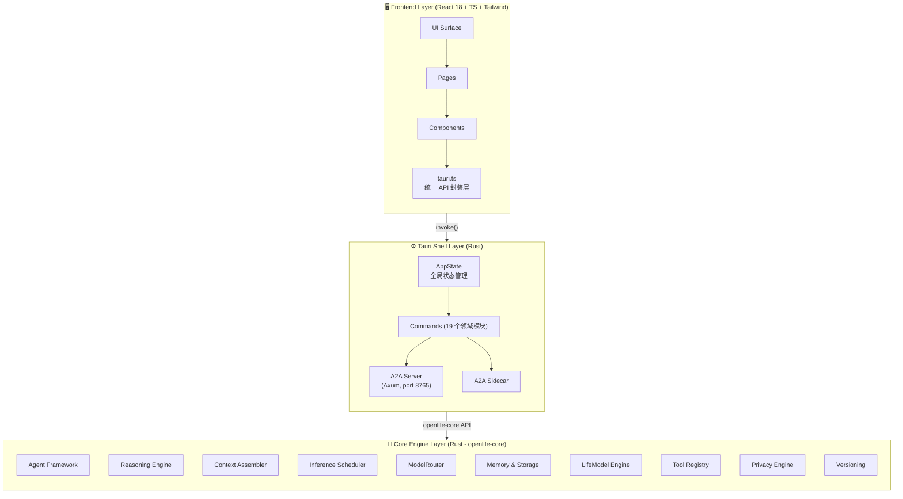
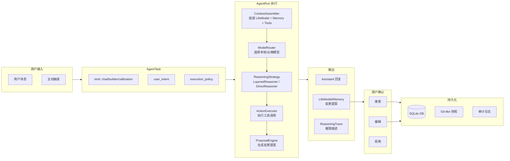
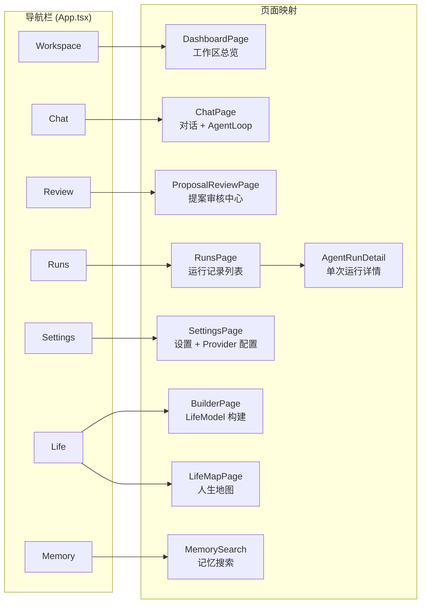

# OpenLife 系统架构图

> 本文档基于代码实际状态（2026-05-01）绘制，涵盖 Frontend / Tauri Shell / Core Engine 三层架构。

---

## 一、总体三层架构



---

## 二、Agent Runtime 核心数据流



---

## 三、Core Engine 模块依赖关系

```mermaid
flowchart TB
    subgraph Agent["🤖 Agent Framework"]
        Runtime["AgentRuntime<br/>中心编排器"]
        Loop["AgentLoop<br/>ReAct 循环"]
        Executor["ActionExecutor<br/>动作执行器"]
        ProposalEngine["ProposalEngine<br/>提案引擎"]
        Store["AgentRunStore<br/>运行记录存储"]
        Types["Types<br/>AgentTask, AgentRun, AgentProposal"]
    end

    subgraph Reasoning["🧠 Reasoning Engine"]
        Strategy["ReasoningStrategy Trait"]
        Layered["LayeredReasoner<br/>Meaning→Strategy→Generation"]
        Direct["DirectReasoner<br/>直接推理"]
        Safety["SafetyChecker"]
    end

    subgraph ContextAsm["📦 Context Assembler"]
        Composite["CompositeAssembler"]
        LMA["LifeModelAssembler"]
        PA["PrivacyAssembler"]
        MA["MemoryAssembler"]
        TA["ToolsAssembler"]
    end

    subgraph ModelLayer["🔌 Model & Scheduler"]
        Scheduler["InferenceScheduler"]
        Router["ModelRouter<br/>provider health + 隐私路由"]
        Ollama["Ollama Client<br/>localhost:11434"]
        LLM["LLM Client<br/>DeepSeek/OpenRouter/OpenAI"]
    end

    subgraph MemoryLayer["💾 Memory & Storage"]
        MemStore["MemoryStore<br/>SQLite messages"]
        VecStore["VectorStore<br/>embedding + 余弦相似度"]
        MemCache["HotMemoryCache<br/>LRU 缓存"]
        Tier["Tier 1/2/3<br/>分层记忆"]
    end

    subgraph LifeModelLayer["🎯 LifeModel Engine"]
        LM["LifeModel<br/>四维模型"]
        Patch["Patch System<br/>增量更新"]
        PatchStore["PatchStore<br/>提案持久化"]
        Builder["Builder Engine<br/>引导式创建"]
    end

    subgraph ToolLayer["🛠️ Tool Registry"]
        MCP["McpRegistry<br/>MCP 客户端"]
        Manifest["ToolManifest<br/>工具清单"]
        Permissions["ToolPermissions<br/>权限管理"]
        Audit["McpAuditStore<br/>审计日志"]
    end

    subgraph Other["🔒 基础设施"]
        Privacy["PrivacyEngine<br/>PII 检测/脱敏"]
        Versioning["VersionManager<br/>快照/回滚"]
        Feedback["FeedbackStore<br/>进化信号"]
        Config["AppConfig<br/>YAML + env"]
    end

    Runtime --> Strategy
    Runtime --> Composite
    Runtime --> Scheduler
    Loop --> Executor
    Loop --> ProposalEngine
    Strategy --> Layered
    Strategy --> Direct
    Layered --> Safety
    Composite --> LMA
    Composite --> PA
    Composite --> MA
    Composite --> TA
    Scheduler --> Router
    Scheduler --> Ollama
    Scheduler --> LLM
    MA --> MemStore
    MA --> VecStore
    MemStore --> MemCache
    VecStore --> Tier
    LMA --> LM
    LM --> Patch
    Patch --> PatchStore
    Executor --> MCP
    MCP --> Manifest
    MCP --> Permissions
    MCP --> Audit
    PA --> Privacy
    LM --> Versioning
    Agent --> Store
```



---

## 四、前端页面与路由结构



---

## 五、数据持久化架构

```mermaid
flowgraph TB
    subgraph SQLite["SQLite 数据库"]
        Messages["messages.db<br/>聊天记录/会话"]
        Vectors["vectors.db<br/>向量记忆/embedding"]
        AgentRuns["agent_runs.db<br/>Agent 运行记录"]
        Proposals["proposals.db<br/>变更提案"]
        MCPAudit["mcp_audit.db<br/>MCP 调用审计"]
        Builder["builder_sessions.db<br/>Builder 会话"]
    end

    subgraph FileSystem["文件系统"]
        ConfigYaml["config.yaml<br/>应用配置"]
        Snapshots["snapshots/<br/>Git-like 版本快照"]
        Keyring["keyring/<br/>加密密钥"]
        PrivacyPolicy["privacy_policy.json<br/>隐私策略"]
    end

    subgraph External["外部服务"]
        Ollama["Ollama<br/>localhost:11434"]
        DeepSeek["DeepSeek API"]
        OpenRouter["OpenRouter API"]
        OpenAI["OpenAI API"]
    end

    AgentRuns --> SQLite
    Proposals --> SQLite
    MCPAudit --> SQLite
```

---

## 六、Tauri Commands 领域划分

```mermaid
flowchart LR
    subgraph Commands["src-tauri/src/commands/"]
        Chat["chat.rs<br/>6 个命令"]
        Agent["agent.rs<br/>AgentRun CRUD"]
        Builder["builder.rs<br/>11 个命令"]
        Calibration["calibration.rs<br/>6 个命令"]
        Proposal["proposal.rs<br/>提案确认流"]
        Memory["memory.rs<br/>10 个命令"]
        MCP["mcp.rs<br/>8 个命令"]
        A2A["a2a.rs<br/>7 个命令"]
        Settings["settings.rs<br/>12 个命令"]
        State["state.rs<br/>8 个命令"]
        Version["version.rs<br/>4 个命令"]
        Diagnostics["diagnostics.rs<br/>5 个命令"]
        Feedback["feedback.rs<br/>5 个命令"]
        Metrics["metrics.rs<br/>指标统计"]
        Execution["execution.rs<br/>工具执行"]
        LifeModelCmd["life_model.rs<br/>2 个命令"]
        RouterCmd["router.rs<br/>路由状态"]
    end

    lib["lib.rs<br/>命令注册 + AppState"]
    lib --> Commands
```



---

## 七、关键设计决策

| 决策 | 说明 |
|------|------|
| **AgentRuntime 为中心** | 所有 AI 执行统一收敛到 AgentRuntime，而非页面级独立逻辑 |
| **ReAct 执行闭环** | Reason → Act → Observe → Reflect → Proposal → Confirm → Apply |
| **本地优先** | Ollama 优先，云端 fallback；PII 检测阻止敏感数据上云 |
| **Proposal-Only 写入** | LifeModel/Memory/Tool 权限变更必须经用户确认 |
| **三层推理** | MeaningPhase → StrategyPhase → GenerationPhase，每层可独立降级 |
| **分层记忆** | Tier 1(热)/Tier 2(温)/Tier 3(冷)，自动晋升/降级 |
| **HashRouter** | Tauri 桌面应用基于 file:// 协议，强制使用 HashRouter |
| **feature flag 保护** | AgentLoop 等实验性功能通过 config 开关控制 |

---

*最后更新: 2026-05-01*
