# OpenLife 产品现实审计

日期：2026-08-24
审计对象：用户实际启动的正式 macOS 应用、当前仓库 `HEAD` 的隔离原生 QA 包、真实运行数据、前端/IPC/Rust/SQLite 主链路
结论口径：正式应用事实、当前源码能力、受控测试证据严格分开

## 结论

OpenLife 当前不能被判定为“可用”。这不是两个孤立入口坏掉，而是五个系统层同时失真：

1. 用户实际启动的正式应用落后于当前源码，源码修复没有进入产品。
2. 当前源码虽然增加了文件夹选择和模型选择，但 Project 仍不是完整的文件工作区能力。
3. Work 的语义与完成判定存在 P0：一次明确的三文件读取任务没有读取任何文件，却错误写入 Agent Memory，并被标记为“已完成 / Work 已验证”。
4. UI 信息架构、密度、响应式布局、错误恢复和状态文案仍显著落后于一线桌面 Agent。
5. 现有测试和历史 QA 证明了许多局部契约，却没有证明正式安装产品上的完整用户旅程。

本轮 12 条核心旅程中，没有一条达到正式原生端到端验收；“无 Project 的普通 Chat”仅达到部分可用。下一阶段不应继续增加横向能力：先冻结产品契约并完成 Figma 旅程验收；进入实施后先消灭“错误成功”、建立发布完整性，再按 12 条纵向旅程重建产品。

## 证据等级

- **正式产品事实**：`/Users/tw/Applications/OpenLife.app`，Bundle ID `ai.openlife.desktop`。这是用户当前产品体验的唯一发布事实。
- **当前源码原生证据**：从当前 `HEAD` 重新构建的 `OpenLife QA.app`，Bundle ID `ai.openlife.desktop.qa`。它证明当前源码能力，但不是正式交付。
- **源码/测试证据**：证明模块、接口或局部契约存在，不等于真实旅程可用。
- **未验证**：没有在本轮当前构建、当前数据和真实原生 UI 中完成，不以旧计划、mock、fixture 或历史记录补齐。

## 构建与发布完整性

| 项目 | 正式应用 | 本轮重新构建 QA |
| --- | --- | --- |
| 路径 | `/Users/tw/Applications/OpenLife.app` | `target/release/bundle/macos/OpenLife QA.app` |
| Bundle ID | `ai.openlife.desktop` | `ai.openlife.desktop.qa` |
| 版本 | `0.1.0` | `0.1.0` |
| 应用自报构建 | `0879eb5ec4b5` | `15910f049b64` |
| 仓库 `HEAD` | `15910f049b64c4a62f20fd0003787c5324d71be0` | 同左 |
| 签名 | `OpenLife Local Code Signing` | `OpenLife Local Code Signing` |
| 二进制 SHA-256 | `e8b9d932897bc36d218ad86223e6075fded7b349968ddca3dc17d52f9fabfda0` | `fe1a93151abe6e3f3fb2b53a98ad63df8fceb387f6fe7a589cb2551f8c361ae8` |
| 证据性质 | 正式产品 | 隔离 QA，不复制正式凭据 |

正式应用与当前源码之间已有 119 个文件变化，约 21,689 行增加、2,622 行删除。仓库里的旧 QA 包起初也自报 `0879eb5ec4b5`；本轮重新构建后才自报当前 `HEAD`。因此，“源码里已经修过”与“用户已经获得修复”是两个完全不同的事实。

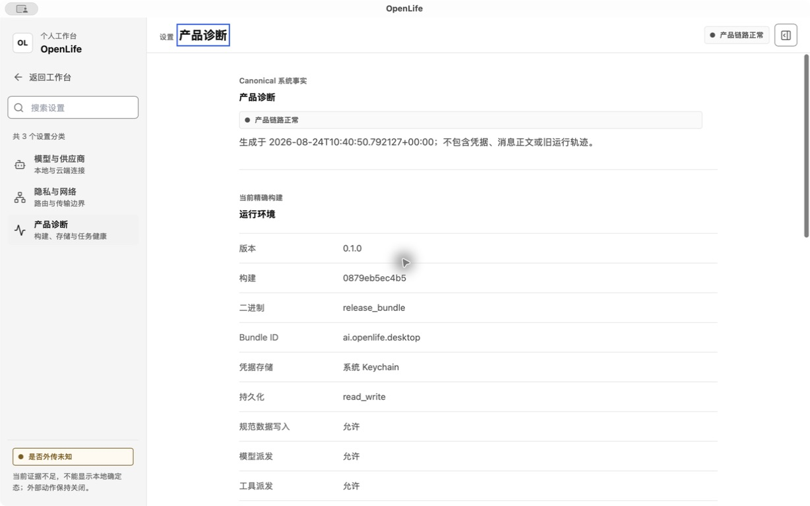

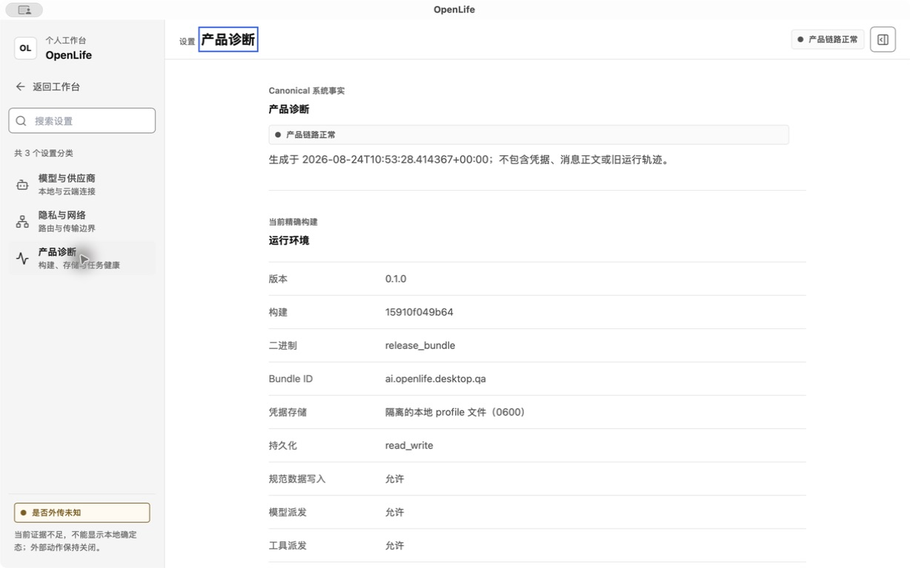

## P0/P1 问题

### P0-1 正式应用不能打开真实 Project 文件夹

正式应用的“新建 Project”只要求名称。创建 `Reality Audit Workspace` 后，数据库记录的 `workspace_root` 为 `NULL`，Project 下拉仍不可选择；用户没有任何路径把本地文件夹绑定为工作区。

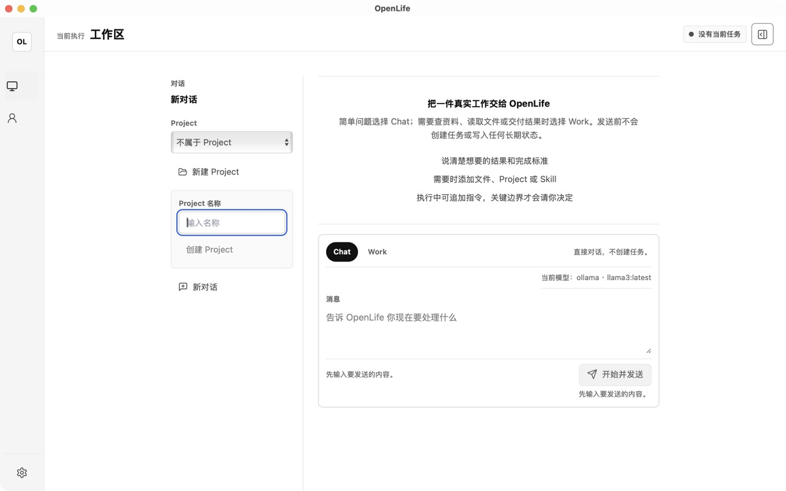

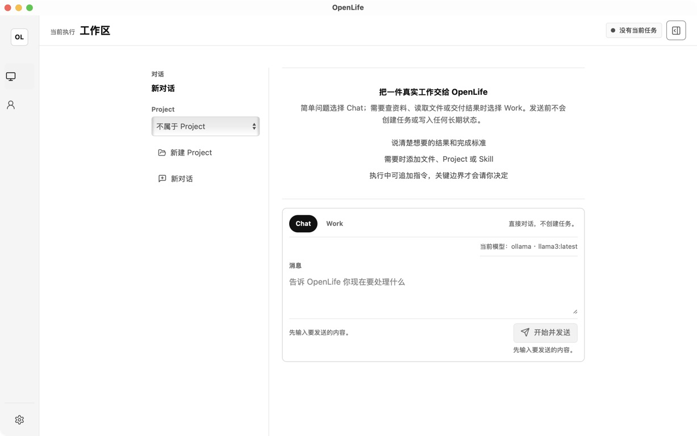

这会直接阻断目录枚举、搜索、读取、写入、预览、diff、撤销和恢复等所有下游 Project 旅程。

### P0-2 当前 HEAD 会把文件读取误执行为长期记忆写入

本轮在当前 `HEAD` 的原生 QA 包中：

- 通过系统原生文件夹选择器绑定 `/tmp/openlife-reality-audit.03HOCE/workspace`；
- 选择本地 `ollama · llama3:latest`；
- 发送：`读取当前 Project 中的 README.md、notes/context.txt 和 data/items.csv，给出三点摘要。不要联网，不要修改或创建任何文件。`；
- 系统没有产生 `file.read` 工具尝试；
- 系统写入 Project Agent Memory，内容仅为 `README.md`；
- 任务、Run、Turn、最终结果全部标记为 completed/delivered；
- UI 随即把该模型标记为 `Work 已验证`。

SQLite 证据：

- Task `67a80797-d9d5-4d44-9eba-2c9aa8c7a0be`：`completed`；
- Run `7aa63fdc-3c8e-4a74-a634-43cf34be1bad`：`completed`；
- Turn `2b724dcb-b9dd-4724-8154-2c4f16615d35`：本地 Ollama、`completed`；
- 唯一 provider attempt 的 `executor_kind` 是 `provider`，不存在 `file.read` attempt；
- Memory `memory:db56abeb-3d8e-491f-88cd-8b88b6d051b3`：内容 `README.md`，被记录为 `user_explicit_instruction`，但用户没有提出记忆请求。

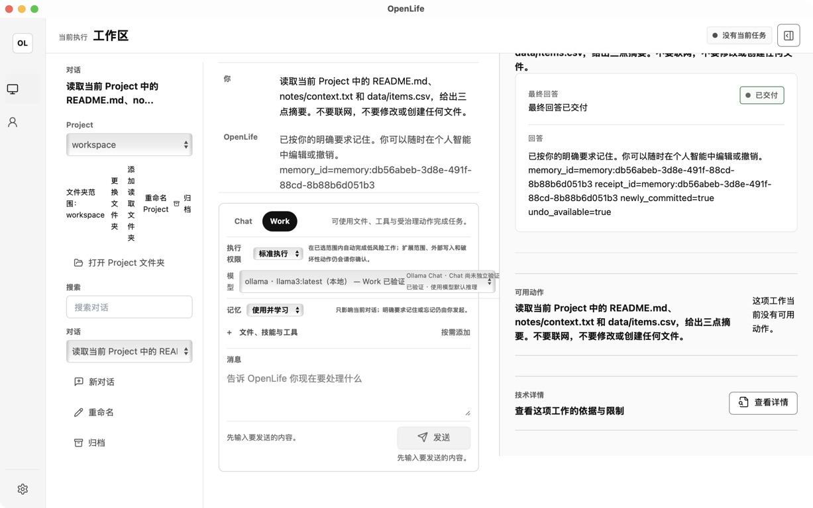

根因链路：

1. `canonical_work_runtime.rs` 在 Agent Memory 启用时把 `personal_intelligence` 作为初始模型可选动作。
2. 初始决策校验允许模型直接返回 `AgentStep::PersonalIntelligence`，没有再次证明用户的真实目标是“记住/忘记/LifeModel 建议”。
3. `personal_intelligence_ports.rs` 只验证 `sourceSpan` 是用户消息中的连续片段；这能证明文本来源，不能证明记忆意图。
4. `README.md` 因为是连续片段而被错误当作“明确记忆内容”。
5. 完成评估器把任何已应用的 Personal Intelligence 当作可交付结果，未校验其是否满足原始文件读取目标。

这是必须先修的“错误成功”问题。相较于明确失败，错误成功会污染长期记忆、误导模型兼容性、制造虚假的完成证据，并让后续 QA 失去可信度。

### P0-3 Provider/Profile 仍不是用户可管理的 Profile 系统

当前源码确实有名为 `ProviderProfileViewModel` 的运行时投影，但持久化配置仍只有：

- 一个 `LlmConfig` 云端供应商/地址/模型/凭据；
- 一个 `prefer_local_model` 布尔值；
- 一个 `local_model` 默认名称；
- 运行时动态发现的 Ollama 模型。

因此它不是一线工具常见的“多个持久化 Provider Profile，每个 Profile 有独立供应商、端点、凭据、模型列表、默认模型、能力与验证状态”。当前模型下拉只是“单个云配置 + 动态本地模型”的运行时列表。

### P0-4 正式 Work 的同一模型/网络边界自相矛盾

正式应用中，本地 Ollama Chat 可以成功；切换同一对话到 Work 后，却以 `Network consent is required before provider dispatch` 阻断。UI 显示本地模型，但运行边界要求网络同意，而且没有直接打开对应设置或批准边界的恢复动作。

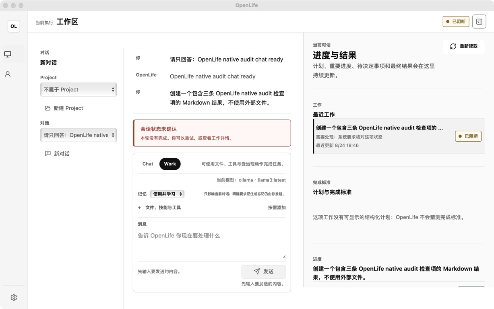

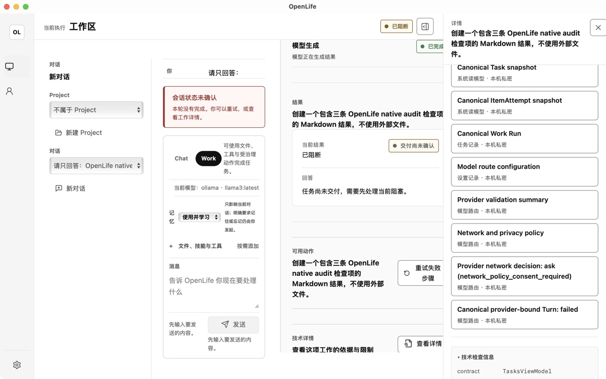

与此相对，同一正式应用的本地 Chat 可以返回指定文本并在重启后恢复正文。这证明本地模型和基本持久化并非整体不可用，也进一步说明问题位于 Work 路由/边界，而不只是 Ollama 离线。

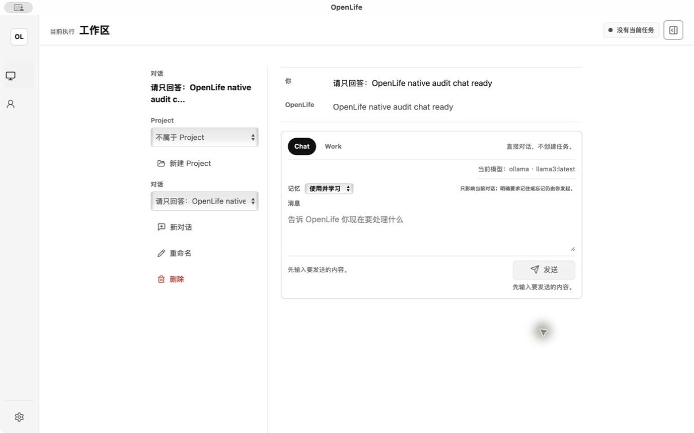

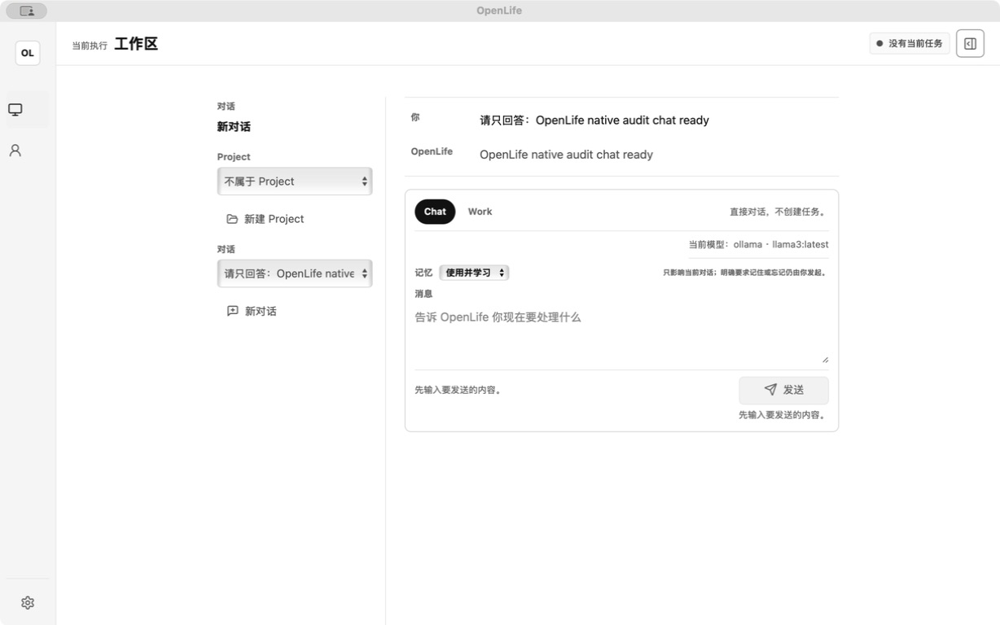

### P1-1 Project 文件能力只覆盖单路径文本读取

当前 Work 的 Project 能力映射只有 `read_workspace_file -> file.read`，参数是一个已知的 workspace-relative `path`。没有面向 Agent 的目录枚举、glob、内容搜索、多文件批量读取、通用写入、重命名或删除能力。Artifact 管线能生成受治理产物，但不能替代用户对真实工作区文件的日常编辑能力。

这解释了为什么“能选择文件夹”仍不等于“可以像一线 Agent 一样在文件夹中工作”。

### P1-2 打开文件夹会丢失新对话草稿上下文

在当前 QA 中，从未发送的“新对话”点击“打开 Project 文件夹”后：

- 文件夹绑定成功；
- UI 返回到此前已存在的旧对话；
- Project 被显示在旧对话上下文；
- 新草稿没有保持；
- 有 Project 的下一条新对话仍默认 Chat，而非已确认的 Work 默认。

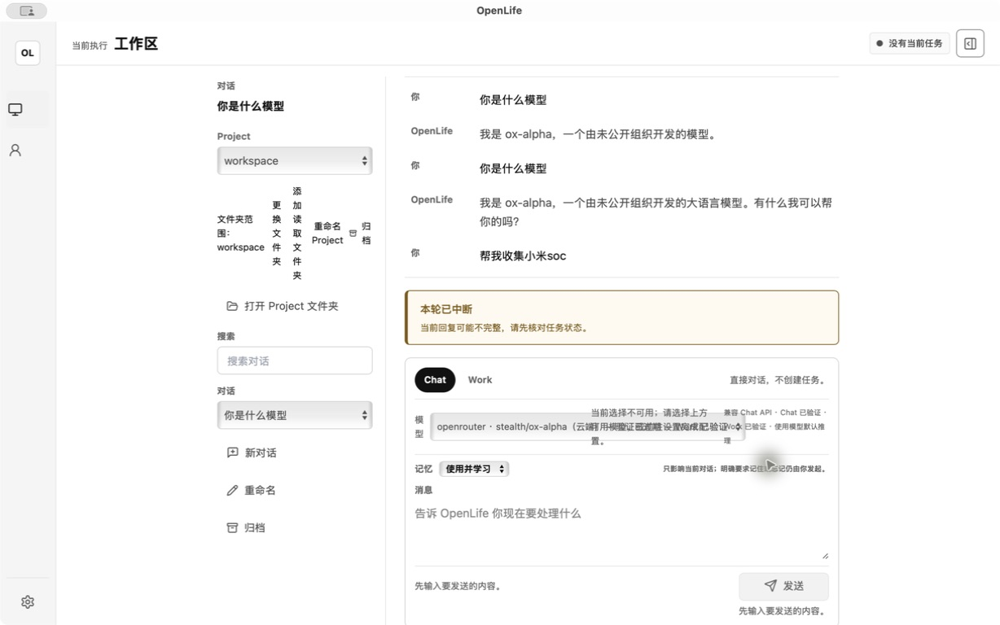

### P1-3 状态标签不能代表用户目标完成

本轮同时观察到：

- 正式诊断显示“产品链路正常”，但正式产品连 Project 文件夹都不能选择；
- 当前 QA 在错误写 Memory 后显示“Work 已验证”；
- 已完成的本地任务详情仍显示“Provider validation is stale; cloud route is not proven ready”；
- 正式重启后恢复了旧对话正文，但标题仍显示“新对话”。

需要把“基础设施健康、Provider 可达、协议兼容、工具执行成功、原始用户目标完成、正式发布已安装”拆成不同事实，禁止一个绿色标签替代全部含义。

## 12 条核心用户旅程

| # | 旅程 | 正式应用 | 当前 HEAD QA | 总体健康 |
| --- | --- | --- | --- | --- |
| 1 | 首次启动、Provider、模型 | 只有单云配置和静态模型展示；无 Profile 管理 | 可选择动态 Ollama 模型，但仍非持久化多 Profile 系统 | **阻断** |
| 2 | 无 Project 普通 Chat | 本地 Ollama 成功，重启恢复正文；标题状态不一致 | 未单独完成全新 Profile 验收 | **部分可用** |
| 3 | 打开本地文件夹作为 Project | 名称创建后 `workspace_root=NULL` | 原生选择器可绑定；新草稿上下文丢失 | **阻断** |
| 4 | 枚举、搜索、读取 Project 文件 | 被旅程 3 阻断 | 没有枚举/搜索能力；真实读取误写 Memory | **P0 失败** |
| 5 | 创建、修改、重命名、预览、diff、撤销 | 不可达 | Artifact 管线不等于通用工作区编辑；无完整原生旅程 | **未实现/未验收** |
| 6 | 长任务计划、进度、转向、停止、恢复 | Work 首轮即阻断 | 有相关 UI/后端接口；未完成一条成功长任务闭环 | **未验收** |
| 7 | JIT Review | 不可达 | 有 ReviewWorkflow 和结果检查器；无本轮原生闭环 | **未验收** |
| 8 | 失败与恢复 | 显示阻断，但缺少针对根因的直接恢复动作 | 详情丰富但状态互相矛盾 | **较差** |
| 9 | 历史、搜索、归档、删除 | 有会话搜索/归档入口 | 有归档项目和受限删除能力；主界面被 93 个注意项和 100 个历史任务淹没 | **部分实现** |
| 10 | Agent Memory / LifeModel | 独立页面存在，当前为空 | 误把文件读取写成 Memory，安全边界失守 | **P0 失败** |
| 11 | 公共 Web 研究与引用 | Work 被网络同意阻断 | 有 Web 管线源码；本轮没有正式原生成功证据 | **未验收** |
| 12 | 独立文件、URL、资源 | 无正式闭环 | 有导入文档和资源接口；未形成统一可发现旅程 | **未验收** |

## UI/UX 审计

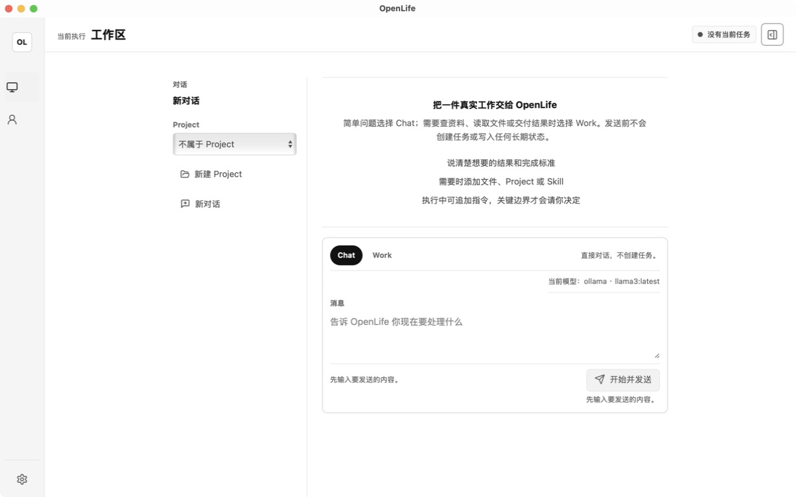

### 信息架构

- 正式首页以“诊断事实、状态说明、空白区域”为主，不以“开始聊天 / 打开文件夹 / 继续最近工作”为主。
- 当前 QA 同时显示顶部“全部活动”、左侧 Conversation、右侧“进度与结果”和 100 条最近工作；同一信息被重复组织，用户很难判断主线。
- Project 管理、对话管理、模型状态、记忆模式、执行模式、附件入口全部挤在 composer 周围，缺少渐进披露。
- Settings 把大量内部传输边界和诊断术语暴露为主要内容。内部事实应该可查，但不应抢占普通用户的首层任务界面。

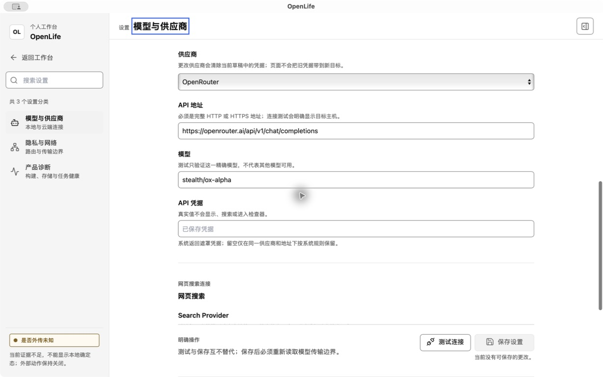

### 视觉与布局

- 1228×768 的常见窗口下，双栏结果布局把 Conversation 区压到最小宽度，Project 操作按钮逐字换行。
- 输入框、状态说明、验证文案相互重叠或拥挤；视觉层级无法稳定表达“主动作、次动作、系统状态、技术详情”。
- 大量小字号、浅灰文字和多层边线造成高认知负担；重要错误与普通说明的对比不足。
- 中英文、产品词和技术词混用，例如 `Project`、`Workbench`、`Work`、`Canonical`、`Provider validation`。
- 图标导航有可访问名称，但在视觉上缺少持续文字标签；初次使用的可发现性不足。

### 交互与恢复

- 正式 Project 创建成功后没有下一步，也没有解释为何仍不可选。
- Work 网络阻断只有重试/技术详情，没有直达“允许网络/切换模型/改用 Chat”的恢复路径。
- 当前文件夹绑定改变了对话上下文，违反用户对“我正在创建新任务”的预期。
- “Work 已验证”由一次错误结果触发，用户无法相信模型兼容性徽标。

### 可访问性边界

本轮 AX 树中可见 headings、buttons、tabs、labels、skip link 和原生选择器等语义，这是积极基础。但本轮不是 WCAG 合规审计，不能从截图或 AX 名称推断键盘顺序、读屏叙事、对比度、缩放和动态通知全部合格。下一阶段必须加入键盘、VoiceOver、200% 缩放、减少动态效果和状态非颜色依赖的正式验收。

## 与一线桌面 Agent 的差距

这里比较的是公开产品契约，不复制品牌样式：

- ChatGPT Desktop 官方 Quickstart 把“开始聊天、创建 Project、打开文件夹”放在同一正常入口，并明确所选文件夹可读写；OpenLife 正式版在最前面的文件夹入口就失败。[ChatGPT Quickstart](https://learn.chatgpt.com/docs/quickstart)
- ChatGPT Desktop 把模型与 reasoning control 放在 composer 下方；OpenLife 当前 HEAD 开始接近这个位置，但仍缺持久化 Provider Profile 和可信兼容性。[ChatGPT Models](https://learn.chatgpt.com/docs/models)
- ChatGPT/Codex 把 workspace/sandbox 与 approval reviewer 分开；OpenLife 的“标准执行”方向正确，但正式网络阻断和本地模型路由互相矛盾。[ChatGPT Permissions](https://learn.chatgpt.com/docs/permission-modes)
- Claude Cowork 公开描述了文件夹范围、任务进度、透明执行、中途 steering、长任务、删除保护和文档/表格/演示文稿交付；OpenLife 目前只有部分后台结构，没有可信的纵向闭环。[Claude Cowork](https://support.claude.com/en/articles/13345190-get-started-with-claude-cowork)
- Cursor Agent 明确提供代码库搜索、多文件编辑、停止、diff review 和 checkpoint restore；OpenLife 的 Project 目前只有单路径 `file.read`，不能支撑同等级文件工作体验。[Cursor Agent](https://prod.cursor.com/help/ai-features/agent) 与 [Cursor Diffs & Review](https://docs.cursor.com/en/agent/review)
- Manus Desktop 公开强调 folder-scoped access 和本地文件读写，Projects 则组织任务与资源；这说明“Project 名称”和“真实文件夹授权”必须是清晰可区分又可组合的产品概念。[Manus Desktop](https://manus.im/docs/features/desktop) 与 [Manus Projects](https://manus.im/docs/features/projects)

## 为什么旧测试没有发现这些问题

1. 多数测试验证结构、状态枚举和局部持久化，而不是从正式安装入口完成用户目标。
2. scripted provider/fixture 能输出完美 JSON，真实小模型会选择错误工具；运行时对“语义是否满足用户目标”的独立约束不足。
3. 浏览器壳和组件测试可以找到按钮，但不能证明 macOS 文件选择器、正式 Profile、签名包和重启后的真实行为。
4. 历史 QA 数据过多，绿灯与失败样本并存；“曾经有一个成功 Artifact”容易掩盖当前首条任务失败。
5. 发布流程没有把 `HEAD -> signed bundle -> installed formal app -> post-launch build identity` 作为一个原子验收。

有限的高保真场景不能穷举所有自然语言。避免漏问题的办法不是无限增加脚本，而是组合三层：

- 12 条纵向旅程覆盖用户目标；
- 状态/边界矩阵覆盖 fresh/returning、local/cloud/offline、empty/large/non-ASCII/unreadable folder、cancel/restart/failure；
- 不变量兜底未知表达：没有所需回执就不能完成、没有明确记忆意图就不能写 Memory、没有读取证据就不能声称读取、没有正式安装证明就不能声称已交付。

## 清理候选

以下是下一阶段的删除候选，不在本审计中直接删除运行时代码：

- 正式应用中的“只创建名称、不绑定目录”的旧 Project 主路径；
- 将全局 Activity、Task 列表、Conversation 和 Results 同时常驻的重复展示；
- 把内部诊断和传输术语放在普通 Settings 首层的页面结构；
- 任何以单云配置冒充多 Profile 的兼容外观；
- 旧 QA Profile 中已归档证据之外的大量开发任务数据；
- 被新纵向切片完全替代后仍残留的旧组件、旧 IPC、兼容 fallback 和样式；
- 旧活动计划 `openlife_foundation_control_loop_plan.md`，由新的产品重建计划替代。

保留边界：正式凭据、用户外部文件、真实 Artifact、必要的 Agent Memory/LifeModel 数据不得因 UI 重建而被无条件删除。开发期迁移保持最小化；旧实现只有在替代链路通过正式原生验收后才删除。

## 审计限制

- 本轮没有输入、复制或暴露正式 Provider 凭据。
- 当前 HEAD QA 复用了现有隔离 QA Profile，因此其历史列表不是“全新用户”证据；本轮新增的 Project、Task、Turn 和 Memory 已用精确 ID 区分。
- 文件夹 fixture 是本轮创建的非敏感临时数据；三个源文件哈希在错误 Work 后保持不变。
- 没有用旧计划、mock、fixture 或历史运行补齐 12 条正式旅程。
- 本轮目标是诊断与规划，没有实现修复。

## 下一步

唯一活动计划见 [`plans/openlife_product_reconstruction_plan.md`](../plans/openlife_product_reconstruction_plan.md)。第一优先级不是美化现有页面，而是：

1. 冻结产品、能力、状态和交互契约；
2. 在 Figma 中完成 12 条旅程和组件系统并经用户确认；
3. 确认后首先让错误语义和缺失证据 fail closed，并建立正式包安装完整性；
4. 再按单个纵向切片实现、原生验收、删除旧链路。
