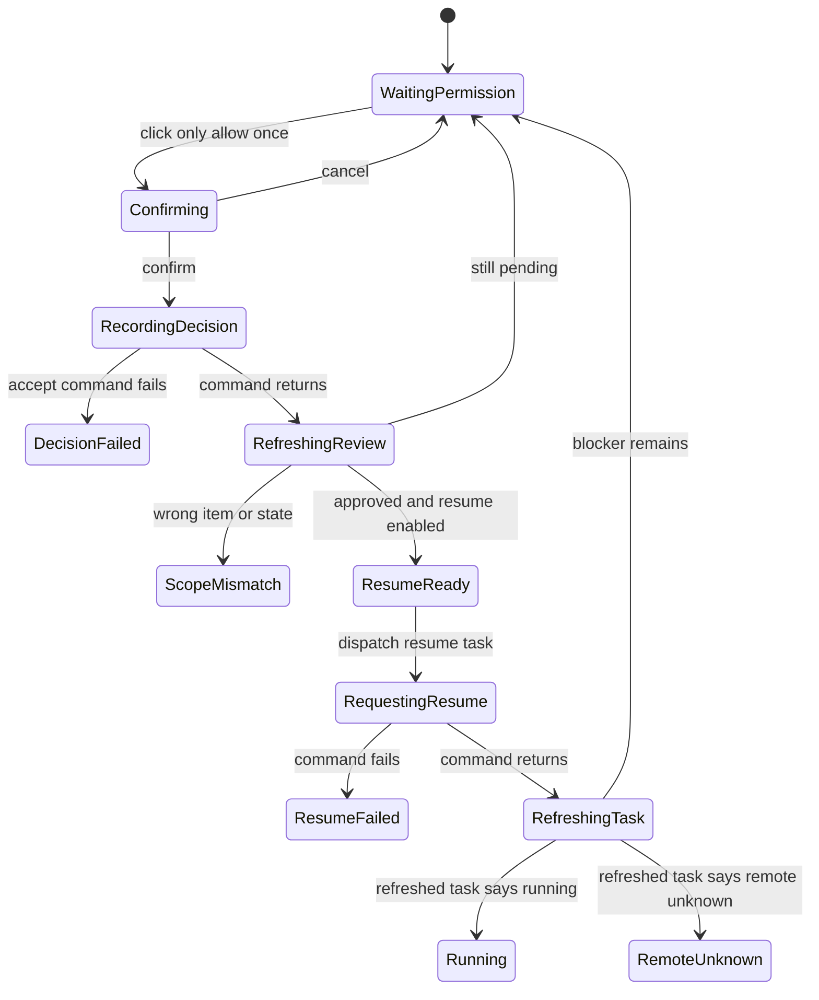

# Critical Flows And State Machines

Status: `REVIEW_CANDIDATE`

## 1. Universal Dispatch Rule

Every state-changing interaction follows one protocol:

```text
render action from backend contract
  -> user invokes action
  -> confirm only when contract requires it
  -> dispatch exact command with target ids
  -> show pending state without claiming outcome
  -> refresh authoritative read model
  -> verify target identity + expected state/evidence
  -> render outcome or remain fail closed
```

A successful IPC promise proves only that the command returned. It does not by
itself prove a durable effect, task completion, provider route, or
materialization.

All dispatch state containers use `role="status"` or an appropriate `aria-live`
region. Buttons remain stable in size while labels change to `正在...`.

## 2. Workspace Task Flow

Workspace owns one current task and uses this hierarchy:

1. objective and current task state;
2. one active blocker or active action;
3. next control;
4. compact timeline;
5. composer and bounded resources;
6. evidence/technical details on demand.

`WorkspaceViewModel` remains limited. The target Workspace UI therefore needs a
composition adapter that preserves backend ownership:

- Workspace references and privacy summary from `WorkspaceViewModel`;
- lifecycle, controls, blocker and terminal evidence from the referenced
  `TasksViewModel` item or current task state;
- imported-resource receipts from the exact turn operation;
- action/observation evidence from the current task transcript;
- review decisions from Review Center references;
- no page-local completion or route inference.

### 2.1 Task State Presentation

| Backend state | Product label | Primary behavior |
|---|---|---|
| `running` | 正在处理 | show active step and Cancel when enabled |
| `waiting_permission` | 等待你的决定 | show exact permission request or a disabled unknown-scope state |
| `blocked` | 当前无法继续 | show blocker and backend-provided recovery action |
| `failed` | 本次处理失败 | show Retry only when enabled |
| `remote_unknown` | 外部结果未知 | do not retry automatically; inspect/reconcile first |
| `cancelled` | 已取消 | show historical result and explicit new-task option |
| `completed_with_pending_review` | 工作已结束，仍有待决定项 | link to Review; do not say fully complete |
| `completed_needs_evidence` | 结果缺少完成依据 | fail closed; evidence/retry only |
| `completed` + final evidence | 已完成 | show result and evidence |
| `unknown` | 状态未知 | disable mutating controls and refresh/inspect |

## 3. Action-Bound Permission And Resume

The current backend can mint an exact, one-time permission. The product can use
the label `仅允许本次并继续` only when a future/readable projection supplies:

- proposal/review item id;
- task session id and blocked queue action id;
- tool name and source;
- risk and action type;
- capability list;
- requested and resolved target summary;
- blocked run id and step index;
- input digest and byte length;
- route/transmission boundary relevant to this action;
- policy `allow_once` and scope kind `action_bound`;
- confirmation requirement;
- task resume relation.

The product surface shows a plain-language subset. Inspector keeps exact ids and
digests.

### 3.1 Known Exact Scope



UI sequence:

1. Confirmation names the exact action: tool, target, purpose, one-time scope,
   relevant transmission boundary, and what will happen after approval.
2. `accept_proposal` records the decision and exact grant.
3. Refresh Review Center/Tasks; verify the same review item is approved and the
   same task exposes an enabled resume control.
4. Dispatch `resume_main_chat_agent_task` with the exact task id.
5. Refresh the task again and render the returned lifecycle state.

The UI must not call approval and resume concurrently. It must not navigate to a
running fixture as a substitute for steps 2-5.

### 3.2 Unknown Or Incomplete Scope

If any required field is missing, incoherent, stale, or belongs to another
task/action:

- `仅允许本次并继续` is disabled;
- the reason is adjacent and announced;
- `查看访问范围` remains available if there is evidence;
- `拒绝` or `稍后处理` follows the actual Review actions;
- the task stays waiting;
- no broad permission is inferred from tool name, folder label, or earlier
  grant.

## 4. Review Decision Flow

Opening an item is navigation/evidence only. It does not change status.

Pending detail order:

1. one-sentence proposed change;
2. current -> proposed diff;
3. reason and evidence source;
4. risk and affected object;
5. expiry;
6. decision bar: 拒绝 / 稍后处理 / 修改 / 批准变更.

The current `ReviewItem` supports type, source, status, materialization status,
allowed actions, risk, expiry, evidence refs, target refs, and task resume
relation. It does not support the rich detail above. `AgentProposal` contains
much of it, but React must not join raw proposals to ReviewItems page-locally.
A backend `ReviewDecisionContext` projection is a Phase 4 contract prerequisite.

### 4.1 Decision States

```text
pending
  -> rejecting -> rejected
  -> postponing -> postponed
  -> editing -> pending_edited
  -> approving -> approved_not_applied

approved_not_applied
  -> applying -> applied | failed | unknown
  -> no apply command -> remain approved_not_applied

applied
  -> rollback_available | final
```

Rules:

- Edit persists only through an actual edit action and returns to pending; the
  static prototype visibly marks this as fixture feedback.
- Approve requires confirmation when `requiresConfirmation` is true.
- The next screen after approval is `已批准，尚未应用`, never `已完成`.
- `应用变更` is enabled only when the backend ReviewAction enables an Apply
  materialization request.
- After Apply, only refreshed `materializationStatus=applied` plus the required
  LifeModel/memory/artifact evidence may show completion.
- A Review batch groups items only; it never exposes batch approval.

## 5. Resource Import And Citation Flow

```text
idle
  -> native_picker_open
  -> cancelled | importing
  -> committed | import_failed | import_cancelled
  -> attached_to_turn
  -> selected_for_context | not_selected
  -> cited_in_validated_result | citation_validation_failed
  -> detached
```

Required UI behavior:

- The plus/attachment button opens the native picker only in the real Tauri
  app; browser-only fallback is unavailable rather than a fake success.
- During import, show filename, type, progress class, and Cancel. Do not expose
  filesystem paths returned by the native picker.
- On committed receipt, show byte/chunk metadata only in Inspector; the product
  chip shows filename and readiness.
- User can detach before send. The chip disappears only after a detach receipt
  confirms `bindingRemoved`.
- After send, show which resources were selected and which backend-issued
  citations support the result.
- Missing/forged citation validation becomes an error/blocker, never a normal
  answer with an unverified source badge.

## 6. Web Search And Evidence Flow

The Web action is a governed task action, not a browser tab built into the
product.

```text
planned -> waiting_permission? -> running -> observation_ready
  -> provider_synthesis -> citation_validated -> completed
  -> challenge/transport/provider/citation failure -> failed_closed
```

Product timeline shows:

- `正在检索公开网页`;
- query summary if safe to display;
- selected result count and source domains;
- one result/evidence expansion;
- final answer citations.

Inspector shows provider/adapter, exact HTTPS URLs, request/action refs,
untrusted-data warning, and receipt status. It does not claim the remote
provider's internal number of searches.

## 7. Reviewed Artifact Flow

```text
draft_generated
  -> proposal_pending
  -> rejected | postponed | edited_pending | approved
  -> materializing
  -> confirmed | failed | unknown
```

- Draft generation never equals file creation.
- Before approval, show filename/target/diff and “尚未写入”.
- Approval is the decision, not the filesystem effect.
- Confirmed requires the backend effect receipt/reconciliation result.
- Unknown after interruption stays unknown; never blind redispatch.
- A later artifact library requires its own read model and is outside Phase 3F.

## 8. Provider Configuration And Connection Test

### 8.1 Edit And Save

1. Editing provider/model/endpoint marks the form dirty and the boundary
   `待后端重新确认`.
2. Save dispatches the whole typed config through `save_config`.
3. While saving, controls are disabled but readable.
4. Command return becomes `设置已保存，正在重新确认边界`.
5. Refresh `ProviderPrivacyBoundarySummary`.
6. Render only the refreshed route/transmission/risk result.

### 8.2 Test Connection

1. Validate required provider, endpoint/model and credential presence locally
   without inventing network authority.
2. Show confirmation when an external request may occur.
3. Dispatch `test_llm_connection` using the draft config.
4. Render `ok`, `validationStatus`, consent/review ids, network decision ids,
   and provider receipt as a result ledger.
5. If a review proposal is returned, navigate to that pending decision only
   after the user chooses to view it.
6. Never auto-save after a successful test.

Test result labels:

| Result | Label |
|---|---|
| success with receipt | 本次连接验证成功 |
| missing credential | 缺少凭据，尚未发起连接 |
| policy blocked | 网络策略已阻止测试 |
| needs review | 需要先确认本次外部连接 |
| runtime incoherent | 当前运行配置不一致，已保护性关闭 |
| remote unknown | 外部结果未知，请先查看依据 |

## 9. Stale, Error, And Remote-Unknown Recovery

- Stale keeps last reliable data visibly dated and disables mutating actions.
- Error shows the error boundary and backend-provided recovery action.
- Unknown shows no green state and no inferred default.
- Remote unknown never auto-retries an external action because the remote side
  may have completed.
- Refresh is a real action with loading/failure/success feedback; it never
  directly swaps to a ready fixture in production.
- Safe mode is amber/neutral protection. Red is reserved for the concrete
  failed action or data-integrity error.

## 10. Static Prototype Contract

The Phase 3F prototype executes no backend command. It may demonstrate the
state machines with deterministic fixture transitions only if:

- the QA toolbar remains visible;
- every transition announces `静态演示`;
- resulting state is never described as backend evidence;
- unknown-scope scenarios remain disabled;
- every enabled control produces visible, testable feedback;
- technical ids are plausible schema examples, not copied production state.
