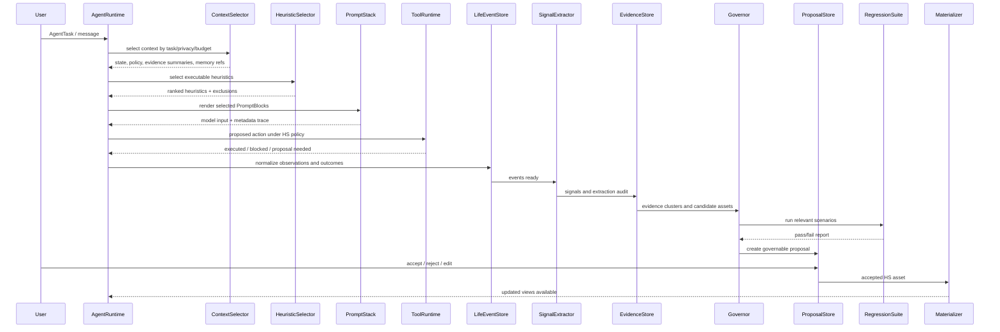

# OpenLife LifeModel-HS Architecture Plan

Date: 2026-05-27
Status: design-only architecture plan
Scope: next-generation OpenLife LifeModel as a local-first, user-governed Personal Heuristic System

This plan has been superseded as an implementation entry by `plans/adr/0013-lifemodel-hs-source-of-truth-governance.md` and `plans/lifemodel_hs_mvp_task_specs.md`. It remains the design baseline and does not itself require or include production code changes, migrations, runtime changes, or feature implementation.

## 1. Executive Design

LifeModel-HS turns the current LifeModel from a mostly materialized user profile into a user-owned Personal Heuristic System.

The target LifeModel is not one YAML file and not a natural-language profile. It is a small set of durable, typed stores and runtime selectors:

- Raw Life Data stays in source systems such as chat, memory, calendar, files, tool traces, feedback, and AgentRunEvent.
- Heuristic Learning converts raw data into normalized Life Events, Signals, Evidence, Candidate Heuristics, Candidate State Patches, and governable Proposals.
- Accepted HS assets live in dedicated stores: EvidenceStore, HeuristicStore, StateStore, PolicyStore, RegressionSuite, and AuditLog.
- Materialized views render selected accepted assets into formats needed by current OpenLife surfaces, including the current LifeModel YAML, PromptStack blocks, UI summaries, and runtime context packets.
- AgentRuntime never receives "the whole LifeModel by default." It asks ContextSelector and HeuristicSelector for field-level, task-level, privacy-aware context.
- No high-risk identity, values, long-term goal, or privacy boundary is silently rewritten. HL can propose; the user governs.

The core shift is:

```text
Current:
LifeModel YAML -> broad PromptStack injection -> Agent output -> Proposal -> LifeModel patch

Target:
Raw Life Data -> Life Event -> Signal -> Evidence -> Candidate Heuristic/State Patch
-> Governance -> Regression -> Accepted HS Asset -> Materialized LifeModel View
-> Context/Heuristic selection -> AgentRuntime behavior
```

## 2. Evidence Reviewed

Current facts in this plan are based on the following project files:

- `AGENTS.md`: current stage, architecture primitives, governance rules, runtime boundaries.
- `README.md`: product definition, current beta state, next LifeModel stage direction.
- `plans/openlife_remaining_tasks_plan.md`: current remaining-task context and LifeModel Evolution entry point.
- `plans/openlife_agent_framework_architecture.md`: AgentRun, ContextAssembler, ModelRouter, ActionExecutor, ProposalStore, Memory, and LifeModel boundaries.
- `openlife-core/src/life_model.rs`: current LifeModel schema, YAML-oriented state, validation, patch application.
- `openlife-core/src/memory.rs`: current MemoryStore tables for messages, memories, snapshots, chat sessions, and state history.
- `openlife-core/src/vectors.rs`: current VectorStore chunk, tier, archive, and retrieval maintenance model.
- `openlife-core/src/agent/proposal_engine.rs` and `openlife-core/src/agent/proposal_generators/chat.rs`: current proposal generation and chat/memory signal extraction helpers.
- `openlife-core/src/agent/proposal_engine.rs`: current proposal generators and proposal creation from runs.
- `openlife-core/src/agent/proposal_generators/chat.rs`: current PromptStack-governed chat proposal extraction with heuristic fallback.
- `openlife-core/src/agent/context_assembler.rs`: current category-level context assembly and ContextPolicy.
- `openlife-core/src/agent/context_assembler.rs`, `openlife-core/src/agent/runtime.rs`, and `openlife-core/src/agent/agent_loop.rs`: current context assembly, prompt construction, privacy classification, and run trace path.
- `src-tauri/src/lib.rs`: current chat preprocessing, privacy redaction, memory retrieval, ContextAssembler V2 usage, persistence, vector memory persistence, and chat proposal generation timeout.
- `src-tauri/src/commands/proposal.rs`: current Proposal apply path, patch store interaction, memory write/archive, tool permission, and replay closure.

Terminology note: this design sometimes uses `PromptStack`, `ToolRuntime`,
`AgentRunEvent`, and `AgentSpec` as target architecture concepts. In the
current codebase, the closest concrete implementation is distributed across
`ContextAssembler`, `AgentRuntime`, `AgentLoop`, `ActionExecutor`,
`tool_permissions`, `AgentRun`, and `agent::store`.
- `src-tauri/src/commands/calibration.rs`: current calibration proposal-first path and legacy-gated direct apply path.

## 3. Current Fact vs Target Design

| Area | Current Fact | Target Design |
| --- | --- | --- |
| LifeModel source of truth | `LifeModel` is a Rust struct serialized to YAML with identity, goals, capabilities, state, relationships, preferences, and `evolution_rules`. | Accepted HS assets become source of truth; YAML becomes a materialized compatibility view. |
| Runtime injection | PromptStack can inject full YAML, state hint, evolution hint, or summary. ContextPolicy is category-level. | ContextSelector and HeuristicSelector select specific state fields, heuristics, evidence summaries, and policies by task, risk, privacy, and token budget. |
| Memory | MemoryStore persists messages/memories/snapshots/state history. VectorStore retrieves chunks and supports tier/archive maintenance. | Memory remains raw/retrieval layer. EvidenceStore is a separate curated layer with provenance, negative evidence, confidence, conflict, decay, and governance status. |
| Evidence | Current chat/memory proposal extraction can produce candidate updates, but there is no full persisted evidence graph. | EvidenceStore is first-class, append-only, queryable, conflict-aware, and linked to events, signals, proposals, heuristics, regressions, and materialized views. |
| Signal extraction | Chat proposal extraction uses local LLM with PromptStack and fallback heuristics. It can generate goal, state, capability, and memory proposals. | SignalExtractor emits typed Signals with extraction method, confidence, uncertainty, negative cues, and audit. Candidate generation cannot directly mutate HS. |
| Governance | Proposal-first path exists for LifeModel, MemoryWrite, MemoryArchive, ToolPermission, external writes, scheduled tasks, data exports. | LifeModelGovernor governs candidate HS assets with risk policy, evidence thresholds, regression results, conflict checks, batching, and user review fatigue controls. |
| Patches | LifeModel patch/risk/snapshot paths exist. | Patches remain the apply mechanism for materialized views, but accepted HS assets are canonical. PatchStore records view materialization and compatibility mutations. |
| Runtime traces | AgentRunEvent is append-only and metadata-redacted for runtime transitions. | HL and HS maintenance also emit metadata-safe events or a parallel HS audit log linked to AgentRunEvent IDs. |
| Legacy evolution | Calibration is proposal-first by default but `run_micro_evolution` can still directly apply if result says applied; legacy direct calibration exists behind config. | All LifeModel-HS mutations converge to Proposal-first. Direct apply is removed or isolated as dev/test legacy compatibility, never product path. |
| Regression | No durable LifeModel regression suite exists for preferences/heuristics. | RegressionSuite stores user-approved scenarios and runs them before accepting or promoting impactful heuristics. |
| Compression | VectorStore has tier/archive; LifeModel has no HS compression. | CompressionEngine merges duplicate heuristics, weakens stale rules, archives low-value assets, and materializes concise views. |

## 4. Problem Response Matrix

| Current Problem | Design Response | Residual Risk | New Complexity |
| --- | --- | --- | --- |
| LifeModel behaves like a static profile/YAML snapshot. | HS canonical stores separate raw data, evidence, state, policy, heuristics, regression, and materialized views. | Early MVP may still render through YAML. | More stores and migrations to maintain. |
| LifeModel is mainly injected through PromptStack and consumed by the Agent. | ContextSelector and HeuristicSelector become runtime gateways before PromptStack assembly and tool execution. | Selector quality determines runtime usefulness. | Requires task classification and selection audits. |
| Agent runs produce Proposals after execution, indirectly updating LifeModel. | HL runs during After Observe and Reflect, producing evidence-backed candidate assets before Proposal. | Long-running asynchronous HL can lag behind user expectations. | Needs job orchestration and status UI. |
| Memory is mostly retrieval context, not complete evidence. | EvidenceStore promotes only normalized, provenance-linked claims from memory/events. | Some raw memories may never become evidence. | Requires evidence schema, scoring, and review. |
| Signal extraction has false positives, false negatives, and corruption risk. | Signals carry method, confidence, uncertainty, negative cues, source spans, and audit; low confidence does not become evidence. | LLM and heuristics still miss subtle signals. | More metadata per extraction. |
| No executable heuristics, evidence chains, regression tests, compression, forgetting, conflict detection. | Heuristic schema includes triggers, conditions, guidance, risk, evidence, opposing evidence, lifecycle, and validation state; RegressionSuite, CompressionEngine, MaintenanceEngine are first-class. | MVP cannot solve all maintenance quality issues immediately. | Heuristic lifecycle must be kept small and understandable. |
| Injection is broad-category, not field/task-level. | Selectors choose exact heuristics/state/policies by task kind, risk, privacy, and budget. | Over-selection or under-selection remains possible. | Requires selector diagnostics. |
| YAML snapshot is not suitable as long-term source of truth. | YAML is demoted to Materialized LifeModel View. | Existing code still consumes YAML until migration finishes. | Dual-write or materialization consistency risk. |
| Legacy micro-evolution/direct-apply paths coexist. | Migration converges all HS updates through LifeModelGovernor and ProposalStore. | Some dev/test flags may linger. | Needs source audits and deprecation gates. |
| Rule bloat, stale-memory pollution, short-term state contamination, confirmation fatigue, prompt pollution. | Evidence thresholds, time decay, state-vs-identity boundaries, proposal batching, selector token budgets, compression, and negative evidence reduce these risks. | User-specific behavior can still be overfit. | Maintenance jobs become product-critical. |

## 5. Non-Negotiable Invariants

1. Raw Life Data never directly mutates LifeModel-HS.
2. HL may generate candidates; only governed acceptance creates accepted HS assets.
3. High-risk identity, values, mission, long-term goals, relationships, and privacy boundaries require explicit user confirmation.
4. Rejected proposals become negative evidence, not discarded noise.
5. Runtime context is selected by task and policy; broad full-block injection is compatibility-only.
6. Cloud model paths must receive only policy-approved materialized summaries.
7. Every accepted heuristic must be explainable through evidence and audit lineage.
8. Every impactful heuristic must be regression-aware before promotion.
9. Compression and forgetting are not cleanup extras; they are part of correctness.
10. The UI must let the user inspect, edit, reject, roll back, archive, and understand HS assets.

## 6. Core Concept Definitions

| Concept | Definition and Boundary | Inputs | Outputs | Lifecycle and Ownership | Relationship to Existing OpenLife |
| --- | --- | --- | --- | --- | --- |
| LifeModel | The user-owned Personal Heuristic System: accepted state, policy, evidence, heuristics, regression, maintenance rules, and materialized views. Not just YAML, profile text, or prompt content. | Accepted HS assets, materialization policy, user edits, accepted proposals. | Materialized YAML, PromptStack blocks, UI summaries, runtime context packets, selector results. | Owned by user; maintained by LifeModelGovernor and MaintenanceEngine; versioned, auditable, rollbackable. | Current `LifeModel` struct becomes a materialized view and compatibility schema. |
| Raw Life Data | Original records from conversations, files, tool results, calendars, feedback, state records, plans, AgentRunEvents, and external sources. Raw data is not trusted as model truth. | Chat messages, memories, vector chunks, tool outputs, run events, feedback, user uploads. | Normalization input only. | Owned by user; source-specific retention and privacy controls. | Current MemoryStore, VectorStore, AgentRunEvent, feedback, files, and state_history are raw sources. |
| Life Event | A normalized, immutable event describing something that happened in the user's life or agent interaction. | Raw records plus source metadata. | Typed event with source refs, time, actor, privacy, payload digest, redacted summary. | Append-only; can be superseded but not mutated. | Extends AgentRunEvent idea into life-domain events without replacing AgentRunEvent. |
| Signal | A possible meaningful pattern extracted from one or more Life Events. Signal is weaker than Evidence. | Life Events, source spans, extractor prompts/rules, model outputs. | Typed signal with confidence, uncertainty, polarity, affected domain, and extraction audit. | Created by SignalExtractor; promoted, weakened, or discarded. | Current chat and memory proposal extraction become Signal-producing steps. |
| Evidence | A supported claim about the user, with source lineage, confidence, recency, negative evidence, and conflict links. Evidence is stronger than Signal but still not a heuristic by itself. | Signals, user confirmations, accepted/rejected proposals, run outcomes, repeated observations. | Evidence record used by candidate generation, selectors, explanations, and regression. | Append-only versions; confidence decays; can be opposed, archived, or superseded. | Current proposal extraction outputs are seed signals, not yet persisted evidence. |
| Heuristic | An executable guidance unit for the Agent: scope, trigger, condition, guidance, priority, confidence, risk, evidence links, opposing evidence, and lifecycle state. | Evidence clusters, user-authored rules, accepted proposals, regression outcomes. | Runtime guidance, policy constraints, selector candidates, prompt blocks or tool constraints. | Draft -> proposed -> accepted -> active -> trial -> deprecated/archived; user governs high-risk changes. | Replaces freeform `evolution_rules` as typed, governable, executable assets. |
| State | Time-sensitive representation of current or recent user condition, focus, energy, health, mood, obligations, and transient context. Not identity. | State events, check-ins, feedback, tool observations, user edits. | State assets and materialized current-state views. | Short TTL by default; must not promote to identity without repeated evidence and confirmation. | Current `state` fields and `state_history` become materialized and raw layers. |
| Policy | Rules that govern privacy, model routing, context selection, tool behavior, confirmation, retention, and HS maintenance. | User settings, accepted policy proposals, risk classifier, defaults. | Runtime decisions, selector constraints, proposal requirements, audit reasons. | Versioned and user-visible; privacy policies require explicit confirmation. | Builds on PrivacyPolicy, ContextPolicy, ToolRuntime, risk classifier, network policy. |
| Proposal | A governable change request for HS assets, materialized views, memory, tools, or external actions. Proposal is the only product path for risky mutation. | Candidate heuristic/state/policy patches, user edits, tool permission requests, memory writes. | Pending/accepted/rejected/edited/postponed decision and optional apply result. | Created by Governor or tools; resolved by user or allowed policy; rejection creates negative evidence. | Current AgentProposal and ProposalStore remain core. |
| Regression Scenario | A stable test case describing how accepted HS behavior should respond in a future run. | User-approved examples, rejected bad behaviors, accepted proposals, privacy incidents. | Pass/fail results for candidates, selectors, materialized views, and prompts. | Created from important decisions; versioned; run before promotion and during maintenance. | New layer that complements existing unit tests and AgentRun replay. |
| Compression | Maintenance process that merges, summarizes, weakens, archives, or forgets HS assets without losing provenance or rollback. | Heuristic clusters, stale evidence, low-use rules, conflicts, negative evidence. | Compressed heuristics, archived records, materialized summaries, deletion proposals. | Scheduled or user-triggered; high-risk compression requires review. | Builds on VectorStore tier/archive but applies to HS assets. |
| Materialized View | A derived representation of accepted HS assets for a specific consumer. It is not canonical truth. | Accepted assets plus render policy. | YAML LifeModel, prompt blocks, UI cards, route policies, context packets. | Rebuilt deterministically; cached with version and source asset IDs. | Current LifeModel YAML becomes `view:lifemodel_yaml@compat`. |
| Personal Heuristic System | The full softwareized system that organizes user-owned heuristics, state, policy, evidence, regression, selectors, materialization, and maintenance. | All accepted HS stores and governance rules. | Better Agent behavior, explanations, stable personal continuity, safer updates. | Long-lived; user-owned; AI-maintainable via schemas and audit. | Becomes the next-generation LifeModel architecture. |

## 7. System Boundary

LifeModel-HS is:

- A local-first asset system for personal heuristics, state, evidence, policy, regression, materialized views, and maintenance.
- A runtime decision layer that improves Agent behavior before, during, and after ReAct.
- A governance system that makes learning explainable, reviewable, reversible, and user-owned.
- A maintenance system designed to resist memory corruption, rule bloat, prompt pollution, and stale identity.

LifeModel-HS is not:

- A single YAML file.
- A vector database.
- A prompt template.
- A general autonomous self-modifying user identity.
- A hidden personalization cache.
- A replacement for the LLM, AgentRuntime, MemoryStore, ProposalStore, ToolRuntime, or PrivacyEngine.

| Neighbor | Relationship |
| --- | --- |
| LLM | LLM may extract signals, summarize evidence, propose candidates, explain conflicts, or run regression simulations. It never owns truth and never silently writes accepted HS assets. |
| AgentRuntime | Runtime queries selectors for relevant heuristics/state/policy. Runtime also emits observations and outcomes back into Life Events. |
| ReAct | HS participates in Reason, Act, Observe, Reflect, Proposal, and Replay. It constrains action intensity, tool choice, privacy route, and explanation style. |
| Memory | Memory is raw/retrieval data. EvidenceStore is curated claim data. Memory can support Evidence, but memory is not Evidence by default. |
| PromptStack | PromptStack renders selected HS assets into model-facing blocks. It should receive selected, versioned, policy-scoped blocks, not broad YAML by default. |
| Proposal | Proposal is the governance gate for HS mutation. Accepted proposals create or update HS assets and materialized views. Rejections become negative evidence. |
| Patch | Patch applies materialized view changes and compatibility LifeModel mutations. Patch does not bypass HS canonical stores. |
| ToolRuntime | HS policies constrain tool availability, confirmation thresholds, action intensity, and replay. Tool observations feed Life Events. |
| Privacy | Privacy policy gates extraction, storage, model route, context selection, materialized views, audit payloads, and retention. |
| UI | UI is the user's governance cockpit: review candidates, inspect evidence, edit heuristics, resolve conflicts, run regressions, rollback, archive, and tune proposal frequency. |

## 8. Data Topology

The target topology uses a small set of typed stores. SQLite is the natural first implementation because the existing app already uses local SQLite for memory, vectors, proposals, patches, events, and stores.

```text
Raw sources:
  MemoryStore, VectorStore, AgentRunEventStore, FeedbackStore, Calendar/File/Tool traces

HL normalization:
  LifeEventStore -> SignalStore -> EvidenceStore

HS canonical assets:
  HeuristicStore
  StateStore
  PolicyStore
  RegressionSuite
  HS AuditLog

Governance:
  LifeModelGovernor -> ProposalStore -> PatchStore/ViewMaterializer

Runtime:
  ContextSelector + HeuristicSelector -> PromptStack / ToolRuntime / ModelRouter / UI

Materialized views:
  LifeModel YAML compatibility view
  PromptStack HS blocks
  UI summary views
  model-routing policy view
```

## 9. Data Model Direction

These schemas are design contracts, not code requirements for this turn.

### 9.1 LifeEvent

```yaml
LifeEvent:
  id: event_*
  source_type: chat_message | agent_run_event | tool_result | feedback | calendar | file | state_checkin | user_edit
  source_id: string
  source_span:
    start: optional_integer
    end: optional_integer
  occurred_at: rfc3339
  recorded_at: rfc3339
  actor: user | agent | tool | system | external
  privacy_level: public | internal | sensitive | strictly_local
  event_type: preference_expression | goal_mention | state_checkin | rejection | tool_outcome | plan_outcome | relationship_update | custom
  payload_ref: raw pointer or encrypted blob ref
  payload_digest: sha256
  redacted_summary: string
  tags: [string]
  audit:
    normalized_by: deterministic | llm | user
    normalizer_version: string
```

### 9.2 Signal

```yaml
Signal:
  id: signal_*
  event_ids: [event_*]
  signal_type: preference | goal | state | capability | privacy | action_constraint | anti_pattern | relationship | contradiction
  claim_candidate: string
  affected_domain: identity | goals | capabilities | state | preferences | relationships | policy | runtime_behavior
  polarity: supporting | opposing | ambiguous
  confidence: 0.0-1.0
  uncertainty_reasons: [string]
  extraction_method: deterministic_rule | local_llm | cloud_summary_llm | user_marked | runtime_outcome
  extractor_version: string
  created_at: rfc3339
  expires_at: optional_rfc3339
  audit_id: audit_*
```

### 9.3 Evidence

```yaml
Evidence:
  id: evidence_*
  signal_ids: [signal_*]
  event_ids: [event_*]
  evidence_type: repeated_preference | recurring_goal | capability_signal | state_trend | contradiction | relationship_update | value_signal | proposal_rejection | runtime_outcome
  claim: string
  affected_path: string
  support_count: integer
  opposing_evidence_ids: [evidence_*]
  confidence: 0.0-1.0
  recency_score: 0.0-1.0
  stability: transient | recurring | durable
  risk: low | medium | high | critical
  privacy_level: public | internal | sensitive | strictly_local
  source_summary: string
  status: active | weakened | contradicted | archived | deleted_by_user
  created_at: rfc3339
  last_seen_at: rfc3339
  decay_policy_id: policy_*
```

### 9.4 StateAsset

```yaml
StateAsset:
  id: state_*
  path: state.current_focus | state.energy | state.emotional_state | custom
  value: json
  confidence: 0.0-1.0
  evidence_ids: [evidence_*]
  ttl: duration
  valid_from: rfc3339
  valid_until: optional_rfc3339
  promotion_guard:
    can_promote_to_preference: boolean
    required_evidence_count: integer
    requires_user_confirmation: boolean
  status: active | expired | archived
```

### 9.5 PolicyAsset

```yaml
PolicyAsset:
  id: policy_*
  policy_type: privacy | model_route | context_selection | tool_permission | confirmation | retention | compression
  scope: global | task_kind | domain | tool | path
  rule: structured_json
  priority: integer
  risk: low | medium | high | critical
  evidence_ids: [evidence_*]
  user_confirmed: boolean
  status: active | draft | deprecated | archived
  created_at: rfc3339
  updated_at: rfc3339
```

### 9.6 RegressionScenario

```yaml
RegressionScenario:
  id: reg_*
  title: string
  task_kind: conversation | planning | tool_use | proactive | scheduled | replay
  input_summary: string
  synthetic_input: optional_string
  required_context_assets: [heuristic_* | state_* | policy_*]
  forbidden_context_assets: [heuristic_* | state_* | policy_*]
  expected_behavior:
    must: [string]
    must_not: [string]
    preferred: [string]
  privacy_policy: local_only | summary_only | cloud_allowed
  risk: low | medium | high | critical
  created_from: proposal_* | user | incident | accepted_run | rejected_run
  status: active | archived
  last_result:
    passed: boolean
    run_id: optional_string
    checked_at: rfc3339
```

### 9.7 MaterializedView

```yaml
MaterializedView:
  id: view_*
  view_type: lifemodel_yaml | prompt_block | ui_summary | context_packet | policy_export
  consumer: PromptStack | UI | AgentRuntime | ModelRouter | compatibility
  source_asset_ids: [string]
  render_policy_id: policy_*
  content_digest: sha256
  content_ref: local blob or inline compact string
  created_at: rfc3339
  expires_at: optional_rfc3339
```

## 10. HL Engineering Pipeline

```text
Raw Life Data
-> Life Event
-> Signal
-> Evidence
-> Candidate Heuristic / State Patch
-> Governance
-> Regression
-> Accepted HS Asset
-> Materialized LifeModel View
```

| Step | Input | Output | Responsibility | LLM Use | User Confirmation | Failure Modes | Audit Records | Wrong-Learning Defense |
| --- | --- | --- | --- | --- | --- | --- | --- | --- |
| Raw Life Data | Messages, memories, tool results, files, feedback, AgentRunEvents. | Source refs and digests. | Preserve original data under privacy/retention policy. | No. | Source-dependent. | Missing source, duplicate, privacy leak, corrupt payload. | Source id, digest, privacy level, retention policy. | Raw data is never model truth and never directly mutates HS. |
| Life Event | Raw source refs. | Normalized event. | Create stable typed event with actor, time, redacted summary, source link. | Optional for summarization only. | No unless source was manual. | Bad normalization, lost context, over-redaction. | Normalizer version, source refs, payload digest. | Keep source pointer and digest; allow re-normalization. |
| Signal | Life Events. | Weak typed claim candidate. | Extract possible preference, state, goal, capability, privacy, anti-pattern, contradiction, outcome. | Optional local LLM plus deterministic rules. | No. | False positive, false negative, model parse failure. | Extractor version, prompt block trace, method, confidence, uncertainty. | Low confidence cannot promote; ambiguous signals stay ambiguous. |
| Evidence | Signals and confirmations/rejections. | Supported claim with provenance. | Cluster signals, score support/opposition, classify risk/path/stability. | Optional summarization and clustering. | No for low-level evidence; user can inspect/delete. | Weak evidence promoted, opposing evidence missed, stale claim. | Evidence ids, source signals, scoring version, conflict links. | Minimum support thresholds, negative evidence, decay, conflict detection. |
| Candidate Heuristic / State Patch | Evidence clusters, current HS, user-authored intent. | Draft heuristic or state/policy patch. | Generate executable guidance or current-state update. | Optional; structured generation preferred. | Not yet accepted. | Over-broad rule, identity contamination, duplicate rule. | Candidate generator version, evidence ids, affected scope. | Candidate status is draft; risk classifier and duplicate search gate it. |
| Governance | Candidate, risk, evidence, current HS. | Proposal or rejection/merge/archive recommendation. | Apply risk policy, evidence thresholds, conflict checks, batching, user fatigue policy. | Optional explanation. | Yes for high/medium risk; low-risk may be batched or user-configured. | Proposal spam, unclear diff, hidden risk. | Proposal payload, reason, before/after, evidence summary. | Proposal-first; high risk explicit; rejection becomes negative evidence. |
| Regression | Candidate proposal, RegressionSuite, selector simulation. | Regression pass/fail report. | Check candidate does not break known user preferences/privacy. | Optional evaluator, but deterministic checks preferred. | User may override with warning. | Flaky LLM judgment, incomplete scenarios. | Scenario ids, input summaries, expected checks, result. | High-risk candidates cannot promote without regression or explicit override. |
| Accepted HS Asset | Accepted proposal and regression report. | Active heuristic/state/policy/evidence update. | Commit canonical asset, update audit, link proposal. | No. | Already confirmed. | Partial commit, stale materialized view. | Accepted asset event, proposal id, patch id, view version. | Transactional local write; rollback snapshot. |
| Materialized LifeModel View | Accepted assets and render policy. | YAML, prompt block, UI view, context packet. | Render deterministic consumer-specific view. | No for canonical rendering. | No, unless view exposes sensitive new asset. | Prompt pollution, stale cache, wrong privacy route. | View source asset ids, digest, render policy. | Views are rebuildable; selectors limit content and token budget. |

## 11. HS Internal Architecture

| Module | Responsibility | Data Structures | Current Relationship | Implementation Direction | Risks |
| --- | --- | --- | --- | --- | --- |
| LifeEventStore | Persist normalized immutable life events from raw sources. | `LifeEvent`, source refs, privacy metadata, digest. | Extends AgentRunEvent and MemoryStore without merging them. | SQLite table plus source adapters for chat, memory, tool, feedback, calibration, user edits. | Event duplication, privacy payload mistakes. |
| SignalExtractor | Convert Life Events into weak Signals. | `Signal`, extractor audit, confidence, uncertainty. | Generalizes current chat and memory proposal extraction. | Start with deterministic + existing extraction helpers; output Signals instead of directly creating accepted facts. | False positives/negatives; extractor drift. |
| EvidenceStore | Store curated supported claims and opposition. | `Evidence`, conflict links, confidence, recency, status. | Turns proposal extraction outputs and run outcomes into a persisted graph. | SQLite with indexes by affected_path, evidence_type, status, risk, privacy. | Evidence bloat and stale claims. |
| HeuristicStore | Store executable personal heuristics. | `Heuristic` schema below, lifecycle, examples, validation. | Replaces freeform `evolution_rules` as canonical asset. | SQLite plus JSON columns for trigger/condition/guidance; deterministic materialization. | Rule bloat, overfitting, conflicts. |
| StateStore | Store current and historical state assets separately from identity. | `StateAsset`, TTL, promotion guard, evidence links. | Builds on `state` and `state_history`. | Keep transient state separate; materialize into current LifeModel YAML state. | Short-term contamination of long-term identity. |
| PolicyStore | Store privacy, route, context, confirmation, retention, and maintenance policies. | `PolicyAsset`. | Builds on PrivacyPolicy, ContextPolicy, ToolRuntime policy, risk classifier. | Start with read-only default policies and proposal-backed user changes. | Hidden policy complexity. |
| LifeModelGovernor | Main governance orchestrator for candidate HS changes. | Candidate, Proposal, risk decision, evidence summary, regression report. | Builds on ProposalEngine, ProposalStore, risk classifier, PatchStore. | New service that creates Proposals; never direct writes. | Proposal fatigue; accidental bypass. |
| HeuristicSelector | Select active heuristics for a task. | Query: task, intent, risk, privacy, context budget; Output: ranked heuristics. | New layer before PromptStack/AgentRuntime. | Deterministic filter + scoring; later semantic retrieval over heuristic text. | Missing critical heuristic; selecting too many. |
| ContextSelector | Select state, evidence summaries, materialized fields, and memories. | Context packet with included/excluded/audit. | Replaces broad ContextPolicy with field-level selection. | Extend ContextAssembler with path-level selectors and metadata-only audit. | Prompt pollution, privacy leakage. |
| RegressionSuite | Store and run behavior/privacy regression scenarios. | `RegressionScenario`, result records. | New layer; complements AgentRun replay. | Start with deterministic scenario checks and prompt snapshots; later model simulations. | Flaky validation, coverage gaps. |
| CompressionEngine | Merge duplicate heuristics/evidence, summarize, archive, and weaken. | Compression proposals, cluster ids, archive records. | Extends VectorStore archive concept to HS assets. | Scheduled maintenance job creates proposals for impactful compression. | Losing nuance or user trust. |
| MaintenanceEngine | Run decay, conflict detection, stale asset scans, quality weakening, and audit checks. | MaintenanceRun, findings, proposals. | New layer, uses current event/audit stores. | Local scheduled or user-triggered maintenance; fail closed. | Maintenance becomes noisy or invisible. |
| Materializer | Render accepted HS assets into YAML, PromptBlocks, UI summaries, and runtime packets. | `MaterializedView`, source asset ids, digest. | Current LifeModelManager and PromptStack consume materialized outputs. | Deterministic renderer; YAML compatibility first. | Divergence between canonical assets and views. |

## 12. Heuristic Schema

The heuristic is the smallest executable unit of the Personal Heuristic System.

```yaml
Heuristic:
  id: heuristic_*
  title: string
  description: string
  scope:
    domains: [planning | conversation | privacy | tool_use | proactive | memory | goals | state]
    paths: [lifemodel path or policy path]
    applies_to_task_kinds: [conversation | planning | scheduled | proactive | replay | skill]
  trigger:
    type: intent | state | time | event | tool | privacy | pattern | manual
    match: structured condition
  condition:
    expression: structured boolean expression
    required_state_ids: [state_*]
    excluded_context: [string]
  guidance:
    action: prefer | avoid | require_confirmation | route_local | reduce_intensity | ask_clarifying | run_analysis_first | suppress
    text: human-readable guidance
    runtime_effect:
      prompt_block: optional compact text
      tool_policy_delta: optional json
      model_route_delta: optional json
      context_policy_delta: optional json
  priority: integer
  confidence: 0.0-1.0
  risk: low | medium | high | critical
  status: draft | proposed | active | trial | weakened | deprecated | archived | rejected
  lifecycle_state:
    phase: candidate | review | active | probation | sunset | archived
    reason: string
  evidence_ids: [evidence_*]
  opposing_evidence_ids: [evidence_*]
  regression_scenario_ids: [reg_*]
  created_at: rfc3339
  updated_at: rfc3339
  last_validated_at: optional_rfc3339
  owner:
    type: user | system | agent | migration
    id: string
  source:
    proposal_id: optional proposal_*
    generator: user_authored | hl_pipeline | migration | maintenance
    generator_version: string
  decay:
    half_life_days: optional_integer
    last_used_at: optional_rfc3339
    use_count: integer
  audit:
    created_by_run_id: optional run_*
    accepted_by_user_at: optional_rfc3339
    last_materialized_view_ids: [view_*]
```

Status semantics:

- `draft`: generated but not ready for review.
- `proposed`: visible in Review Center.
- `trial`: accepted with limited runtime effect and active monitoring.
- `active`: selectable by runtime.
- `weakened`: still present but lower priority/confidence due to decay, negative evidence, or failed regression.
- `deprecated`: not selected by default; kept for explanation and rollback.
- `archived`: hidden from runtime; recoverable.
- `rejected`: not active; acts as negative evidence for similar future candidates.

### 12.1 Example: Low-Energy Planning

```yaml
id: heuristic_low_energy_planning
title: Low-energy planning should reduce intensity
scope:
  domains: [planning, conversation, state]
  paths: [state.health_status.energy_level, preferences.planning_style]
  applies_to_task_kinds: [conversation, planning]
trigger:
  type: state
  match:
    path: state.health_status.energy_level
    operator: <=
    value: 4
condition:
  expression: task.requires_planning == true
guidance:
  action: reduce_intensity
  text: When energy is low, propose fewer steps, shorter time blocks, and recovery-aware options.
  runtime_effect:
    prompt_block: "Use a low-energy planning mode: fewer steps, smaller commitments, no aggressive optimization."
priority: 70
confidence: 0.78
risk: low
status: active
lifecycle_state:
  phase: active
  reason: Accepted from repeated state/planning outcomes.
evidence_ids: [evidence_energy_planning_001, evidence_energy_planning_002]
opposing_evidence_ids: []
created_at: 2026-05-27T00:00:00Z
updated_at: 2026-05-27T00:00:00Z
last_validated_at: 2026-05-27T00:00:00Z
owner:
  type: user
  id: local_user
source:
  proposal_id: proposal_low_energy_planning
  generator: hl_pipeline
  generator_version: hl_mvp_1
```

### 12.2 Example: User Prefers Draft Before Execution

```yaml
id: heuristic_draft_before_execution
title: Draft before external execution
scope:
  domains: [tool_use, planning]
  paths: [policy.confirmation.external_write, preferences.collaboration]
  applies_to_task_kinds: [planning, skill, replay]
trigger:
  type: tool
  match:
    side_effect_type: external_write
condition:
  expression: action.risk != low
guidance:
  action: require_confirmation
  text: Show a draft or plan before executing write-like actions.
  runtime_effect:
    tool_policy_delta:
      external_write: proposal_first
priority: 90
confidence: 0.86
risk: medium
status: active
evidence_ids: [evidence_rejected_direct_write_001, evidence_user_requested_draft_002]
opposing_evidence_ids: []
created_at: 2026-05-27T00:00:00Z
updated_at: 2026-05-27T00:00:00Z
last_validated_at: 2026-05-27T00:00:00Z
owner:
  type: user
  id: local_user
source:
  proposal_id: proposal_draft_before_execution
  generator: hl_pipeline
  generator_version: hl_mvp_1
lifecycle_state:
  phase: active
  reason: Accepted after repeated user preference signals.
```

### 12.3 Example: Privacy-Sensitive Topics Prefer Local Model

```yaml
id: heuristic_sensitive_topics_local_model
title: Sensitive topics prefer local model
scope:
  domains: [privacy, conversation, model_route]
  paths: [policy.privacy.model_route]
  applies_to_task_kinds: [conversation, planning, skill]
trigger:
  type: privacy
  match:
    detected_topics: [health, relationships, identity, finances, private_files]
condition:
  expression: privacy.sensitivity >= sensitive
guidance:
  action: route_local
  text: Keep sensitive topics on local models unless the user explicitly overrides.
  runtime_effect:
    model_route_delta:
      privacy_policy: local_only
priority: 100
confidence: 0.95
risk: high
status: active
evidence_ids: [evidence_user_privacy_preference_001]
opposing_evidence_ids: []
created_at: 2026-05-27T00:00:00Z
updated_at: 2026-05-27T00:00:00Z
last_validated_at: 2026-05-27T00:00:00Z
owner:
  type: user
  id: local_user
source:
  proposal_id: proposal_sensitive_local
  generator: user_authored
  generator_version: manual
lifecycle_state:
  phase: active
  reason: User-confirmed privacy boundary.
```

### 12.4 Example: Rejected Reminders Reduce Proactive Frequency

```yaml
id: heuristic_reduce_rejected_reminders
title: Repeatedly rejected reminders reduce proactive frequency
scope:
  domains: [proactive, memory]
  paths: [policy.proactive.reminder_frequency]
  applies_to_task_kinds: [proactive, scheduled]
trigger:
  type: pattern
  match:
    event_type: proposal_rejection
    proposal_type: schedule_checkin
    count_within_days:
      count: 3
      days: 14
condition:
  expression: rejection.reason in [not_useful, too_frequent, wrong_timing]
guidance:
  action: suppress
  text: Reduce similar proactive reminders and ask for cadence only after a quiet period.
  runtime_effect:
    context_policy_delta:
      proactive_reminder_cooldown_days: 14
priority: 75
confidence: 0.82
risk: low
status: active
evidence_ids: [evidence_rejected_reminders_001]
opposing_evidence_ids: []
created_at: 2026-05-27T00:00:00Z
updated_at: 2026-05-27T00:00:00Z
last_validated_at: 2026-05-27T00:00:00Z
owner:
  type: system
  id: openlife
source:
  proposal_id: proposal_reduce_reminders
  generator: hl_pipeline
  generator_version: hl_mvp_1
lifecycle_state:
  phase: active
  reason: Learned from repeated rejected proposals as negative evidence.
```

### 12.5 Example: Stalled Long-Term Goals Trigger Friction Analysis First

```yaml
id: heuristic_stalled_goals_friction_first
title: Stalled long-term goals trigger friction analysis first
scope:
  domains: [goals, planning, conversation]
  paths: [goals.long_term, preferences.planning_strategy]
  applies_to_task_kinds: [conversation, planning]
trigger:
  type: pattern
  match:
    path: goals.long_term
    status: active
    progress_delta_days: 30
    progress_delta_max: 0
condition:
  expression: user_asks_for_more_planning == true
guidance:
  action: run_analysis_first
  text: Before adding tasks, analyze friction, constraints, energy, motivation, and blocked dependencies.
  runtime_effect:
    prompt_block: "For stalled long-term goals, diagnose friction before proposing more tasks."
priority: 85
confidence: 0.76
risk: medium
status: trial
evidence_ids: [evidence_stalled_goal_001, evidence_overplanning_rejected_002]
opposing_evidence_ids: []
created_at: 2026-05-27T00:00:00Z
updated_at: 2026-05-27T00:00:00Z
last_validated_at: null
owner:
  type: user
  id: local_user
source:
  proposal_id: proposal_stalled_goal_friction
  generator: hl_pipeline
  generator_version: hl_mvp_1
lifecycle_state:
  phase: probation
  reason: Medium-risk planning strategy accepted for trial before full promotion.
```

## 13. ReAct Interaction Design

LifeModel-HS should improve the next Agent run, not just store knowledge.

### 13.1 Before Reason

Input:

- AgentTask, user message, privacy policy, available tools, recent run context.

HS work:

- ContextSelector identifies relevant state fields, accepted policies, compact evidence summaries, and memories.
- HeuristicSelector selects active heuristics by trigger, task kind, risk, privacy, and token budget.
- Materializer renders selected assets into PromptBlocks or internal runtime constraints.
- Audit records included/excluded assets without raw sensitive content.

Runtime effect:

- Better context selection, lower prompt pollution, field-level privacy, less stale profile injection.

### 13.2 During Act

Input:

- Proposed tool call, model route, action intensity, write/external side effect.

HS work:

- PolicyStore and selected heuristics constrain tool choice, confirmation level, model route, and action intensity.
- Privacy-sensitive heuristics can force LocalOnly.
- Draft-before-execution heuristic can turn a write action into a Proposal.

Runtime effect:

- Safer tools, fewer accidental writes, better privacy strategy, more aligned action pacing.

### 13.3 After Observe

Input:

- Tool result, model result, user reaction, rejected/accepted proposal, run outcome.

HS work:

- LifeEventStore normalizes observations.
- SignalExtractor finds outcome, preference, rejection, success, failure, privacy, and contradiction signals.

Runtime effect:

- Outcomes become learnable evidence instead of disappearing into logs.

### 13.4 During Reflect

Input:

- Run trace, observations, selected heuristics, user feedback, result quality.

HS work:

- EvidenceStore updates confidence, recency, opposition, and negative evidence.
- MaintenanceEngine records low-quality heuristic usage or conflict.

Runtime effect:

- Heuristics improve or weaken based on actual utility.

### 13.5 During Proposal

Input:

- Candidate heuristic/state/policy patches and evidence summary.

HS work:

- LifeModelGovernor classifies risk, checks conflicts, batches low-risk changes, attaches evidence and regression results, and creates Proposals.

Runtime effect:

- User sees governable, explainable updates instead of hidden personalization.

### 13.6 During Replay / Regression

Input:

- New candidate heuristic, historical scenarios, accepted/rejected examples.

HS work:

- RegressionSuite verifies the candidate does not violate known preferences, privacy policies, or tool governance.
- Replay uses stored AgentSpec and ToolRuntime policy; HS adds scenario-level expected behavior checks.

Runtime effect:

- New learning is less likely to break old confirmed preferences.

### 13.7 Pseudo-Flow

```text
User message
  -> AgentTask created
  -> ContextSelector.select(task, privacy, budget)
       -> selected_state
       -> selected_policies
       -> selected_evidence_summaries
       -> selected_memory_refs
  -> HeuristicSelector.select(task, selected_state, risk, privacy)
       -> active_heuristics
       -> excluded_heuristics with reasons
  -> Materializer.render_runtime_packet(...)
  -> PromptStack assembles selected blocks and metadata trace
  -> ModelRouter chooses route under HS privacy policies
  -> ReAct Reason
  -> ReAct Act
       -> ToolRuntime checks ToolPolicy + selected HS policies
       -> action may run, block, or create Proposal
  -> Observe
       -> AgentRunEvent appended
       -> LifeEventStore normalizes observation
  -> Reflect
       -> SignalExtractor emits Signals
       -> EvidenceStore updates evidence and negative evidence
  -> Candidate generation
       -> LifeModelGovernor produces Proposal if thresholds met
  -> RegressionSuite checks candidate
  -> User review
       -> accepted: commit HS asset, materialize views, link patch/snapshot
       -> rejected: store negative evidence, weaken similar candidates
```

### 13.8 Sequence Diagram



## 14. Context and Heuristic Selection

Selection is the runtime usefulness core. Without selection, HS becomes a knowledge base.

Selector inputs:

- AgentTask kind, intent, risk, initiator, privacy policy.
- User message and recent conversation summary.
- Available tool set and side-effect class.
- Current StateAssets and applicable PolicyAssets.
- Candidate memory hits and evidence summaries.
- Token budget and model route.

Selector output:

```yaml
RuntimeHSPacket:
  selected_heuristics:
    - heuristic_id
    - title
    - compact_guidance
    - runtime_effect
    - evidence_summary
  selected_state:
    - path
    - value_summary
    - ttl
  selected_policies:
    - policy_id
    - runtime_decision
  selected_evidence_summaries:
    - evidence_id
    - claim_summary
  excluded:
    - asset_id
    - reason: privacy | stale | low_relevance | conflict | token_budget | risk
  audit:
    selector_version: string
    task_id: string
    privacy_policy: string
    estimated_tokens: integer
```

Selection scoring:

```text
score =
  trigger_match * 0.30
  + task_relevance * 0.20
  + confidence * 0.15
  + recency_or_state_validity * 0.10
  + priority * 0.10
  + regression_health * 0.10
  - conflict_penalty
  - prompt_pollution_penalty
```

Hard filters:

- Privacy disallow.
- Status not active/trial.
- Expired state.
- Critical conflict unresolved.
- Regression failed for this task class.
- Token budget exhausted unless policy priority is high.

## 15. Materialized Views

Materialized views are derived, rebuildable, and consumer-specific.

| View | Consumer | Content | Source | Risk Control |
| --- | --- | --- | --- | --- |
| `lifemodel_yaml@compat` | Existing LifeModelManager, old PromptStack paths, UI compatibility. | Current identity/goals/capabilities/state/preferences plus compact accepted heuristics if needed. | Accepted StateAssets, Heuristics, PolicyAssets. | Never canonical; includes source asset ids and digest. |
| `prompt_block.hs_runtime@1` | PromptStack. | Compact selected heuristic guidance and state summaries. | RuntimeHSPacket. | Field/task-level selection, token budget, privacy filter. |
| `ui.hs_overview@1` | LifeModel/Review UI. | User-readable assets, conflicts, recent changes. | HS stores. | No raw sensitive payload by default. |
| `model_route_policy@1` | ModelRouter. | Route constraints such as LocalOnly topics. | PolicyStore and selected heuristics. | Explicit privacy priority. |
| `review_candidate@1` | Review Center. | Before/after, evidence summary, regression result, risk. | Governor output. | User confirmation, edit, reject, postpone. |

The current YAML view should remain during migration. The first target does not remove current LifeModel code; it changes what is authoritative.

## 16. Governance Design

LifeModelGovernor owns the transition from candidate to proposal.

Decision stages:

1. Candidate intake: heuristic/state/policy patch plus evidence links.
2. Schema validation: required fields, paths, lifecycle state, owner/source.
3. Risk classification: reuse existing LifeModel risk classifier and extend to heuristics/policies.
4. Evidence threshold:
   - Low-risk state: one strong explicit signal or repeated weak signals.
   - Medium-risk preference/planning: multiple evidence points or one explicit user statement.
   - High-risk identity/values/privacy/long-term goals: explicit user confirmation, even with strong evidence.
5. Conflict check: compare affected paths, triggers, action effects, and opposing evidence.
6. Duplicate check: search similar active heuristics and propose merge instead of new rule.
7. Regression check: run relevant scenarios for medium/high risk and privacy/tool policies.
8. Proposal shaping: produce concise explanation, before/after, evidence summary, risk, regression result, and suggested action.
9. Fatigue control: batch related low-risk proposals, defer low-confidence changes, and suppress repeated rejected categories.
10. Commit: accepted proposals create HS assets and materialized view updates in one transaction.

Governance outputs:

- Create Proposal.
- Merge into existing Proposal.
- Weaken/archive existing asset.
- Request clarification.
- Drop candidate with audit.
- Create regression scenario from important accepted/rejected decision.

## 17. Regression Design

Regression scenarios are user-level behavior tests, not only code tests.

Scenario sources:

- User explicitly says "do/don't do this."
- User rejects a proposal due to wrong behavior.
- User accepts a high-risk heuristic.
- Privacy incident or near-miss.
- Tool/action mistake.
- Long-term preference confirmed across time.

Regression run types:

- Deterministic policy check: "Sensitive topic must be LocalOnly."
- Selector check: "Draft-before-execution heuristic must be selected for external write."
- Prompt inclusion check: "No raw LifeModel appears in SummaryOnly view."
- Behavioral simulation: model output is checked against must/must_not rules.
- Replay-linked check: stored run/action re-evaluated under new heuristic.

MVP should start with deterministic checks and selector/prompt assertions. LLM-judged behavioral simulation is a later enhancement because it can be flaky.

## 18. Maintenance Mechanisms

| Mechanism | Design |
| --- | --- |
| Conflict detection | Detect path conflicts, trigger overlap with opposite guidance, evidence opposition, policy contradiction, and regression failures. Conflicts create review items, not silent auto-resolution for high-risk assets. |
| Expiration and time decay | State has TTL by default. Evidence has recency decay. Heuristics may have half-life unless user-pinned. Low-use and stale assets become weakened before archival. |
| Low-quality heuristic weakening | Track selection count, user corrections, ignored guidance, proposal rejection, failed regression, and negative outcomes. Lower confidence or move to trial/weakened. |
| Rejected proposal as negative evidence | Every rejection records reason, affected path, candidate fingerprint, source evidence, and future suppression hints. Similar candidates need stronger evidence or explicit user request. |
| Duplicate heuristic compression | Cluster by scope, trigger, guidance action, and semantic similarity. Propose merge preserving evidence ids and old asset aliases. |
| Rule bloat prevention | Default to update/merge existing heuristic over creating a new one; limit active heuristics per scope; select by relevance and token budget. |
| Short-term state vs identity boundary | StateAssets require TTL and cannot promote into preferences/identity without repeated evidence, stability classification, and user confirmation. |
| Proposal fatigue prevention | Batch low-risk related proposals, cooldown repeated categories, ask clarifying questions instead of many proposals, and show "why now." |
| AI-coding-friendly maintenance | Stable schemas, versioned prompt blocks, deterministic renderers, metadata-only audit, migration guides, fixture scenarios, and explicit source/target boundaries. |
| Forgetting | User can archive/delete evidence and heuristics. Deletion tombstones prevent regeneration from old raw data unless user allows re-learning. |
| Compression audit | Every compression records source assets, resulting asset, lost fields, preserved evidence links, and rollback path. |

## 19. UI and Product Interaction

The target UI is not a CRUD admin surface. It should feel like a personal operating system governance console.

Required surfaces:

- Review Center: candidate heuristic/state/policy proposals with risk, evidence, regression, and "why now."
- Evidence drawer: show supporting and opposing evidence summaries, source type, recency, and confidence. Raw source reveal requires user action.
- Heuristic browser: active/trial/weakened/archived heuristics grouped by domain, not an endless rule list.
- Conflict queue: contradictions needing user clarification.
- Regression view: important personal behavior tests, last run result, and impacted candidates.
- Materialized view inspector: show what was included in a PromptStack or runtime packet without exposing raw sensitive content.
- Rollback/history: accepted HS asset timeline, related proposal, patch, and materialized view versions.
- Maintenance inbox: compression, decay, stale rule, and forgetting suggestions.

Review card minimum fields:

- Candidate title and type.
- Affected scope/path.
- Risk and confirmation requirement.
- Evidence summary and opposing evidence count.
- Regression result.
- Runtime effect.
- Suggested action: accept, edit, reject, postpone, ask why, archive similar.

User control defaults:

- High-risk proposals are never batch accepted.
- Low-risk proposals can be batched but must be inspectable.
- "Reject similar for a while" should create negative evidence and a cooldown.
- "Always do this" should create a user-authored heuristic proposal with high priority.

## 20. Comparison With Codex, Claude Code, and Hermes-Like Self-Evolution

| System | Memory / Evolution Unit | Similarity | Difference for OpenLife |
| --- | --- | --- | --- |
| Codex / Claude Code project memory | Project instructions, working habits, coding preferences, repo conventions. | Trace and experience can improve future work. | Scope is project/workspace behavior, not personal life identity; usually instruction-like, not user-governed life evidence. |
| OpenLife current memory | Chat records, vector chunks, snapshots, state history, proposals. | Already local-first and can support retrieval/proposals. | Needs evidence graph, executable heuristics, regression, compression, and field-level selection. |
| Hermes-like self-evolution | Trace-driven optimization of skills, prompts, tool descriptions, or agent behavior. | OpenLife can learn from run traces and outcomes. | OpenLife must not autonomously rewrite user identity; user sovereignty and privacy are stricter. |
| OpenLife LifeModel-HS | Trace-driven optimization of personal heuristics, context policy, privacy route, collaboration strategy, and state continuity. | Uses self-evolution patterns but under governance. | Strong advantage: personal continuity across chat/planning/tools with local-first audit. Main risk: wrong learning feels personal and must be reversible. |

OpenLife advantages:

- Local-first personal data boundary.
- Existing ProposalStore, PatchStore, PromptStack, AgentRunEvent, ToolRuntime, ModelRouter, and Privacy primitives.
- Can connect personal context to real action governance, not just chat memory.
- User-governed negative evidence and regression can make learning safer than hidden memory systems.

OpenLife gaps:

- No persistent EvidenceStore/HeuristicStore yet.
- No selector quality metrics.
- No durable regression suite.
- Legacy direct apply paths still need convergence.
- UI must make evidence and governance understandable without overwhelming users.

## 21. Migration Path

Migration should be additive and compatibility-first. Do not rewrite the current Agent framework.

### Phase 0: ADR and Schema Freeze

- Write ADR for LifeModel source-of-truth shift.
- Freeze MVP schemas for LifeEvent, Signal, Evidence, Heuristic, StateAsset, PolicyAsset, RegressionScenario, MaterializedView.
- Define asset ids, versioning, privacy metadata, and audit payload limits.
- Define current YAML as `lifemodel_yaml@compat`.

### Phase 1: EvidenceStore MVP

- Add EvidenceStore as separate local store.
- Adapt current chat/memory proposal extraction outputs into persisted evidence candidates.
- Record proposal rejection as negative evidence.
- Link evidence to memory ids, AgentRunEvent ids, proposals, and affected paths.
- No runtime behavior change yet.

### Phase 2: HeuristicStore and Materializer MVP

- Add HeuristicStore with the schema above.
- Migrate `evolution_rules` into inactive/imported heuristics or materialized text.
- Create deterministic YAML materializer that can render accepted state/preferences/heuristics into current LifeModel YAML fields.
- Keep current LifeModelManager API while changing what feeds it.

### Phase 3: Selector MVP

- Add HeuristicSelector and ContextSelector behind an internal feature gate or design gate.
- For first runtime integration, select only:
  - privacy-sensitive local model heuristic,
  - draft-before-execution heuristic,
  - low-energy planning heuristic.
- Render selected assets as compact PromptBlocks and policy deltas.
- Emit metadata-only selection audit.

### Phase 4: Governor and Regression MVP

- Route candidate HS changes through LifeModelGovernor.
- Add deterministic regression scenarios for privacy, draft-before-execution, low-energy planning, and rejected reminders.
- Require regression report for medium/high-risk heuristic promotion.
- Keep ProposalStore and Review Center as user-facing governance.

### Phase 5: Compression and Maintenance MVP

- Add maintenance scans:
  - duplicate heuristic clusters,
  - stale state assets,
  - low-quality heuristics,
  - conflict queue,
  - proposal fatigue signals.
- Maintenance creates proposals, not direct writes.

### Phase 6: Converge Legacy Paths

- Convert `run_micro_evolution` direct apply behavior into proposal-only output.
- Keep `allow_legacy_calibration_direct_apply` only for dev/test until removed.
- Audit all LifeModel writes: Builder, Calibration, Chat, Memory, Tool Permission, Proactive, Skill.
- Require source audit that no product path mutates canonical HS outside Governor/Proposal acceptance.

## 22. First MVP

The first MVP should prove that HS improves one real Agent run without broad rewrites.

MVP scope:

- EvidenceStore persisted.
- HeuristicStore persisted.
- Three active heuristics:
  - sensitive topics prefer local model,
  - draft before execution,
  - low-energy planning.
- One negative-evidence loop:
  - rejected reminders reduce proactive reminder frequency.
- ContextSelector/HeuristicSelector select these heuristics by task and privacy.
- Materializer emits compact runtime PromptBlock and policy deltas.
- Review Center can accept/reject/edit heuristic proposals.
- RegressionSuite has deterministic checks for the three active heuristics.
- YAML remains materialized compatibility view.

MVP should not do:

- Autonomous identity rewrite.
- Cloud-based raw LifeModel extraction.
- Full automatic compression.
- Broad semantic heuristic retrieval across all memories.
- Auto-apply high-risk changes.
- Replace existing PromptStack or AgentRuntime foundations.
- Build a complex expert-system rule editor.

MVP validation:

- A privacy-sensitive conversation routes LocalOnly because of selected HS policy.
- An external write action becomes draft/proposal-first because of selected HS heuristic.
- A low-energy state causes smaller planning suggestions.
- Rejected reminder proposals reduce future reminder candidates or create a cadence proposal.
- Selection audit shows included/excluded heuristics without raw sensitive payload.
- Regression catches a candidate that would violate LocalOnly privacy.

## 23. Failure Modes and Defenses

| Failure Mode | Defense Strategy |
| --- | --- |
| Memory corruption | Raw memory cannot directly mutate HS. Evidence requires source refs, confidence, support count, and user-inspectable lineage. Memory archive/delete can remove or weaken linked evidence. |
| Wrong signal recognition | Signals remain weak; low confidence does not promote. Use extraction audit, uncertainty reasons, evidence thresholds, conflict checks, and user rejection as negative evidence. |
| Missing signal recognition | Provide user "mark as preference/state/goal" actions, periodic re-extraction with newer extractors, and coverage metrics by source type. |
| Rule conflict | Conflict detection over paths, triggers, runtime effects, and opposing evidence. Conflicts enter review queue; high-risk conflicts require user resolution. |
| Rule bloat | Prefer updating/merging existing heuristics, active heuristic caps per scope, compression scans, trial status, and selector token budgets. |
| Overfitting to user's past | Decay old evidence, require recent support for transient behavior, preserve opposing evidence, and ask before turning repeated state into long-term preference. |
| Incorrectly fixed user identity | Identity and values are high-risk. Require explicit confirmation, multiple evidence points, regression scenarios, and easy rollback. State cannot silently promote to identity. |
| Prompt pollution | Runtime selectors provide compact task-level assets; materialized PromptBlocks have token budgets and metadata traces; full YAML is compatibility-only. |
| Privacy leakage | PrivacyPolicy and PolicyStore gate extraction, evidence summaries, materialized views, PromptStack, ModelRouter, and audit. StrictlyLocal assets never go to cloud. |
| User confirmation fatigue | Batch low-risk proposals, cooldown repeated categories, suppress similar rejected candidates, ask clarifying questions, and expose "why now." |
| AI coding maintenance errors | Stable schemas, ADRs, migration guides, regression fixtures, source audits, metadata-only trace contracts, and no hidden direct-write paths. |
| Materialized view drift | Store source asset ids and digest; rebuild deterministic views; run view consistency checks; keep PatchStore/snapshot rollback. |
| Selector misses critical heuristic | Regression scenarios assert expected selection; high-priority privacy/tool heuristics use hard filters; UI can pin critical heuristics. |
| Compression loses nuance | Compression is proposal-first for impactful changes, preserves source evidence links and old aliases, and supports rollback. |
| LLM unavailable | Deterministic fallback keeps pipeline running; missing LLM creates audit reason and lower confidence, not silent failure. |
| Bad model JSON or hallucinated evidence | Parse failure is explicit; model output cannot create Evidence without valid source refs; source ids are checked. |

## 24. Open Design Questions

These should be resolved through ADR or product review before implementation:

1. Which low-risk state updates may auto-accept, if any?
2. What is the default retention period for raw Life Data vs Evidence vs Heuristics?
3. Should user-deleted raw data force deletion, weakening, or tombstoning of derived evidence?
4. What exact UI language makes "heuristic" understandable to normal users?
5. How much of the regression suite should be visible to users by default?
6. Should privacy policies be modeled as heuristics, policies, or both with different runtime effects?
7. What is the default active heuristic cap per domain?
8. Which materialized YAML fields should include heuristic-derived text during compatibility mode?
9. How should multi-user or shared-device scenarios affect LifeModel-HS ownership?
10. When can any HS maintenance action be automatic rather than proposal-first?

## 25. Acceptance Checklist for This Architecture

This design satisfies the required LifeModel-HS design areas now governed by ADR 0013 and the MVP task specs:

- A. Core concept definitions: Section 6.
- B. LifeModel softwareized model system boundary: Sections 3, 5, 7, 8.
- C. HL engineering pipeline: Section 10.
- D. HS internal architecture: Section 11.
- E. Heuristic schema and required examples: Section 12.
- F. ReAct interaction design and pseudo-flow/sequence diagram: Section 13.
- G. Maintenance mechanisms: Section 18.
- H. Comparison with Codex, Claude Code, Hermes-like self-evolution: Section 20.
- I. Migration path and MVP: Sections 21 and 22.
- J. Failure modes and defenses: Section 23.
- K. Complete detailed plan with data models, flows, lifecycle, audit, maintenance, migration, and risk defenses: Sections 8 through 24.

## 26. Final Architecture Position

LifeModel-HS should land as an additive architecture layer, not a rewrite. The current OpenLife Agent framework already has the right governance spine: ProposalStore, PatchStore, AgentRun records, context/prompt assembly, ActionExecutor, tool-permission checks, ModelRouter, ContextAssembler, MemoryStore, VectorStore, and privacy policies. The next-generation LifeModel should use that spine to become a user-governed Personal Heuristic System.

The most important product judgment is restraint. OpenLife should learn from traces, but it should not behave as if every trace is truth. It should turn life data into evidence, evidence into proposed heuristics, proposals into accepted assets, and accepted assets into better runtime behavior. The user remains the owner; HS remains explainable; materialized views remain rebuildable; and the Agent becomes more personal because it is more governed, not because it is more hidden.
