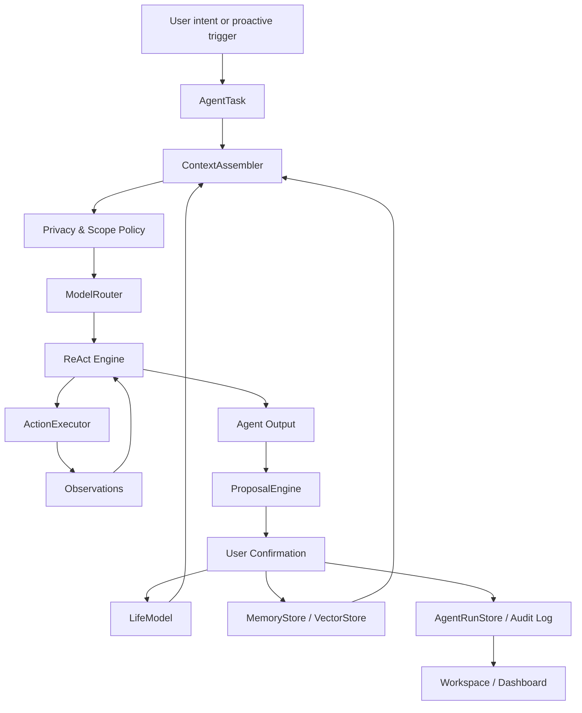

# OpenLife Agent Framework Architecture

> Version: 2026-05-01
> Status: Architecture baseline for the next development cycle
> Scope: Product definition, system architecture, migration route, and engineering boundaries

> 2026-05-30 alignment note: Read this together with
> `plans/openlife_lifemodel_governed_agent_runtime.md`. This document remains
> the Agent Framework baseline, but LifeModel-HS should now be treated as the
> shared protocol layer and ReAct as the current default runtime strategy, not
> the final architecture boundary. W1-W10 are complete through MultiStrategy
> Preview AgentRun Audit Persistence; MultiStrategy is preview/audit-ready and
> must not be treated as the default Chat runtime.

## 1. Executive Summary

OpenLife should be treated as a local-first personal Agent framework, not merely a desktop chat app or a life dashboard.

The core thesis is:

```text
OpenLife = LifeModel-HS Protocol Layer
         + Governed Agent Runtime
         + Runtime Strategies
         + Memory/Feedback/Maturation Loop
         + User-Controlled Actions
```

The product should let a user build and continuously refine a private LifeModel, then use that LifeModel as the context layer for many AI-driven tasks: conversation, planning, writing, reviewing, tool execution, reflection, goal tracking, state updates, and future proactive assistance.

The current codebase already contains many necessary building blocks:

- `LifeModel`: private structured representation of identity, goals, capabilities, and state.
- `Builder`: guided construction of the LifeModel.
- `LayeredReasoner`: current reasoning strategy for meaning, strategy, generation, and safety checks.
- `Scheduler`: local/cloud model routing.
- `MemoryStore` and `VectorStore`: persistent chat and semantic memory.
- `MCP` and `A2A`: tool and agent interoperability foundations.
- `Feedback`, `Evolution`, `Calibration`: early mechanisms for model improvement.
- `Diagnostics`, `Recovery`, `Safe Mode`: stability and recovery primitives.

However, these capabilities are still organized like app features. The missing architectural center is an explicit Agent Runtime that turns user intent into traceable tasks, contextual reasoning, actions, observations, proposals, confirmations, and updates to the LifeModel.

This document defines the Agent Framework target architecture and a migration
route from the current implementation to a coherent OpenLife Agent framework.
The more specific next implementation order is defined in
`plans/openlife_lifemodel_governed_agent_runtime.md`.

## 2. Product Definition

### 2.1 What OpenLife Is

OpenLife is a personal operating system for AI-assisted life and work.

It gives the user a private LifeModel, then uses that model to make AI behavior more aligned with the user's identity, goals, capabilities, constraints, preferences, and current state.

OpenLife should support:

- Personal context-aware AI execution.
- Local-first privacy and selective cloud delegation.
- ReAct-style task execution with tools, memory, and feedback.
- Continuous but user-controlled LifeModel evolution.
- Proactive planning, review, and intervention based on goals and state.
- A framework layer that can power multiple user-facing experiences.

### 2.2 What OpenLife Is Not

OpenLife should not be reduced to:

- A generic chat wrapper.
- A simple goal tracker.
- A dashboard with AI text sprinkled on top.
- A life coaching app with static forms.
- A set of disconnected pages for Chat, Builder, Settings, Memory, and Dashboard.

Those can be surfaces. They are not the architecture.

### 2.3 Core User Promise

After building a LifeModel, the user should be able to use OpenLife for many tasks, and the system should:

- Understand what matters to the user.
- Choose local or cloud models appropriately.
- Use private memory safely.
- Execute or prepare actions through tools.
- Explain why it responded or acted the way it did.
- Learn from outcomes.
- Propose LifeModel updates without silently rewriting the user.
- Help the user plan, review, and adjust over time.

## 3. Architectural Principles

### 3.1 User Sovereignty

The LifeModel belongs to the user. High-impact changes must be reviewable, reversible, and explainable.

The system can suggest:

- Goal updates.
- State changes.
- Preference refinements.
- Capability additions.
- Identity or value interpretations.

But high-risk changes must not be silently applied.

### 3.2 Local-First Privacy

Private data should stay local by default. Cloud models are allowed, but only through explicit routing policies and privacy filters.

The architecture should distinguish:

- Data that can be used locally.
- Data that can be summarized before cloud use.
- Data that must be redacted.
- Data that must never leave the device.

### 3.3 Agent Runs Are First-Class

Every meaningful AI operation should be represented as an `AgentRun`.

An AgentRun records:

- User intent.
- Context used.
- Model route.
- Tool calls.
- Memory hits.
- Observations.
- Reasoning summary.
- Output.
- Proposed model or memory updates.
- Errors and recovery state.

This is the difference between "the app replied" and "the agent executed a traceable task."

### 3.4 ReAct With Guardrails

OpenLife should support a ReAct-style loop comparable in execution seriousness to OpenClaw-like agent systems, while remaining local-first and user-governed:

```text
Reason -> Act -> Observe -> Reflect -> Propose -> Confirm -> Persist
```

But tool execution and model mutation must be governed by policy:

- Low-risk read actions can run automatically.
- Medium-risk writes require review or scoped permission.
- High-risk actions require explicit confirmation.
- Critical actions require stronger confirmation or are disallowed.

In this architecture, tools are not optional UI features. Tools are the agent's execution surface. OpenLife Beta requires:

- Core OS tools for LifeModel, goals, memory, proposals, snapshots, and AgentRun lookup.
- External tools through MCP/A2A or other manifest-backed integrations.
- Governance tools for permission checks, permission requests, privacy inspection, replay, risk classification, and audit.
- Skill tools for high-level built-in capabilities such as weekly review, goal breakdown, and memory consolidation.
- Plugin-declared tools to remain disabled/declarative-only unless a real local executor exists.

The detailed Beta gates are defined in `plans/openlife_react_beta_roadmap.md`.

### 3.5 Model-Agnostic Routing

The architecture should not be hardcoded around a single cloud provider.

Supported provider classes:

- Local model providers, such as Ollama.
- Known cloud providers, such as DeepSeek, OpenAI, and OpenRouter.
- Custom OpenAI-compatible providers.
- Future specialized models for embedding, planning, tool use, and summarization.

Routing should be policy-driven, not scattered across pages.

### 3.6 Progressive Migration

The existing project should not be rewritten from scratch.

The right path is:

- Preserve working modules.
- Introduce a central Agent Runtime.
- Route existing Chat and Builder flows through it gradually.
- Convert scattered confirmation and feedback mechanisms into unified proposals.
- Reshape the frontend around agent tasks and lifecycle.

## 4. Current Capability Inventory

| Capability | Current implementation | Current value | Main gap under new definition |
|---|---|---|---|
| LifeModel | `openlife-core/src/life_model.rs` | Strong foundation for personal context | Needs clearer patch/proposal semantics and stronger field ownership rules |
| Builder | `openlife-core/src/builder.rs`, `frontend/src/pages/BuilderPage.tsx` | Can guide initial model construction | Too large, complex, and not yet framed as an AgentTask lifecycle |
| Chat | `src-tauri/src/lib.rs`, `frontend/src/pages/ChatPage.tsx` | Main user interaction surface | Should become an Agent workspace, not a standalone chat pipeline |
| LayeredReasoner | `openlife-core/src/reasoning/layered.rs` | Early Meaning/Strategy/Execution abstraction | Should evolve into ReAct runtime or become one strategy inside it |
| Scheduler | `openlife-core/src/scheduler.rs`, `llm.rs`, `ollama.rs` | Local/cloud routing exists | Needs provider-agnostic model policies and per-task routing traces |
| Memory | `memory.rs`, `vectors.rs`, `memory_cache.rs` | Persistent and semantic memory exist | Needs explicit governance, context selection, corruption diagnostics, and task linkage |
| Feedback/Evolution | `feedback.rs`, `evolution.rs`, `calibration.rs` | Early LifeModel improvement loop | Needs unified Proposal model and confirmation workflow |
| MCP | `mcp.rs`, `mcp_audit.rs`, `ToolCallCard` | Tool interoperability exists | Needs deny-by-default execution policy and AgentAction abstraction |
| A2A | `a2a.rs`, `a2a_server.rs`, sidecar | Future agent network foundation | Needs to become external AgentAction/AgentPeer layer |
| Privacy | `privacy.rs`, settings policy | PII detection and policy exist | Needs integration into ContextAssembler and ModelRouter |
| Diagnostics/Safe Mode | diagnostics commands, Recovery UI | Important trial stabilization work | Needs to be formalized as runtime health and recovery capability |
| Frontend | Chat, Dashboard, Builder, Memory, Settings | Many functional pages | Needs product IA around Agent Workspace, not scattered feature pages |

## 5. Target Architecture Overview



The target architecture centers on one runtime concept:

```text
AgentTask -> AgentRun -> Actions/Observations -> Output -> Proposals -> Confirmation -> Persistence
```

Existing pages and commands should become views and adapters around this lifecycle.

## 6. Core Domain Objects

### 6.1 AgentTask

An `AgentTask` represents what the user or system wants OpenLife to do.

Suggested fields:

```rust
pub struct AgentTask {
    pub id: String,
    pub kind: AgentTaskKind,
    pub title: String,
    pub user_intent: String,
    pub input: serde_json::Value,
    pub session_id: Option<String>,
    pub life_context_scope: LifeContextScope,
    pub execution_policy: ExecutionPolicy,
    pub status: AgentTaskStatus,
    pub created_at: String,
    pub updated_at: String,
}
```

Suggested task kinds:

| Kind | Purpose |
|---|---|
| `conversation` | Normal chat and companionship |
| `life_model_build` | Initial or incremental LifeModel construction |
| `planning` | Goal planning and task breakdown |
| `review` | Daily, weekly, or project review |
| `writing` | Context-aware drafting and editing |
| `research` | Tool-assisted information gathering |
| `tool_execution` | Explicit user-requested action through MCP/A2A |
| `calibration` | Model correction and LifeModel alignment |
| `memory_governance` | Memory search, archive, restore, or summarization |
| `proactive_checkin` | Agent-initiated check-in or recommendation |

### 6.2 AgentRun

An `AgentRun` is one execution attempt for an AgentTask.

Suggested fields:

```rust
pub struct AgentRun {
    pub id: String,
    pub task_id: String,
    pub status: AgentRunStatus,
    pub model_route: Option<ModelRouteTrace>,
    pub context_summary: Option<ContextSummary>,
    pub observations: Vec<AgentObservation>,
    pub actions: Vec<AgentAction>,
    pub output: Option<AgentOutput>,
    pub proposals: Vec<AgentProposal>,
    pub errors: Vec<AgentRunError>,
    pub started_at: String,
    pub finished_at: Option<String>,
}
```

This should become the primary debug and product trace unit.

### 6.3 LifeContextScope

The context scope defines which parts of the LifeModel and memory may be used.

Suggested fields:

```rust
pub struct LifeContextScope {
    pub include_identity: bool,
    pub include_goals: bool,
    pub include_capabilities: bool,
    pub include_state: bool,
    pub include_preferences: bool,
    pub include_relationships: bool,
    pub memory_top_k: usize,
    pub allow_sensitive_context: bool,
    pub cloud_redaction_level: RedactionLevel,
}
```

Examples:

- A daily review can use goals, state, and recent memory.
- A public writing task may use preferences but not sensitive identity details.
- A local-only reflective conversation can use richer private context.
- A cloud task should receive summarized or redacted context.

### 6.4 ExecutionPolicy

The execution policy controls model choice, tools, privacy, and risk.

Suggested fields:

```rust
pub struct ExecutionPolicy {
    pub preferred_model_route: ModelRoutePreference,
    pub allow_cloud: bool,
    pub allow_local: bool,
    pub allow_tools: bool,
    pub require_confirmation_for_tools: bool,
    pub max_tool_risk: RiskLevel,
    pub max_life_model_patch_risk: RiskLevel,
    pub timeout_ms: u64,
}
```

### 6.5 AgentAction

An `AgentAction` represents a concrete action the agent wants to perform.

Action types:

- `internal_read`
- `internal_write`
- `mcp_tool_call`
- `a2a_message`
- `life_model_patch`
- `memory_write`
- `memory_archive`
- `snapshot_create`
- `file_read`
- `file_write`
- `network_request`

Every action should have:

- Risk level.
- Permission state.
- Input summary.
- Output summary.
- Audit metadata.

### 6.6 AgentProposal

An `AgentProposal` is a suggested change that awaits user decision or can be auto-applied under policy.

Suggested fields:

```rust
pub struct AgentProposal {
    pub id: String,
    pub run_id: String,
    pub proposal_type: AgentProposalType,
    pub affected_path: String,
    pub before: serde_json::Value,
    pub after: serde_json::Value,
    pub reason: String,
    pub source: String,
    pub confidence: f32,
    pub risk_level: RiskLevel,
    pub status: ProposalStatus,
    pub created_at: String,
}
```

Proposal types:

- `life_model_patch`
- `goal_update`
- `state_update`
- `preference_update`
- `capability_update`
- `memory_write`
- `memory_archive`
- `tool_permission`
- `schedule_checkin`

This should replace fragmented confirmation flows in Builder, Calibration, Evolution, and MCP.

## 7. Runtime Components

### 7.1 AgentRuntime

The central orchestrator.

Responsibilities:

- Create AgentTasks.
- Start AgentRuns.
- Assemble context.
- Route model calls.
- Drive ReAct loops.
- Execute actions through guarded executors.
- Generate user-facing outputs.
- Generate proposals.
- Persist run traces.

Current migration target:

- Start by routing Chat through AgentRuntime.
- Then route Builder Review and Calibration proposals through the same proposal layer.

### 7.2 ContextAssembler

Builds the prompt/context bundle for a task.

Inputs:

- LifeModel.
- Memory search results.
- Current session messages.
- User preferences.
- Task kind.
- Privacy policy.
- Model route.

Outputs:

- Context summary for the model.
- Redacted cloud-safe context.
- Local-only rich context.
- Trace of what was included and excluded.

This component is essential because the LifeModel should not be dumped into every prompt blindly.

### 7.3 ModelRouter

The successor to the current `InferenceScheduler`.

Responsibilities:

- Choose local, cloud, or hybrid route per task.
- Support DeepSeek, OpenAI, OpenRouter, Ollama, and custom OpenAI-compatible providers.
- Decide which model is used for planning, execution, summarization, embedding, and tool calls.
- Produce a `ModelRouteTrace` for transparency.
- Enforce privacy and cloud eligibility.

Routing should consider:

- Task complexity.
- Tool requirements.
- Privacy sensitivity.
- User preference.
- Local model availability.
- Provider health.
- Cost and latency.

### 7.4 ReActEngine

The ReAct engine drives iterative reasoning and action.

Loop:

```text
Plan -> Act -> Observe -> Decide -> Continue or Finish
```

LayeredReasoner can evolve into this layer or remain one strategy inside it.

Important design rule:

The system should store reasoning summaries and decision traces, not necessarily raw chain-of-thought. The product needs explainability without exposing unsafe or overly verbose internal reasoning.

### 7.5 ActionExecutor

Executes approved or allowed actions.

Executors:

- Internal store reads.
- Internal store writes.
- MCP tools.
- A2A peer messages.
- LifeModel patch application.
- Snapshot creation.
- Memory writes and archives.

Execution policy:

| Risk | Example | Default behavior |
|---|---|---|
| Low | Read current LifeModel summary | Auto-run |
| Medium | Write a memory note | User can configure, default confirm |
| High | Change long-term goal or call external write tool | Explicit confirm |
| Critical | Destructive file operation or sensitive external send | Strong confirm or block |

### 7.6 ProposalEngine

Turns observations and outputs into structured proposals.

Examples:

- "The user mentioned they are now focusing on thesis writing. Update `state.current_focus`?"
- "The user repeatedly mentions DeepSeek setup. Add `OpenLife debugging` as a short-term goal?"
- "This chat revealed a new preference for concise technical answers. Update communication preference?"
- "This Builder signal suggests a value of autonomy. Confirm before writing to Identity?"

The ProposalEngine is the heart of continuous LifeModel evolution.

### 7.7 AgentRunStore

Persists the task execution trace.

Suggested SQLite tables:

| Table | Purpose |
|---|---|
| `agent_tasks` | User/system task definitions |
| `agent_runs` | Execution attempts |
| `agent_observations` | Observed facts, memory hits, tool results |
| `agent_actions` | Planned and executed actions |
| `agent_proposals` | Suggested changes |
| `agent_confirmations` | User decisions |
| `agent_artifacts` | Generated outputs, summaries, or files |

This should link to existing stores:

- `chat_sessions`
- `messages`
- `vector_chunks`
- `life_model` snapshots
- `mcp_audit`
- `builder_sessions`

### 7.8 ProactiveScheduler

Responsible for agent-initiated touchpoints.

Initial triggers:

- Daily review.
- Weekly planning.
- Stale goal check.
- State risk check.
- Pending Builder Review reminder.
- Memory maintenance warning.
- Model/API readiness issue.

Design rule:

Proactive behavior should start as local notifications or dashboard cards, not intrusive autonomous messages.

## 8. Data Architecture

### 8.1 Existing Stores

Current storage areas:

- LifeModel YAML under app data.
- SQLite message/session database.
- SQLite vector database.
- Builder session JSON/store.
- Version snapshots.
- MCP audit database.
- Config YAML.
- Privacy policy configuration.

These should be preserved during migration.

### 8.2 Target Storage Layout

Recommended conceptual layout:

```text
app_data/
  config.yaml
  privacy_policy.yaml
  life-model/
    current/life_model.yaml
    snapshots/
  databases/
    memory.db
    vectors.db
    agent_runs.db
    mcp_audit.db
  builder/
    sessions.json
  recovery/
    backups/
    import-staging/
  logs/
    startup_warnings.json
```

The exact paths can remain compatible with current code, but the conceptual separation should guide future refactors.

### 8.3 LifeModel Mutation Rules

LifeModel updates should follow this lifecycle:

```text
Observation -> Proposal -> User decision -> Snapshot -> Patch apply -> Audit record -> Diagnostics refresh
```

Rules:

- High-risk fields are never silently overwritten.
- Array fields default to merge and deduplicate.
- Replacements require explicit replace semantics.
- Unsupported or invalid patches must be reported as skipped, not silently ignored.
- Every accepted patch should be traceable to a run, source, reason, and confirmation.

### 8.4 Memory Mutation Rules

Memory writes should distinguish:

- Chat transcript memory.
- Semantic memory.
- User-pinned memory.
- Temporary task memory.
- Archived memory.

Every memory should record:

- Source run or session.
- Sensitivity.
- Retention class.
- Last access time.
- Tier.
- Whether it is user-confirmed or inferred.

## 9. Backend Architecture Target

### 9.1 Recommended Module Structure

Target Rust core structure:

```text
openlife-core/src/
  agent/
    mod.rs
    task.rs
    run.rs
    runtime.rs
    context.rs
    react.rs
    action.rs
    proposal.rs
    policy.rs
    store.rs
  life_model/
    mod.rs
    schema.rs
    patch.rs
    validation.rs
  model/
    mod.rs
    router.rs
    providers/
      ollama.rs
      openai_compatible.rs
      deepseek.rs
      openrouter.rs
  memory/
    mod.rs
    store.rs
    vector.rs
    governance.rs
  tools/
    mod.rs
    mcp.rs
    a2a.rs
    permissions.rs
  diagnostics/
    mod.rs
    health.rs
    recovery.rs
```

This does not need to happen in one large refactor. It is a directional target.

### 9.2 Tauri Command Layer

The command layer should become thin adapters.

Command modules should:

- Validate request shape.
- Call core services.
- Return typed DTOs.
- Avoid containing business logic.
- Avoid duplicating frontend-specific assumptions.

New Agent Runtime commands:

```rust
create_agent_task
start_agent_run
continue_agent_run
cancel_agent_run
get_agent_run
list_agent_runs
list_pending_proposals
confirm_agent_proposal
reject_agent_proposal
edit_agent_proposal
get_agent_workspace_state
```

Legacy commands can remain as wrappers:

- `start_stream_message` creates a `conversation` task/run.
- `builder_start` creates a `life_model_build` task/run.
- `generate_calibration_report` creates a `calibration` task/run.

## 10. Frontend Architecture Target

### 10.1 Product Information Architecture

The frontend should move from feature pages to an Agent workspace.

Recommended top-level navigation:

| Section | Purpose |
|---|---|
| Workspace | Today's agent cockpit: active task, next action, pending proposals, readiness |
| Agent | Chat/task execution surface with trace, tools, and outputs |
| LifeModel | Build, inspect, edit, and version the personal model |
| Memory | Search, manage, archive, and restore memory |
| Runs | Execution history, traces, tool calls, proposals, and artifacts |
| Settings | Model providers, privacy, recovery, diagnostics |

Current page mapping:

| Current page | Future role |
|---|---|
| `ChatPage` | Agent execution surface |
| `DashboardPage` | Workspace / Today |
| `BuilderPage` | LifeModel build flow |
| `LifeModelEditor` | LifeModel inspector and editor |
| `MemorySearch` | Memory governance |
| `CalibrationPage` | Proposal/review center or LifeModel alignment tool |
| `VersionControl` | LifeModel recovery and audit |
| `McpPage` | Tool registry and permissions |
| `A2APage` | Agent peer network |
| `SettingsPage` | Control plane and diagnostics |

### 10.2 Agent Surface

The main Agent page should show:

- User input.
- Current task mode.
- LifeModel context summary.
- Model route used.
- Tool/action plan.
- Streaming output.
- Pending confirmations.
- Generated artifacts.
- Follow-up proposals.

It should answer three user questions:

- What is the agent doing?
- Why is it doing it this way?
- What changed after it finished?

### 10.3 Workspace Surface

The Workspace should prioritize:

1. Is the system ready?
2. What is the user currently trying to accomplish?
3. What does OpenLife recommend next?
4. What proposals require review?
5. What changed recently in the LifeModel or memory?

The Dashboard should not be a static stats board. It should be an operating surface.

### 10.4 Proposal Review Surface

All high-impact suggestions should be reviewed in one consistent pattern:

- Proposed change.
- Before and after.
- Source.
- Reason.
- Confidence.
- Risk.
- Accept / edit / reject / postpone.

This can power Builder, Calibration, Evolution, proactive updates, and memory governance.

## 11. Model Provider Architecture

### 11.1 Provider Classes

OpenLife should support:

- `local_ollama`
- `deepseek`
- `openai`
- `openrouter`
- `custom_openai_compatible`

Each provider should define:

- Base URL.
- API key source.
- Chat models.
- Embedding models.
- Streaming support.
- Tool-call support.
- Privacy restrictions.
- Health check behavior.

### 11.2 Model Roles

Do not assume one model does everything.

Suggested roles:

| Role | Purpose |
|---|---|
| Chat | Natural conversation and final responses |
| Planner | Break tasks into steps |
| Tool use | Generate structured tool calls |
| Summarizer | Compress memory and traces |
| Extractor | Convert conversation into LifeModel signals |
| Embedding | Semantic memory search |
| Safety | PII and risky action classification |

Initial implementation can map multiple roles to the same model, but the architecture should leave the roles explicit.

### 11.3 Routing Trace

Every run should be able to show:

- Provider used.
- Model used.
- Why local or cloud was chosen.
- Whether context was redacted.
- Whether fallback happened.
- Any provider error or timeout.

This is critical for user trust and debugging.

## 12. Safety, Privacy, and Confirmation

### 12.1 Risk Levels

| Risk | Examples | Behavior |
|---|---|---|
| Low | Read local memory summary, suggest wording | Auto allowed |
| Medium | Add inferred memory, update current focus | Confirm by default |
| High | Change values, mission, long-term goals, external write tools | Explicit confirm |
| Critical | Delete data, send sensitive data externally, destructive filesystem tools | Strong confirm or block |

### 12.2 Cloud Privacy Policy

Cloud-bound context should pass through:

```text
LifeContextScope -> PrivacyEngine -> Redaction -> ModelRouter -> Provider
```

Possible redaction levels:

- `none`
- `light`
- `summary_only`
- `strict`
- `local_only`

### 12.3 Audit Requirements

The user should be able to inspect:

- Which model saw which kind of context.
- Which tools were called.
- Which LifeModel changes were proposed.
- Which changes were accepted.
- Which changes were rejected.
- Which actions failed.

## 13. Proactive Agent Design

OpenLife should eventually initiate helpful interactions, but only with careful pacing.

### 13.1 Proactive Trigger Types

| Trigger | Example |
|---|---|
| Time-based | Daily review, weekly planning |
| Goal-based | A deadline is approaching |
| State-based | Stress is rising or sleep is poor |
| Memory-based | Repeated topic indicates new priority |
| System-based | API key invalid, memory index corrupt |
| Review-based | Pending LifeModel proposals exist |

### 13.2 Proactive Output Types

Start with low-intrusion surfaces:

- Workspace cards.
- Notification badges.
- Daily brief.
- Pending proposal list.

Avoid early overreach:

- Do not spam messages.
- Do not silently mutate model state.
- Do not overinterpret sparse signals.

## 14. Migration Plan

### Phase 0: Architecture Alignment

Deliverables:

- This architecture document.
- Updated development plan that names Agent Runtime as the center.
- Updated frontend redesign plan around Workspace / Agent / LifeModel / Memory / Runs / Settings.

### Phase 1: AgentRun Baseline

Goal:

Introduce AgentTask and AgentRun without breaking existing Chat.

Deliverables:

- Core types.
- SQLite AgentRunStore.
- Minimal Tauri commands.
- Chat creates an AgentRun for each user message.
- Run trace records model route, context summary, output, and errors.

### Phase 2: Chat as Agent Surface

Goal:

Turn Chat from message UI into the first Agent execution surface.

Deliverables:

- Show current task mode.
- Show LifeModel context summary.
- Show local/cloud route.
- Show tool/action trace.
- Persist user and assistant messages through AgentRun.
- Preserve current chat compatibility.

### Phase 3: Unified Proposal Layer

Goal:

Unify Builder, Calibration, Evolution, and memory updates.

Deliverables:

- AgentProposal type.
- Proposal store.
- Confirm/edit/reject APIs.
- Builder Review emits proposals.
- Calibration emits proposals.
- LifeModel patches go through one application path.

### Phase 4: ModelRouter Upgrade

Goal:

Replace scattered provider assumptions with explicit model routing.

Deliverables:

- Provider registry.
- Model roles.
- DeepSeek/OpenAI/OpenRouter/custom support.
- Per-run route trace.
- Cloud privacy routing.
- Provider health diagnostics.

### Phase 5: Workspace Redesign

Goal:

Make the frontend reflect the Agent framework.

Deliverables:

- Workspace page as default landing.
- Agent page for task execution.
- Proposal review center.
- Runs history page.
- Settings as control plane.

### Phase 6: Proactive Agent MVP

Goal:

Introduce safe proactive behavior.

Deliverables:

- Daily brief task.
- Weekly review task.
- Pending proposal reminders.
- Goal stale detection.
- State check-in card.

### Phase 7: Engineering Consolidation

Goal:

Reduce complexity and harden contracts.

Deliverables:

- Split oversized Builder and page files.
- Generate or test Tauri command contracts.
- Add smoke tests around Settings -> Builder -> Agent -> Workspace.
- Update README and AGENTS.md to reflect the new architecture.

## 15. Immediate Next Development Package

The next implementation package should be intentionally narrow:

### Package: AgentRun Baseline for Chat

Backend:

- Add `agent` module with `AgentTask`, `AgentRun`, `AgentRunStore`, and `ModelRouteTrace`.
- Add SQLite store for agent runs.
- Wrap `start_stream_message` so each normal chat message creates or updates an AgentRun.
- Record:
  - session id
  - user input
  - context summary
  - selected provider/model
  - output status
  - runtime error if any

Frontend:

- Add small "Run trace" panel in Chat.
- Show model route and context summary.
- Do not redesign the whole UI yet.

Tests:

- Rust: creating and loading AgentRun.
- Rust: chat path creates AgentRun.
- Frontend: Chat displays run trace when available.

Acceptance:

- A user sends one message and can inspect what model was used and what LifeModel context was considered.

This gives the project a new architectural spine without destabilizing everything else.

## 16. Acceptance Criteria for the Architecture

OpenLife should be considered aligned with this architecture when:

- Every meaningful AI operation is represented as an AgentRun.
- The user can inspect what context was used.
- The user can inspect which model/provider was used.
- Tool calls are represented as governed AgentActions.
- LifeModel changes are represented as proposals before application.
- High-risk changes are confirmed and reversible.
- Chat, Builder, Calibration, and proactive check-ins use the same proposal layer.
- Dashboard becomes a Workspace that shows tasks, proposals, readiness, and next actions.
- The system can recover from configuration and storage failures without silent data loss.

## 17. Key Architectural Risks

### Risk 1: Overbuilding the Runtime

The Agent Runtime must start small. If it tries to absorb every feature at once, it will stall development.

Mitigation:

- Start with Chat AgentRuns only.
- Add proposals second.
- Add tools and proactive tasks later.

### Risk 2: LifeModel Becomes Too Vague

If LifeModel fields are too broad or inconsistently updated, it becomes decorative.

Mitigation:

- Define field ownership.
- Require patch provenance.
- Add validation and skipped-field reporting.
- Use snapshots before changes.

### Risk 3: Privacy Semantics Become Cosmetic

If cloud routing does not clearly state what data was sent, trust breaks.

Mitigation:

- Add context summaries and redaction traces.
- Store route decisions.
- Make local-only scopes enforceable.

### Risk 4: Frontend Still Feels Like Many Apps

If pages remain disconnected, users will not understand OpenLife as an Agent framework.

Mitigation:

- Make Workspace the default mental model.
- Use AgentRuns and Proposals as shared UI concepts.
- Reduce top-level navigation complexity.

### Risk 5: ReAct Tool Execution Becomes Unsafe

If MCP/A2A execution is not deny-by-default, the framework becomes risky.

Mitigation:

- Treat external actions as pending unless explicitly allowlisted.
- Use risk classification and confirmation.
- Audit all tool calls.

## 18. Open Product Questions

These should be answered before large UX redesign:

1. How proactive should OpenLife be by default?
2. Should AgentRuns be visible to normal users, or summarized as "activity history"?
3. Which LifeModel fields are allowed to influence cloud model prompts?
4. Should user tasks become durable objects like a lightweight project system?
5. Should OpenLife support files/artifacts as first-class outputs?
6. How much of ReAct trace should be exposed to the user?
7. Should third-party tools be installed manually only, or should there be a marketplace later?

## 19. Recommended North Star

The North Star should be:

```text
OpenLife is the local-first Agent framework that helps a person think, act, review, and evolve with AI that actually understands their life context.
```

The next milestone should not be "more pages" or "more features."

The next milestone should be:

```text
Make one user task fully traceable from intent to context to model route to output to LifeModel feedback.
```

Once that loop works, the rest of the product can grow around a stable center.
