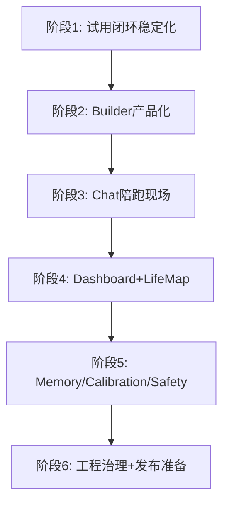
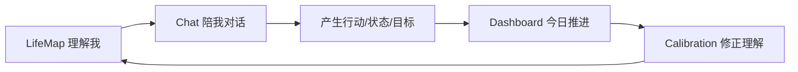

# OpenLife Alpha → Beta 产品化收口计划

> Historical plan. Do not use as current Agent development authority.
> Current order is defined by `plans/README.md` and
> `plans/openlife_lifemodel_governed_agent_runtime.md`.

> 周期目标：从「开发者能看出潜力的复杂系统」变成「普通用户可以连续试用 7 天，并愿意继续打开的个人成长伙伴」
> 
> 关键词：**可用、可信、可持续使用**

---

## 一、产品闭环总览


---

## 二、六阶段详细计划

---

### 阶段 1：试用闭环彻底稳定化

**目标**：确保用户可以顺利完成 Settings → Builder → Chat → Dashboard 的第一条闭环

**优先级**：P0 — 如果用户第一次试用就报错、卡住、看不懂配置，后面所有智能能力都没有意义

#### 1.1 Settings 成为真正的「试用控制台」

- [ ] 重构 Settings 页面为「试用控制台」而非配置表
- [ ] 增加 LLM 后端连接状态实时检测卡：
  - DeepSeek API 连接状态 + 一键测试
  - OpenAI API 连接状态 + 一键测试
  - OpenRouter API 连接状态 + 一键测试
  - Ollama 本地检测（自动发现常用端口）+ 模型列表
- [ ] 每个连接失败都给出明确的用户可修复动作，不展示技术错误
- [ ] 数据目录状态可见：messages.db / vectors.db / mcp_audit.db / config.yaml 健康状态
- [ ] 人生模型读取状态可见：是否存在、是否为空、最后更新时间
- [ ] 启动失败、模型失败、API 失败、Builder 失败全部有非静默提示

#### 1.2 错误处理全面用户化

- [ ] Chat 报错给出「修复动作」而非技术栈跟踪
- [ ] Builder 报错给出「重试 / 跳过 / 反馈」三选一
- [ ] 所有 Tauri command 错误统一包装为用户可读消息
- [ ] 增加 `get_readiness_report` command，返回前端可渲染的诊断卡片

#### 1.3 链路稳定性保障

- [ ] Settings → Builder 跳转时校验模型配置是否就绪
- [ ] Builder → Chat 跳转时校验人生模型是否已生成
- [ ] Chat → Dashboard 数据流转不丢失
- [ ] 页面 Reload 后用户状态完整保留（会话、当前模式、输入草稿）

#### 验收标准

| 检查项 | 标准 |
|--------|------|
| 首次配置时间 | 新用户能在 10 分钟内完成配置并发出第一条有效对话 |
| 失败提示 | 常见失败都有用户能看懂的提示和修复动作 |
| 链路稳定 | Settings → Builder → Chat → Reload 稳定可用 |
| 测试通过 | 前端 build/test 全绿，Rust 测试不因迁移或配置问题失败 |

---

### 阶段 2：Builder 人生模型构建产品化

**目标**：把 Builder 做成 OpenLife 的核心首体验，不是普通问卷

**产品差异点**：ChatGPT 也能聊天，但 OpenLife 的价值是「它先理解你是谁，然后陪你成长」

#### 2.1 三种构建方式强化

- [ ] **快速构建**：5-10 分钟生成一个可用人生模型
  - 6 步引导：身份 → 价值观 → 目标 → 能力 → 状态 → 回顾
  - 每步有示例、有跳过、有编辑
- [ ] **渐进构建**：每次只补一个维度，适合长期慢慢完善
  - 维度选择器：Identity / Goals / Capabilities / State
  - 选择后进入单维度深度对话
  - 明确提示「这将补充你的 Goals，不会影响 Identity」
- [ ] **苏格拉底构建**：深度探索，不急于写入
  - 重点是解释「我为什么这样理解你」
  - 多轮对话后才进入 Review
  - 每次探索后有「这个理解对吗？」确认

#### 2.2 Review 页产品化改造

- [ ] Review 页标题改为「OpenLife 准备这样理解你」
- [ ] 每条写入建议显示：来源（哪轮对话）、置信度、影响字段、风险等级
- [ ] 高风险字段（价值观、使命、长期目标）默认不勾选
- [ ] 编辑复杂字段必须保持 JSON/结构化数据，禁止退化为字符串
- [ ] 展示应用结果：applied / merged / skipped / edited / rejected 计数

#### 2.3 写入策略安全化

- [ ] 写入 LifeModel 时默认 merge，不覆盖用户已有内容
- [ ] 渐进构建选择 Goals/State/Capabilities 时不会误写 Identity
- [ ] 用户编辑 Review 内容后，后端保存的是编辑后的内容
- [ ] 增加「撤销本次构建」能力（利用 versioning）

#### 验收标准

| 检查项 | 标准 |
|--------|------|
| 快速构建 | 用户能完成一次快速构建，并在 LifeMap 看到真实写入结果 |
| 渐进安全 | 渐进构建选择单维度时不会误写其他维度 |
| 编辑保存 | 用户编辑 Review 内容后，后端保存编辑后的内容 |
| 防误删 | 用户不会因为一次构建误删已有目标、价值观、能力 |

---

### 阶段 3：Chat 从聊天框升级为陪跑现场

**目标**：让 Chat 成为用户每天最自然打开的页面

**定位**：用户和 OpenLife 的「现场工作台」——规划今天、复盘情绪、拆目标、做决策、沉淀状态

#### 3.1 对话模式固定化

- [ ] 顶部模式选择器：今日规划、情绪复盘、目标拆解、决策陪跑、自由聊天
- [ ] 每种模式有不同 prompt 策略（后端 LayeredReasoner 层注入不同 system prompt）
- [ ] 每种模式有对应 UI 入口和图标
- [ ] 模式切换不丢失对话上下文

#### 3.2 人生模型脉搏展示

- [ ] Chat 顶部展示当前人生模型摘要：
  - 当前身份标签
  - 今日目标进度
  - 当前情绪状态
  - 价值观关键词
- [ ] 点击脉搏展开完整模型片段
- [ ] 对话中 Assistant 引用模型内容时高亮显示来源

#### 3.3 Reasoning Trace 用户化

- [ ] 不展示内部 JSON，展示「为什么这样回答」
- [ ] 用自然语言摘要：「基于你的价值观 X，我认为你应该优先做 Y」
- [ ] 可展开查看详细推理链
- [ ] 错误时展示「我卡在哪一步」而非技术堆栈

#### 3.4 行动转化按钮

每次 Assistant 回复后提供操作栏：
- [ ] 「保存为今日目标」→ 写入 DailyGoals
- [ ] 「记录为状态」→ 写入 State 历史
- [ ] 「拆成长期目标」→ 打开 Builder 目标模式
- [ ] 「生成 Calibration 建议」→ 跳转到 Calibration
- [ ] 「加入记忆」→ 写入 VectorStore

#### 3.5 健壮性

- [ ] 对话失败后可重试，不丢用户输入
- [ ] 聊天历史刷新后完整保留
- [ ] 流式中断后显示「已中断，点击继续」

#### 验收标准

| 检查项 | 标准 |
|--------|------|
| 模式发现 | 用户不需要自己想 prompt，也知道 OpenLife 能帮什么 |
| 可解释 | 用户能看到回答依据，而不是黑盒 |
| 行动转化 | 一次对话能自然转化为目标、状态或模型建议 |
| 数据完整 | 聊天历史刷新后完整保留，失败可重试 |

---

### 阶段 4：LifeMap 和 Dashboard 成为长期使用入口

**目标**：让用户理解「OpenLife 眼中的我」，并知道今天该做什么

**分工**：Dashboard = 每日入口 / LifeMap = 长期身份入口

#### 4.1 Dashboard 今日驾驶舱

- [ ] 「今天我状态如何？」——情绪/健康/专注度速览
- [ ] 「今天最值得做什么？」——基于目标和状态的建议排序
- [ ] 「有没有风险或提醒？」——StateAlert 展示 + 阈值预警
- [ ] 「下一步去哪？」——智能导航：去 Chat / Builder / Calibration / Settings
- [ ] 今日目标完成进度条 + 快速打卡
- [ ] 最近记忆片段速览

#### 4.2 LifeMap 人生地图

- [ ] 默认阅读模式强化，减少大表单压迫感
- [ ] 四维雷达图：Identity / Goals / Capabilities / State 完整度可视化
- [ ] 每个维度增加「建议补充项」列表
- [ ] 「最近对话如何影响了我」区域：展示对话带来的模型变化
- [ ] 与 VersionControl 打通：展示模型演化时间线
- [ ] 高风险模型变更必须能回滚（一键恢复上一版本）

#### 4.3 数据联动

- [ ] Dashboard 下一步行动可跳转到具体 Chat 模式
- [ ] LifeMap 变更后 Dashboard 实时反映
- [ ] 校准建议从 Calibration 流向 LifeMap 高亮展示

#### 验收标准

| 检查项 | 标准 |
|--------|------|
| 今日清晰 | 用户打开 Dashboard 就知道今天该干什么 |
| 身份理解 | 用户打开 LifeMap 就能理解自己的人生模型，而不是看一堆字段 |
| 完整度感知 | 用户可以看到 OpenLife 对自己的理解是否越来越完整 |
| 安全回滚 | 用户能安全回滚模型变化 |

---

### 阶段 5：Memory / Calibration / Safety 收口为可信系统

**目标**：让用户相信 OpenLife 不是乱记、乱改、乱调用工具

**定位**：Beta 阶段的信任底座

#### 5.1 Memory 可见治理

- [ ] Memory 页面展示三层记忆：
  - 热记忆（Hot Cache）：最近高频访问
  - 检索记忆（Vector Store）：按相关度排序
  - 归档记忆（Archived）：低访问频率
- [ ] 用户可搜索、归档、恢复、删除记忆
- [ ] 每条记忆显示来源：聊天 / Builder / 状态记录 / 系统推断
- [ ] 记忆操作有确认机制

#### 5.2 Calibration 透明化

- [ ] 每条校准建议解释「为什么出现」
- [ ] 展示来源数据：基于哪次对话、哪条状态、哪个目标
- [ ] 模型校准必须有确认机制：「应用 / 忽略 / 反馈不准确」
- [ ] 校准历史可查看

#### 5.3 Safety 信任底座

- [ ] MCP 工具调用明确风险等级：low / medium / high / critical
- [ ] 高风险 MCP 必须先确认再执行
- [ ] 审计日志可查看、导出、清理
- [ ] Privacy Policy 设置持久化（重启后不丢失）
- [ ] PII 检测触发时向用户说明「已脱敏处理」

#### 验收标准

| 检查项 | 标准 |
|--------|------|
| 记忆可见 | 用户知道 OpenLife 记住了什么 |
| 记忆可控 | 用户可以控制记忆（搜索/归档/恢复/删除） |
| 建议溯源 | 用户知道模型建议来自哪里 |
| 工具透明 | 用户知道工具有没有执行，以及执行了什么 |
| 隐私持久 | 隐私策略重启后不丢失 |

---

### 阶段 6：Beta 工程治理与发布准备

**目标**：让项目从「能跑」变成「能维护、能发布、能迭代」

#### 6.1 拆分 src-tauri/src/lib.rs

当前 `src-tauri/src/lib.rs` 约 2500 行，已部分拆分：

```
src-tauri/src/
├── lib.rs              # 保留：模块注册、共享类型、Tauri Builder
├── commands/
│   ├── mod.rs          # command 模块聚合
│   ├── settings.rs     # 设置相关命令
│   ├── memory.rs       # 记忆相关命令
│   ├── chat.rs         # 【待拆分】聊天命令
│   ├── builder.rs      # 【待拆分】Builder 命令
│   ├── calibration.rs  # 【待拆分】校准命令
│   ├── mcp_a2a.rs      # 【待拆分】MCP/A2A 命令
│   └── dashboard.rs    # 【待拆分】Dashboard 数据命令
```

拆分原则：
- [ ] 每个 domain 一个文件
- [ ] `lib.rs` 只保留模块导入、共享 struct、Tauri Builder 配置
- [ ] 前后端类型契约整理，避免 Rust 返回结构和 TS 类型不一致
- [ ] 建立 command contract checklist（Rust command ↔ TS tauri.ts ↔ mock 对齐）

#### 6.2 测试体系对齐

- [ ] 前端 mock 与真实 command 参数/返回值对齐
- [ ] 新增 command 必须同步更新 `frontend/src/test/mocks/tauri.ts`
- [ ] 核心 command 有单元测试或至少 mock 覆盖
- [ ] 最小 E2E 或 App 级试用路径测试

#### 6.3 文档与发布

- [ ] README 改成真正面向试用用户（非开发者）
- [ ] 增加「试用前检查」章节
- [ ] 增加「常见错误修复」章节
- [ ] 清理重复文档、历史计划、临时文件
- [ ] 编写 `BETA_USER_GUIDE.md`

#### 验收标准

| 检查项 | 标准 |
|--------|------|
| 测试通过 | `cargo test -q` 通过 |
| 前端测试 | `cd frontend && npm test -- --run` 通过 |
| 构建通过 | `cd frontend && npm run build` 通过 |
| 试用路径 | 新用户按照 README 可以启动并完成一次试用 |
| 代码结构 | 不再依赖一个超长 lib.rs 承担所有业务 |

---

## 三、建议开发顺序



**严格顺序执行，不要跳阶段**。理由：
- 先做 MCP/A2A 深水区 → 项目做重，但基本体验不顺
- 先让普通人能用 → 再让高级能力变强

---

## 四、下一轮 Sprint 建议

**主题**：「Chat 陪跑现场第二阶段 + LifeMap 联动」

### 具体开发内容

1. **Chat 里加入「本次回答依据」摘要**
   - Reasoning Trace 去技术化
   - 用一句话总结「基于你当前的 X 状态，我建议 Y」

2. **Assistant 回复后操作升级**
   - 从「填 prompt」升级为真实动作入口
   - 点击「保存为今日目标」直接写入，不再让用户写 prompt

3. **Chat 显示当前引用的人生模型片段**
   - 侧边栏或顶部折叠面板展示被引用的模型字段

4. **LifeMap 增加「最近对话如何影响了我」**
   - 展示近期对话带来的模型字段变化

5. **Dashboard 下一步行动跳转 Chat 模式**
   - 例如「去规划今天」→ 直接打开 Chat 的「今日规划」模式

### 关键产品闭环



---

## 五、总体判断

OpenLife 现在：
- ✅ 不缺想象力
- ✅ 不缺模块
- ❌ 缺少产品闭环
- ❌ 缺少信任机制
- ❌ 缺少体验秩序

本周期做好后，项目将从「复杂但散」变成「有核心使用感」。

---

*文档版本: 2026-04-22*
*对应 AGENTS.md 上下文: /Users/fujing/Desktop/偶来福/AGENTS.md*
