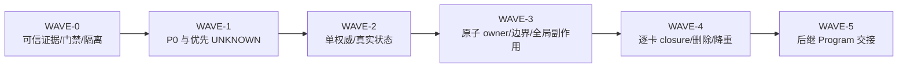

# OpenLife Current Development Program v1.0.2 — Validator Recovery

> Date: 2026-07-27
> Initial publication state: `DRAFT_AWAITING_USER_APPROVAL`
> Live status and execution authority: read
> `plans/openlife_current_development_program.json`; this Markdown never grants
> execution authority.
> Review baseline: `de158ce53018c9c649f7dc0dcb3bdd8271ed4977`
> Scope: current task order, evidence gates, 101-card scheduling, and Agent
> dispatch governance. This document does not change product behavior and does
> not grant Phase7, trial, external-live, durable-write, or finding-closure
> credit.

## 1. Program Decision

OpenLife should **reorganize development on current `main` while retaining the
useful V4 root-cause protocol**.

This means:

- do not restore the literal V4 branch, its old 13-commit order, or its obsolete
  status authority;
- do not create a replacement repository, sibling OpenLife directory, or
  long-lived worktree;
- do not resume feature-first development while evidence gates, the confirmed
  P0, and the priority UNKNOWN set remain unresolved;
- keep the current product and Phase7 deletion baseline, but schedule work from
  the tracked 101-card ledger;
- inherit V4's good method: source map, real RED, root invariant, minimal fix,
  same-slice old-path deletion, positive/fault/absence/non-regression evidence,
  and an architecture stop after three failed attempts.

The V4 commit facts remain historical evidence: 13 unique commits were
classified as 4 integrated, 8 superseded, 1 evidence-only, and 0
still-needed-port. That classification grants **no finding closure**.

This v1.0.2 successor is a narrow validator-recovery release. It preserves the
v1.0.1 Wave order, findings, product boundaries, no-external-action defaults,
and closure policy. It changes only merge-history replay and predecessor
receipt carry-forward so the already authorized W0-S1 task can be reconciled
without inventing a receipt for Program activation. A merge contributes only
paths whose result differs from every parent; side-branch commits remain
individually receipt-covered. R3-N010, R3-N020 and R4-FLAKY-001 remain open.

## 2. Authority And Approval Boundary

Read the active stack in this order:

1. `AGENTS.md`
2. `plans/README.md`
3. `plans/openlife_single_system_deletion_manifest.md`
4. `plans/openlife_single_system_development_preparation.md`
5. this Program
6. `plans/openlife_current_development_program.json`
7. `plans/openlife_problem_ledger.json`
8. the frozen restart-baseline JSON as historical baseline evidence
9. a user-named task packet bound to a Program slice

This Program owns current task order, Wave dependencies, feature-reopen gates,
and Agent dispatch rules. It cannot restore an expected-absent object, override
single-system boundaries, change a product API/schema, or declare a finding or
Phase7 closed.

The initial publication state is deliberately fail closed:

- Program status: `DRAFT_AWAITING_USER_APPROVAL`
- execution authorized: `false`
- every Wave and slice: `PLANNED_NOT_AUTHORIZED`
- bounded feature eligibility: `false`
- normal feature development reopened: `false`

The machine JSON is the sole live state field, while this Markdown is the
stable human contract; an activation transition must not rewrite its
substantive rules. Creating this document is planning, not permission to start coding. An
independent challenge can find defects in the plan, but it still cannot grant
execution authority. The user must explicitly approve the exact Program
version first.

Program activation is a **pre-Wave transition**, not W0-S4:

1. the draft validator and disposable Git-fixture mutation self-test pass;
2. an independent challenge is bound to the exact frozen draft commit and has
   no blocking finding;
3. the user explicitly approves that reviewed version;
4. an activation change records the approved draft commit and sets
   `execution_authorized=true`;
5. the activation validator passes before W0-S2 packet preparation and dispatch.

Later validation does not trust a copied `execution_authorized=true` field. It
replays the first commit after the approved draft and requires that commit to
be the draft's single-parent direct child, to change only Program JSON and
ledger JSON, and to satisfy the same activation-only overlay. A task packet's
activation SHA must equal that derived commit.

These checks use:

```sh
node scripts/test-current-development-program-validator.mjs
node scripts/validate-current-development-program.mjs --profile=draft
node scripts/validate-current-development-program.mjs --profile=activation
node scripts/validate-current-development-program.mjs --profile=ongoing
node scripts/validate-current-development-program.mjs --profile=ongoing \
  --slice=<SLICE_ID> \
  --task-packet=<FROZEN_PACKET_PATH> \
  --execution-baseline=<FROZEN_EXECUTION_BASELINE_SHA>
```

The ancestry checks require the review baseline object to be present. A
detached CI checkout is supported, but a shallow checkout must fetch full
history first. The bare ongoing command validates only a clean integrated
living state. Every task seeking implementation or evidence credit must use
the scoped form; it checks committed, staged, unstaged, and untracked paths
against the frozen packet.

The self-test uses disposable local Git fixtures under the system temporary
directory. It performs no network or product-data action, prints one bounded
result per scenario, applies a per-scenario timeout, and deletes only its
validated temporary prefix.

The validator proves repository structure, state consistency, exact digests,
and packet scope. It does not prove that a human or Agent identity is
independent merely because two strings differ, and it does not convert local
Git state into GitHub approval. Exact-SHA challenge and user approval remain
separate recorded actions.

## 3. Frozen Facts

The formal review was source- and behavior-bounded at
`de158ce53018c9c649f7dc0dcb3bdd8271ed4977` (tree `3aa4d4d793ca7a8b687be9e6f21515296db63dff`). Future slices must
record their real execution SHA and prove it descends from that review
baseline; they must not pretend the old SHA is forever current.

| Fact                           |            Count |
| ------------------------------ | ---------------: |
| Distinct problem cards         |              101 |
| Historical cards               |               72 |
| R3 new cards                   |               28 |
| R4 distinct new cards          |                1 |
| Closed cards                   |                0 |
| P0 / P1 / P2 / UNKNOWN         | 1 / 17 / 22 / 61 |
| Source mapped / source UNKNOWN |           95 / 6 |
| Closure candidates not closed  |               54 |
| Historical OPEN_UNKNOWN        |                7 |

`R4-NATIVE-001` is evidence merged into `BR4-D064`, not card 102. The six
cards without current source refs remain exactly:
`BR4-D009`, `BR4-D010`, `BR4-D011`, `BR4-D018`, `BR4-D038`, and
`BR4-D039`.

Evidence words are not interchangeable:

- `SOURCE-CONFIRMED`: current source supports the stated path or condition;
- `REPRODUCED`: a bounded behavior/fault scenario was actually observed;
- `HISTORICAL-EVIDENCE`: point-in-time evidence only;
- `UNKNOWN`: required evidence is absent.

`PARTIAL` is coverage metadata, not a fifth evidence status. For source
evidence it means the current reference set exists but is not claimed to be an
exhaustive whole-repository source map. Browser shell, native Tauri,
external-live, durable-write, and finding closure retain separate credit.

## 4. Program Shape



| Wave                                                         | Assigned cards | Detail now                                                            | Feature credit      |
| ------------------------------------------------------------ | -------------: | --------------------------------------------------------------------- | ------------------- |
| `WAVE-0` — 可信证据、门禁与隔离基线                          |              3 | W0-S1 predecessor receipt retained; W0-S2 requires packet preparation | none                |
| `WAVE-1` — P0 修复与历史 P0/当前 UNKNOWN 裁决                |             15 | outcome and gates only                                                | none                |
| `WAVE-2` — 单权威、统一门禁与真实状态                        |             41 | outcome and gates only                                                | bounded domain only |
| `WAVE-3` — 操作级原子 owner、边界能力与全局副作用            |             21 | outcome and gates only                                                | bounded domain only |
| `WAVE-4` — 逐卡 closure、契约生成、死表面删除与 owner 降重   |             21 | outcome and gates only                                                | bounded domain only |
| `WAVE-5` — 后继 Program 交接：真实产品试用与正常功能开发解冻 |              0 | handoff marker; not executable in schema 1.0.2                        | none                |

W1-W4 are deliberately not decomposed into speculative implementation tasks
yet. Before each starts, its current source map and ledger facts must be
refreshed, then a bounded preparation packet must be reviewed. W5 is not a
dispatchable Wave in this Program; it requires a separately approved successor.

No Wave may pass vacuously. Every card entering a Wave must leave a
current-execution-SHA outcome: `CLOSED`, `ADJUDICATED_AND_REASSIGNED`,
`QUARANTINED_UNREACHABLE`, or `EXPLICIT_CARRY_FORWARD_WITH_REASON`. A
closure candidate is verified before implementation; only a failed proof opens
the minimal root-fix slice.

## 5. WAVE-0 — First Executable Wave

### W0-S1 — Truthful Frontend Evidence

Cards: `R3-N010`, `R3-N020`.

Objective:

- repair or remove the required Frontend Coverage false-green path;
- add deterministic failures for `W0-COV-MISSING`,
  `W0-COV-NONNUMERIC`, `W0-COV-ZERO-COLLECTION`, and
  `W0-COV-BELOW-THRESHOLD`;
- add deterministic failures for `W0-TEST-ZERO-COLLECTION`,
  `W0-TEST-FORBIDDEN-CREDIT`, and `W0-TEST-ID-DRIFT`;
- ensure default Vitest credit excludes retired Stage1, Step6, and dev-harness
  evidence plus the `tauriDev`-dependent records from the mixed
  `frontend/src/tauri.test.ts` owner, while retaining its current-product
  wrapper tests.

Exit: four coverage and three selection counterexamples fail, valid inputs
pass, and the current credited test IDs/count are explicit. The precise
current/historical counts and digests are measured by W0-S1 rather than treated
as already-proved implementation facts. A passing job before those
counterexamples gives no coverage or selection credit.

The machine Program retains the complete W0-S1 task-packet blueprint as
historical dispatch evidence. Its independently reviewed predecessor receipt
and immutable successful-attempt record are carried into this successor, but
they grant no finding closure and cannot be dispatched again. The live status
is `PREDECESSOR_RECEIPT_RETAINED_NOT_DISPATCHABLE`; the next executable slice
after successor activation is W0-S2.

### W0-S2 — Owner-Lease Evidence Determinism

Card: `R4-FLAKY-001`.

Objective:

- preserve the full error source chain so process-registry rejection and OS
  `WouldBlock` are distinguishable;
- freeze `W0-LEASE-FORKEXEC` on macOS arm64 with a clean parent, explicit
  fork-to-exec child, test ID, seed or `N/A`, process model, and concurrency;
- run the focused contract 20 consecutive times and the full workspace at
  concurrency 1 twice.

Any unexplained variation keeps the gate blocked. This slice may diagnose a
product root cause, but cannot silently expand into a product fix.

### W0-S3 — Native External-State Isolation

This is a high-risk evidence prerequisite linked to `BR4-D064`, not a second
assignment, root fix, or P0 closure claim.

Objective:

- inventory before/after filesystem data-dir, Keychain service/account prefix,
  locks, file descriptors, and sockets;
- create an isolated secret-store seam suitable for native verification;
- fail on changes outside the declared allowlist and leave unobserved surfaces
  `UNKNOWN`.

The retained Keychain secret must not be deleted without separate explicit user
authority. External providers and real product durable writes remain disabled.

### W0-S4 — Wave-0 Ledger Reconciliation

Objective:

- record the exact execution-SHA outcomes from W0-S1 through W0-S3;
- update card evidence without converting unresolved or partially covered facts
  into closure;
- reconcile residual `UNKNOWN`, blockers, and W1 entry facts;
- confirm Program, ledger, and active authority still agree.

Program activation has already occurred before W0. W0-S4 cannot retroactively
authorize prior work; it closes the Wave's evidence ledger.

## 6. Later Wave Outcomes

### WAVE-1 — P0 And Priority UNKNOWN

- prepare one BR4-D064 root-fix slice with profile/data-dir/process-scoped key
  authority, writer lease, migration/backout, and orphan reconciliation;
- adjudicate the 14 historical-discovery P0/current-UNKNOWN cards using
  current-SHA source plus targeted behavior/fault evidence;
- give every W1 card an explicit closed, reassigned, quarantined, or
  reasoned-carry outcome;
- do not start broad P1 work until reachable product-path P0 is zero or the
  affected surface is proven unreachable and quarantined.

### WAVE-2 — One Authority And Truthful State

Address `CQ-C01`, `CQ-C02`, and `CQ-C05` through a shipped
command/effect/owner registry, second-writer deletion, typed corrupt/unavailable
state, and receipts that cannot be discarded. A replacement and its old
writer/route must converge in the same slice. Each of the 19 initial W2 closure
candidates is verified first; a failed proof opens its minimal root-fix slice.
Every card entering W2 must receive a current-SHA outcome before the Wave can
close.

### WAVE-3 — Atomic Operations And Real Boundaries

Address `CQ-C03`, `CQ-C04`, and `CQ-C08`. Each operation must declare one
transaction/journal/outbox and terminal owner before implementation. Freeze a
fail-before/fail-after/retry/cancel/restart matrix, carry bounded authority to
the leaf effect, and make Keychain/lock/FD/socket/network acquisition explicit.
Each of the 11 initial W3 closure candidates is verified first, and every card
entering W3 must receive a current-SHA outcome.

### WAVE-4 — Closure And Maintainability

Validate W4's 11 initially assigned closure candidates plus explicitly carried
residuals; earlier Waves validate their own candidates. A failed validation
opens a minimal root-fix slice. Generate Rust/TypeScript/handler bijections,
review reachability before deleting dead surfaces such as ReflexEngine or old
flags, and ratchet owner size/fan-out without creating new second owners. No
W4 or residual card may disappear through a vacuous exit gate.

### WAVE-5 — Successor Program Handoff For Real Product Trial

This Program stops after W4 readiness. It does not authorize a W5 task packet,
external provider, non-loopback web/MCP, real durable write, or normal feature
reopen. W5 is a fail-closed handoff marker: the user must start and explicitly
approve a separately validated successor Program for those scenarios.
Unexecuted dimensions remain `UNKNOWN`.

## 7. Feature Development Gates

There are two different gates.

### Bounded Feature Eligibility

A small feature may only be considered inside the current Wave's
`BOUNDED_DOMAIN_ONLY` credit after all are true:

1. required checks have tested failure paths and truthful evidence names;
2. `R4-FLAKY-001` has no unexplained variation under the W0 contract;
3. `BR4-D064` is closed or its surface is proven unreachable and
   quarantined;
4. all 14 historical-discovery P0/current-UNKNOWN cards are current-SHA
   adjudicated;
5. all 101 baseline cards retain owner/source/evidence/next-proof records;
6. isolated native trial has no undeclared mutation inside the declared
   external-state inventory;
7. the proposed feature crosses no open P0, authority, truth, or effect
   boundary and carries replacement absence evidence.

A card marked “not a global blocker” is not closed. It still blocks any feature
that crosses its domain. Passing this gate does not reopen broad or normal
feature development.

### Normal Feature Development Reopen

Normal feature work remains blocked until bounded eligibility is satisfied for
the domain **and** `G-W2-AUTHORITY-TRUTH`,
`G-W3-ATOMICITY-BOUNDARY`, `G-W4-CLOSURE-CONVERGENCE`, and
`G-W5-PHASE7-TRIAL` all pass. Program schema 1.0.2 cannot grant or run W5;
the successor Program must own that gate and explicitly grant
`NORMAL_AFTER_GATE` credit.

## 8. Development Operating Model

- one writable checkout: `/Users/tw/Desktop/open-life`;
- one long-term branch: `main`;
- one short-lived `codex/...` task branch in the same checkout;
- one root cause per slice;
- warning threshold: 30 files or 3,000 changed lines;
- hard stop: 80 files or 10,000 changed lines; no packet-level exception exists,
  so the slice must split or this Program must stop for a successor;
- three failed attempts recorded against the same root-cause cluster stop
  further dispatch until an independent architecture review explicitly covers
  those attempt records;
- read-only source mapping and non-overlapping verification may run in
  parallel; writes to the same owner, schema, authority, or ledger are
  serialized;
- only the Integrator updates the tracked ledger and integration state.

After a task is integrated, the Integrator records its reviewed packet digest,
digest-addressed tracked artifact under
`plans/openlife_task_packets/<packet_sha256>.json`, exact committed base/head
range, exact changed paths, frozen allowlist, activation SHA, and same-head
independent review in the ledger. Bare ongoing validation on clean `main`
recomputes that packet and checks that every non-state commit and path touched
since the approved Program draft is covered by such a receipt. Packet artifacts
are immutable receipts, not a second planning authority. This is a
living-state/integration check, not a substitute for the scoped pre-merge task
gate.

Every frozen packet is also settled by one append-only attempt record. The
packet and a bounded digest-addressed attempt artifact land first; a later
state commit records `SUCCEEDED`, root-cause failure, scope abort, or external
blocker without merging failed product code. Artifacts contain only structured
summaries and a small necessary excerpt—never credentials, Keychain values,
private product data, or unbounded logs/patches.

After three counted implementation failures in one root-cause cluster, an
independent architecture review must name the shared failure pattern, reassess
the root cause, revise the invariant or strategy, and freeze constraints for
the next attempt. The next implementation packet must bind that exact review
and those constraints; verification or challenge activity cannot consume the
reset.

If development discovers a genuinely new problem, the Integrator appends a
`CUR-N...` card in a creation commit, obtains an independent review bound to
that SHA, and records the review plus stable-fact digest in the following
reconciliation commit. The creation commit by itself is never a green
integrated handoff. The digest freezes identity, origin, cluster, guards,
initial Wave, and exact proof contract. The 101 baseline cards and the existing
merge record remain immutable; a new cluster or a merge-policy change requires
a successor Program.

High-risk means canonical authority, durable write, permission, external
effect, schema, migration, or Keychain work. It requires a head-SHA independent
challenge. This Program has no waiver-to-merge lane. User approval of this
Program is also not a GitHub formal review.

## 9. Agent Task Packet

Every implementation, verification, or challenge Agent receives a frozen
packet:

```yaml
task_id:
packet_status: FROZEN_FOR_DISPATCH
packet_sha256:
packet_payload_sha256:
packet_freeze_review:
  outcome: PASS
  reviewed_payload_sha256:
  integrator_id:
  reviewer_id:
  artifact_or_record:
program_schema_version: "1.0.2"
program_activation_sha:
mode: IMPLEMENTATION | VERIFICATION | VERIFICATION_THEN_CONDITIONAL_IMPLEMENTATION | CHALLENGE
wave_id:
slice_id:
slice_exit_contract_id:
execution_baseline_sha:
expected_parent_main_sha:
checkout: /Users/tw/Desktop/open-life
branch: codex/...
assigned_agent_id:
finding_ids: []
preimplementation_proof_ids: []
architecture_review_id:
architecture_review_constraints: []
required_guard_ids: []
governance_task: false
root_cause_cluster_id:
objective:
non_goals: []
invariant:
canonical_owner:
source_map: []
allowed_touched_paths: []
forbidden_touched_paths: []
expected_absent_paths: []
risk_class: LOW | MEDIUM | HIGH
external_action_policy:
  external_provider_or_network: false
  real_durable_write: false
  keychain_delete: false
  product_data_delete: false
  new_worktree: false
  sibling_repository: false
red_contract: []
minimal_fix_contract:
old_path_deletion_contract:
verification_commands: []
required_evidence_dimensions: []
acceptance_criteria: []
closure_claim_allowed: false
budget:
  warning_files: 30
  warning_churn_lines: 3000
  hard_stop_files: 80
  hard_stop_churn_lines: 10000
stop_conditions: []
review_contract:
  risk_class: LOW | MEDIUM | HIGH
  independent_challenge_required:
  reviewed_head_sha:
  review_type: INDEPENDENT_AGENT_CHALLENGE | GITHUB_FORMAL_REVIEW
  review_artifact:
  github_formal_review_count: 0
  github_formal_approval_credit: false
ledger_update_contract:
handoff_contract:
```

Dispatch stops if the source map is false, a write is needed outside the
allowlist, an expected-absent path would be recreated, the RED cannot fail for
the stated reason, a closure-candidate proof has not failed before conditional
implementation, the same root cause has failed three times, the hard budget is
exceeded, or a requested external action lacks authority.

`packet_payload_sha256` is computed with both packet hashes and the freeze
review normalized to `null`; an independent reviewer signs that payload digest.
`packet_sha256` then covers the complete reviewed packet with only itself
normalized to `null`. The packet baseline and expected parent must equal the
local `main` tip at dispatch; its activation SHA must be an ancestor. The actual
branch must equal the packet's `codex/...` branch. Scoped validation covers
every committed, staged, unstaged, and untracked change since that baseline.
It also rechecks the immutable Phase7 expected-absent path registry and requires
the canonical `single_system` guard command; a packet cannot narrow those
global protections by reporting a smaller local absence list.

The retained W0-S1 receipt is replayed against the v1.0.1 dispatch Program and
its digest-addressed historical packet; the v1.0.2 inline blueprint is not a
new W0-S1 dispatch authority. W0-S2 is the next packet-preparation subject.
W0-S2/W0-S3 and later-Wave slices use the same reviewed freeze contract after
their Wave preparation: all finding
IDs must currently belong to that ready/in-progress Wave (except an explicitly
named Program prerequisite such as D064 in W0-S3), one root cluster is named,
owner/source paths resolve at the baseline, external-action defaults stay
false, and the packet's independent freeze review passes. This lets the
Integrator refine later work without silently amending the approved Program;
changing Wave order, gates, evidence rules, or authority still requires a new
successor Program with its own validator, independent exact-commit challenge,
and explicit user approval. This validator deliberately does not support
in-place amendments after execution starts.

Cards marked `CLOSURE_CANDIDATE` cannot enter ordinary `IMPLEMENTATION`.
Their packet must either be verification-only or use
`VERIFICATION_THEN_CONDITIONAL_IMPLEMENTATION`, freeze the exact
`preimplementation_proof_ids`, and credit both proof execution and proof
failure before any implementation change receives credit.

## 10. Lessons Carried Forward

The Program converts the retrospective into controls:

| Past mistake                                          | Program prevention                                                        |
| ----------------------------------------------------- | ------------------------------------------------------------------------- |
| Branches/worktrees became parallel product realities  | one checkout, main as the only long-term branch, short task branches only |
| Changes were too large and mixed concerns             | one root cause, enforced size budgets, split before hard stop             |
| Roadshow urgency replaced the main sequence           | freeze SHA/unresolved work, return to the same Program after interruption |
| “complete/ready/final” lacked evidence dimensions     | bind status to SHA/profile/scenario/evidence dimension                    |
| Green checks were trusted without testing the checker | failure counterexamples before gate credit                                |
| New routes/writers survived beside old ones           | same-slice owner convergence and expected absence                         |
| Unknown/corrupt became empty/default/healthy          | typed fail-closed truth                                                   |
| Multi-store operations lacked an atomic owner         | journal/outbox owner plus fault matrix before code                        |
| Tests stopped before real global effects              | filesystem/Keychain/lock/FD/socket/network inventory                      |
| Docs and large owner modules only grew                | one authority index, retirement rules, owner/fan-out ratchet              |
| Independent challenge was absent or mislabeled        | mandatory same-SHA challenge, never fake approval                         |

Preserve what already improved: a single checkout, recoverable ref cleanup,
V4 commit classification without fake closure, historical authority demotion,
`red-until-trial-green`, and separated compile/unit versus browser-shell
credit.

## 11. Closure And Anti-Hallucination Rules

A card can become `CLOSED` only with:

1. current-SHA implementation or explicit current-SHA adjudication;
2. behavior or fault evidence at the real owner boundary;
3. independent closure review bound to the same reviewed head SHA;
4. capability non-regression;
5. same-SHA independently reviewed applicability adjudication for
   `ABSENCE_IF_APPLICABLE`, followed by expected-absent evidence only when that
   adjudication says deletion applies.

Tests pass, source presence, historical “complete”, an owner waiver, or approval
of this Program is insufficient alone. MD/JSON/ledger disagreement, missing
artifacts, unknown values, or a stale SHA all block progress.

Wave outcomes and integration/attempt/review records are append-only. If a
later scoped integration makes closure evidence stale, the Integrator must
append `REVALIDATED_CLOSED` with refreshed same-head evidence while preserving
the original implementation SHA and author. Rewriting the original `CLOSED`
outcome or its history is forbidden.

## 12. Initial Draft Approval And First Transition

At initial publication, the only transition is read-only review of the Program
itself. After the corrected draft is validated and bound to an independent
challenge, it is frozen in a draft commit. The user may then explicitly approve
that exact reviewed draft. A separate activation state change sets execution
authority and must pass the activation profile. Approval does not pre-approve
W0 code, external actions, merges, or closures.

After activation, this paragraph remains historical publication context;
current execution, Wave, gate, approval, and next-slice state comes from the
machine Program and ledger. W0-S1 is retained as predecessor task evidence
without closure credit and must not be dispatched again. After successor
activation, the Integrator prepares and freezes **W0-S2 — Owner-Lease Evidence
Determinism** against the live baseline. W0-S3 requires its own later prepared
packet; W0-S4 reconciles the Wave ledger after the preceding slices have their
required evidence and challenge.
