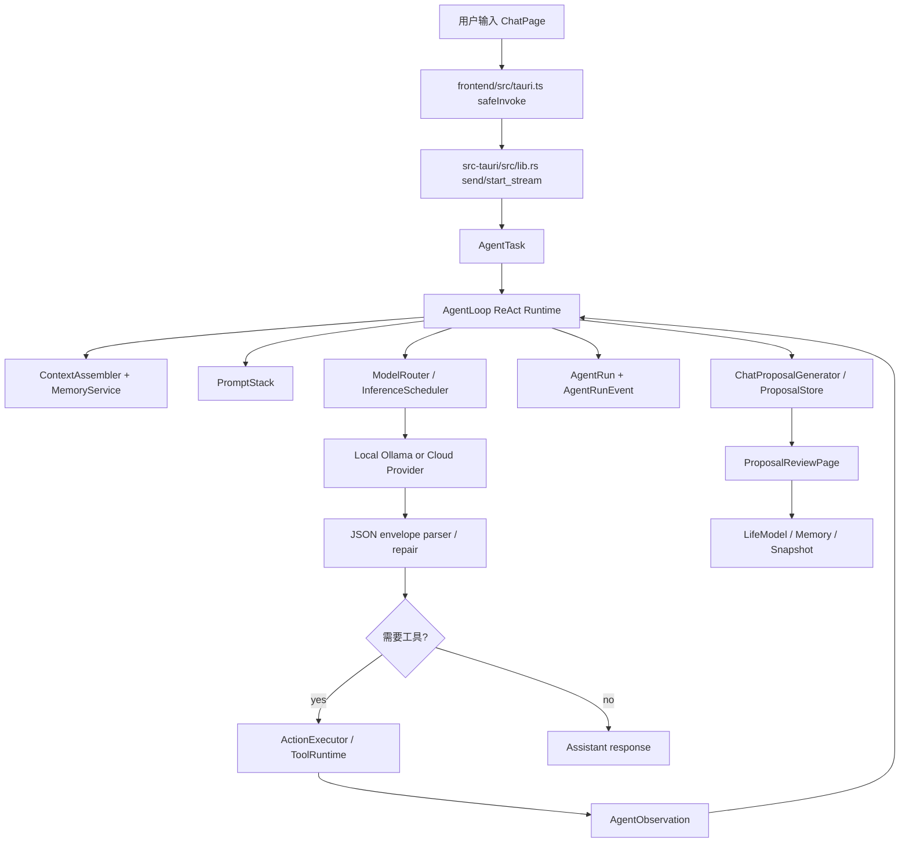
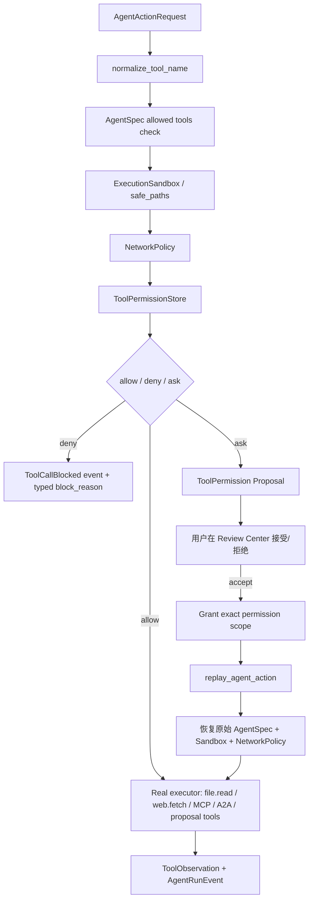
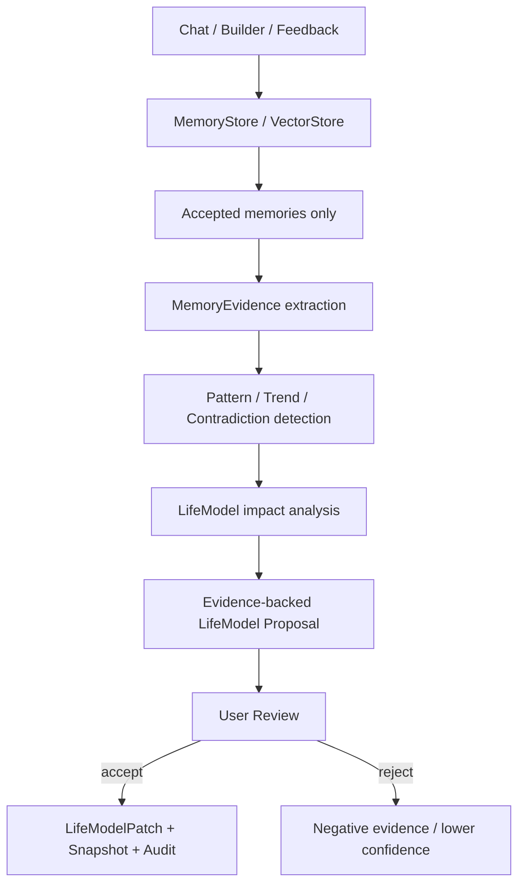
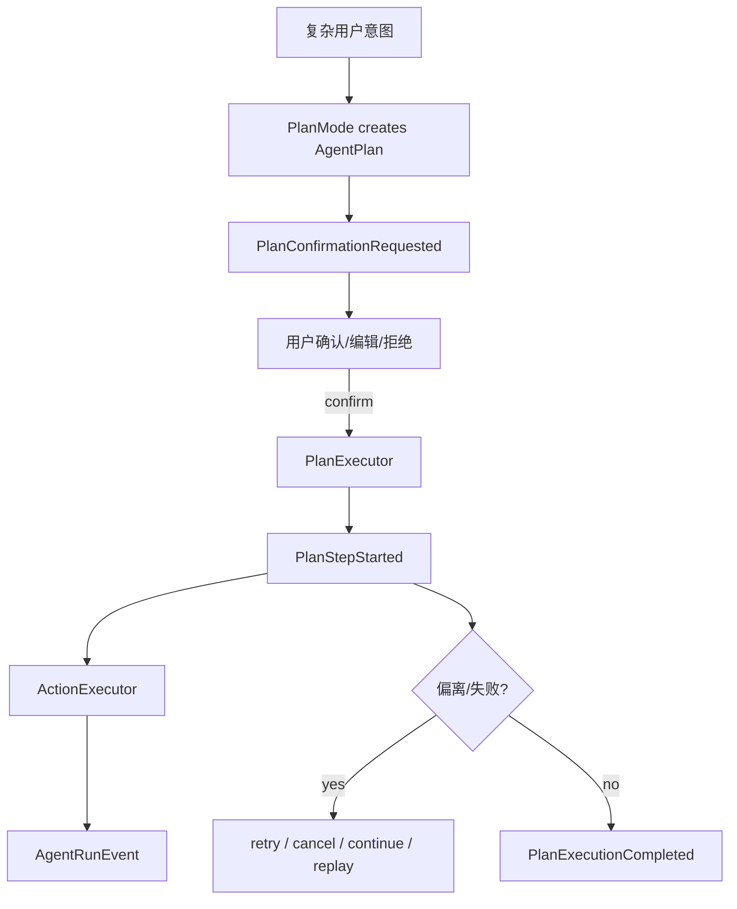
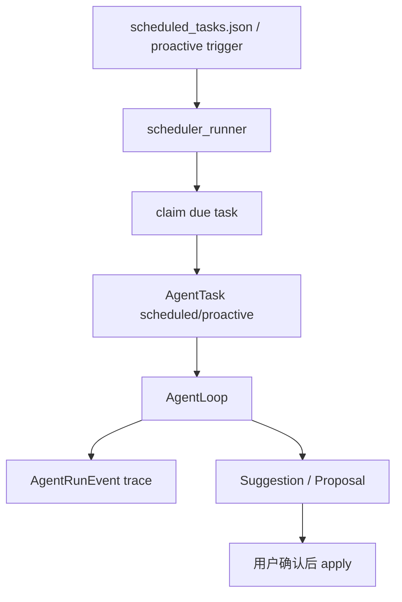
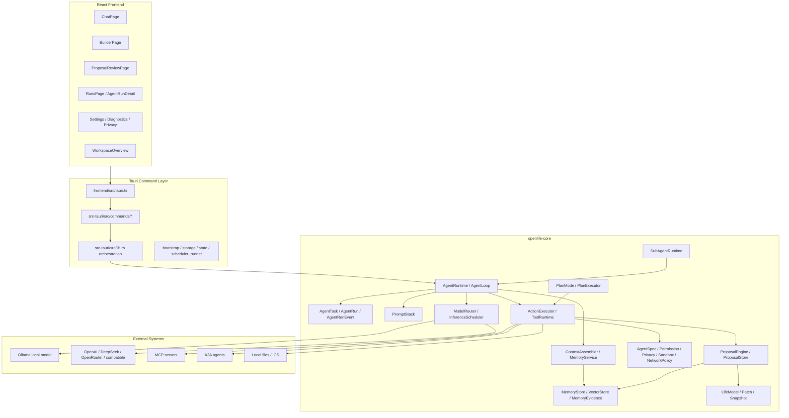
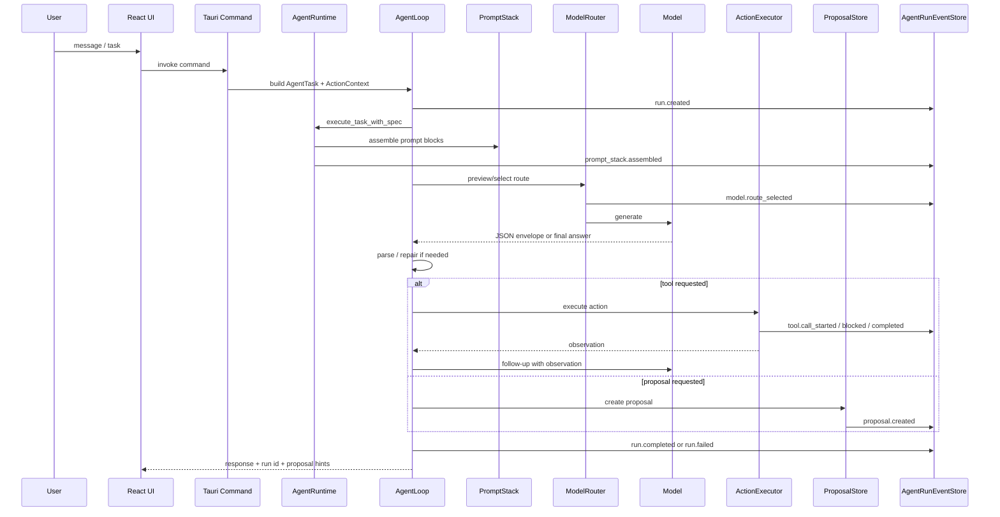
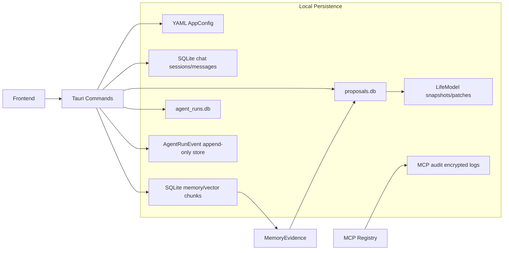

# OpenLife 当前项目状态与 Agent Framework 架构报告

Date: 2026-05-23  
Scope: 基于仓库文档、Rust/TypeScript 代码静态审阅、当前路线图与 Beta RC 验收材料。未重新运行 `make ci`。当前工作区存在未提交修改，本报告以已落地代码结构和现有文档事实为主，不把未提交修改视为已发布结论。

---

## 1. 结论摘要

OpenLife 目前已经不是一个早期聊天 Demo，而是一个具备真实 Agent Framework 主干的本地优先个人 Agent OS 雏形。核心原语已经基本齐备：`AgentTask -> AgentRun -> AgentRunEvent -> ContextAssembler -> PromptStack -> ModelRouter -> ReAct AgentLoop -> ToolRuntime/ActionExecutor -> Proposal -> Replay/Audit -> Memory/LifeModel`。

当前最准确的阶段判断是：

- **产品阶段**：P12 Beta Release Candidate 已通过代码级验收，可进入小范围真实用户试用。
- **工程阶段**：vNext P0-P12 原语已实现，但还没有达到 Codex / Claude Code 一线 Agent 产品的整体成熟度。
- **架构阶段**：主干方向正确，治理设计强于普通个人 AI App；短板集中在执行路径收敛、真实工具执行广度、端到端行为验收、生产分发和长任务可靠性。

一句话判断：

> OpenLife 已经完成了“个人 Agent Framework 的骨架和关键治理器官”，但还没有完成“工业级 Agent 产品的肌肉、耐力和分发能力”。

---

## 2. 审阅依据

核心文档：

- `README.md`
- `plans/openlife_post_beta_roadmap.md`
- `plans/openlife_vnext_p12_beta_rc_acceptance_report.md`
- `plans/current_agent_runtime_audit.md`
- `plans/openlife_codex_level_upgrade_plan.md`
- `plans/openlife_codex_level_acceptance_matrix.md`
- `plans/openlife_vnext_architecture_diagrams.md`
- `plans/openlife_vnext_core_primitives_and_boundaries.md`

核心代码：

- `openlife-core/src/agent/types/mod.rs`
- `openlife-core/src/agent/agent_loop/`
- `openlife-core/src/agent/action_executor/`
- `openlife-core/src/agent/runtime.rs`
- `openlife-core/src/agent/prompt_stack.rs`
- `openlife-core/src/agent/model_router.rs`
- `openlife-core/src/agent/execution_sandbox.rs`
- `openlife-core/src/agent/plan_executor.rs`
- `openlife-core/src/agent/sub_agent.rs`
- `src-tauri/src/lib.rs`
- `src-tauri/src/commands/`
- `frontend/src/pages/`
- `frontend/src/components/`

外部对标信息：

- OpenAI Codex 官方介绍：云端软件工程 Agent，可并行处理任务、读写代码、运行测试、提交 PR。
  <https://openai.com/index/introducing-codex/>
- OpenAI Codex GA：CLI、IDE、云端、Slack、SDK、管理与监控能力。
  <https://openai.com/index/codex-now-generally-available/>
- OpenAI Codex app：面向多 Agent 并行协作和长任务管理的桌面指挥台。
  <https://openai.com/index/introducing-the-codex-app/>
- OpenAI Codex cloud docs：每个任务使用独立 sandbox cloud container。
  <https://platform.openai.com/docs/codex>

---

## 3. 当前已完成功能与完成度

完成度分级：

- **A**：主路径可用，有测试和 UI/命令入口，Beta 可试用。
- **B**：核心实现存在，但仍需路径收敛、端到端验收或真实用户验证。
- **C**：原语或雏形存在，但离产品级能力仍有明显缺口。
- **D**：设计中或声明中，尚不能视为可用功能。

| 功能域 | 当前状态 | 完成度 | 代码/文档证据 | 主要差距 |
|---|---:|---:|---|---|
| LifeModel 四维模型 | Identity/Goals/Capabilities/State/Preferences/Relationships 等模型、编辑、快照、patch 基础已存在 | A- | `openlife-core/src/life_model.rs`, `frontend/src/pages/LifeModelEditor.tsx` | 仍需要把所有演化统一绑定到 evidence-backed Proposal |
| Builder | 支持快速、渐进、苏格拉底式构建，默认生成 Proposal | A- | `src-tauri/src/commands/builder.rs`, `frontend/src/pages/BuilderPage.tsx` | Builder prompt 与执行路径还未完全收敛到统一 PromptStack/AgentRuntime |
| Chat 主体验 | 流式聊天、会话持久化、readiness、slash command、AgentRun 关联、Proposal banner | A- | `frontend/src/pages/ChatPage.tsx`, `src-tauri/src/lib.rs` | ChatPage 仍偏大，流式/非流式/fallback 路径仍需统一 facade |
| AgentRun | 有运行记录、列表、详情、恢复、删除、按 session 查询 | A | `openlife-core/src/agent/store.rs`, `src-tauri/src/commands/agent.rs`, `RunsPage` | 需要更强地把所有行为都强制进入 AgentRun |
| AgentRunEvent | 事件枚举包含 run/model/tool/proposal/fallback/plan/replay/compaction 等 40+ 类 | A- | `openlife-core/src/agent/types/mod.rs`, `event_store.rs` | 部分 legacy/fallback 路径事件完整性仍是 Post-Beta 重点 |
| ReAct AgentLoop | 真实迭代循环：模型生成、JSON envelope、repair、工具执行、observation、follow-up | B+ | `openlife-core/src/agent/agent_loop/` | `run_loop_core` 职责仍重；长任务稳定性和失败恢复还未到一线水平 |
| PromptStack | 已有 PromptStack、PromptBlock、built-in blocks、事件记录 | B+ | `openlife-core/src/agent/prompt_stack.rs` | built-in block 仍少；Builder/Calibration/Skills/legacy generate 还有 ad hoc prompt |
| ContextAssembler | 已实现模块化上下文组装和治理摘要 | B+ | `openlife-core/src/agent/context_assembler.rs` | 需要更多隐私策略、token budget、memory evidence 联动验证 |
| ModelRouter | 已从 experimental 毕业，支持任务/隐私/本地云端路由概念 | B+ | `openlife-core/src/agent/model_router.rs`, `scheduler.rs` | 与一线产品相比缺少大规模模型评测、成本/延迟优化和强 SLA |
| ToolRuntime / ActionExecutor | 已支持 Core OS、Execution tools、MCP wrapper、权限、proposal、typed block reason | B | `openlife-core/src/agent/action_executor/` | 真实执行工具范围仍窄；MCP target governance、stub truthfulness 是 Codex-level 阻断项 |
| MCP | 注册、list tools、call tool、audit、manifest、权限基础存在 | B | `openlife-core/src/mcp.rs`, `src-tauri/src/commands/mcp.rs` | 同名工具 disambiguation、真实 target 权限、无 fake fallback 仍需强化 |
| A2A | 本地 agent card、discover、send task、sidecar 控制、bridge preview | B- | `openlife-core/src/a2a.rs`, `src-tauri/src/commands/a2a.rs` | 更像协议接入基础，还不是成熟的多 Agent 协同平台 |
| Proposal 统一确认层 | 支持 LifeModel/Memory/ToolPermission/ExternalWrite/ScheduledTask/DataExport 等类型 | A- | `proposal_store.rs`, `proposal_engine.rs`, `ProposalReviewPage.tsx` | continuation/replay 仍需要完全类型化、所有 apply/reject 都进入完整事件链 |
| Memory | SQLite message/session/state + vector chunks + hot cache + archive/restore/search | B+ | `memory.rs`, `vectors.rs`, `memory_service.rs` | 记忆作为 retrieval 可用；作为 LifeModel evidence layer 尚未端到端闭环 |
| MemoryEvidence | 信号类型和提取结构存在 | B- | `openlife-core/src/agent/memory_evidence.rs` | repeated preference -> evidence -> proposal -> accepted patch 仍需集成验收 |
| PlanMode / PlanExecutor | 有 plan 创建、确认、执行、retry/cancel/continue/replay/deviation | B | `plan_mode.rs`, `plan_executor.rs`, `src-tauri/src/commands/plan.rs` | 真实复杂计划任务成功率、UI 交互、异常恢复仍需打磨 |
| AgentSpec | 有 AgentSpecStore、默认 spec、工具治理、运行选择 | B+ | `agent_spec_store.rs`, `types/mod.rs` | replay/plan/sub-agent 必须恢复原始 AgentSpec，不能出现 `None` bypass |
| ExecutionSandbox | 有 sandbox config、安全路径、shell governance | B | `execution_sandbox.rs`, `shell_executor.rs` | shell 默认关闭是正确的；离 Codex 级可控执行环境还有距离 |
| ShellExecutor | 已实现但默认关闭 | C+ | `shell_executor.rs` | 不能作为 Beta 用户能力宣传；需要强 sandbox、approval、trace、平台验证 |
| Skills | 内置 skill MVP、JSON envelope、skill proposal | B- | `openlife-core/src/skills.rs`, `src-tauri/src/commands/execution.rs` | skills prompt 未完全 PromptStack 化；外部 skill ecosystem 未成熟 |
| Plugins | manifest 管理、enable/disable、declarative-only 策略 | B- | `plugins.rs`, `PluginSection.tsx` | 仍偏本地 manifest，缺少真实安全 executor 和市场生态 |
| Diagnostics / Safe Mode | 系统诊断、安全模式、恢复控制台、隐私诊断导出 | A- | `commands/diagnostics.rs`, `SettingsPage.tsx` | 还需要真实用户环境验证和平台级分发测试 |
| Workspace / Runs / Review UI | 工作台、运行列表、运行详情、Proposal Review、Settings 已成体系 | B+ | `WorkspaceOverview.tsx`, `RunsPage.tsx`, `AgentRunDetail.tsx` | UI 可用但还不是一线 Agent 指挥台级的多任务协作体验 |
| Release build | macOS aarch64 app/dmg 已产出 | B- | P12 RC report | 无 universal binary、无签名公证、Windows/Linux 未验证 |
| 测试/CI | 文档记录 799 Rust/Tauri 测试 + 214 前端测试，`make ci` 作为门控 | A- | `Makefile`, P12 RC report | 行为验收矩阵还未全部满足；本报告未重新跑 CI |

---

## 4. 与一线 Agent 产品的差距

这里的“一线水平”主要参考 Codex / Claude Code / Cursor Agent 类产品的共同标准：真实执行、强沙箱、长任务、并行任务、可恢复、可审计、开发工具链集成、团队级监控和稳定分发。

### 4.1 OpenLife 已经接近一线的部分

| 维度 | 判断 |
|---|---|
| Agent 原语完整性 | 已经有 `AgentTask/AgentRun/Event/PromptStack/ToolRuntime/Proposal/Replay`，这一点比多数个人 AI App 更接近 Agent Framework |
| 隐私与确认机制 | LifeModel、Memory、外部写操作都倾向 proposal-first，这是 OpenLife 的核心优势 |
| 本地优先 | Tauri + Rust + SQLite + Ollama 路径符合个人数据 OS 的定位 |
| Trace 设计 | AgentRunEvent 覆盖面较广，具备成为审计源的基础 |
| Beta 试用工程 | 有诊断、Safe Mode、试用指南、RC 报告、CI 门控，已经不是随手 Demo |

### 4.2 与 Codex 等一线 Agent 的关键差距

| 差距项 | Codex 等一线产品形态 | OpenLife 当前状态 | 差距等级 |
|---|---|---|---:|
| 并行长任务执行 | Codex 云端任务可多 Agent 并行，每个任务独立 sandbox/container | OpenLife 有 Plan/SubAgent 原语，但还不是成熟并行任务系统 | 高 |
| 真实执行环境 | Codex cloud 每任务有可配置代码环境、依赖、测试运行 | OpenLife 有 ExecutionSandbox/ShellExecutor，但 shell 默认关闭，工具执行面窄 | 高 |
| 工程交付闭环 | 读代码、改代码、跑测试、提交 PR、代码审查、CI 反馈 | OpenLife 不是 coding agent 产品，缺少 Git/PR/CI 原生闭环 | 高 |
| 工具真实性 | 一线产品必须避免 fake success，工具失败要可复现 | OpenLife 已意识到问题，但 stub/declarative-only/MCP fallback 仍是升级重点 | 高 |
| 运行时权威收敛 | 所有任务进入统一 harness，权限和沙箱不可绕过 | OpenLife 仍有 5+ 执行入口、fallback/legacy path | 高 |
| Prompt 架构 | Prompt policy、tool schema、context budget、memory 都有统一 harness | OpenLife 有 PromptStack，但覆盖尚未全路径完成 | 中高 |
| 评测体系 | 大量真实任务评测、回归集、可观测指标、管理面板 | OpenLife 有 CI 和 acceptance matrix，但缺真实用户/长任务 eval 数据 | 中高 |
| 产品分发 | macOS/Windows/IDE/CLI/Cloud/团队管理 | OpenLife 目前 macOS aarch64 RC，未签名、未跨平台验证 | 高 |
| 多 Agent 协作 UX | Codex app 类指挥台管理多个 agent 长任务 | OpenLife 有 Workspace/Runs，但还不是多 Agent cockpit | 中高 |
| 模型能力 | 一线产品使用专门训练的 coding/agentic 模型 | OpenLife 依赖外部云端/本地模型路由，自身没有专用模型能力 | 中 |

### 4.3 OpenLife 不应该简单照抄 Codex 的地方

OpenLife 的目标不是成为代码工程 Agent，而是私人 LifeModel-governed Agent OS。因此它的差异化优势应该是：

- 私人 LifeModel 上下文，而不是 repo 上下文。
- 本地优先和隐私治理，而不是云端优先。
- 用户确认下的长期自我理解演化，而不是一次性任务完成。
- MemoryEvidence -> LifeModel Proposal 的个人成长闭环，而不是 PR 交付闭环。

所以，对标 Codex 的重点不是“做代码编辑能力”，而是学习它的：

- agent harness 严谨性；
- sandbox 和 permission 不可绕过；
- 长任务可恢复；
- trace 可解释；
- 任务并行与调度；
- 产品级稳定性和分发。

---

## 5. 当前功能链梳理

### 5.1 Chat 到 AgentRun 到 Proposal



技术细节：

- `AgentRunEventType` 覆盖 `run.created`、`prompt_stack.assembled`、`model.route_selected`、`tool.call_blocked`、`proposal.created`、`replay.*` 等。
- `AgentLoop` 的默认 step budget 文档为 4，tool budget 为 6。
- streaming 和 non-streaming 共用核心 loop，但 Tauri 层入口仍未完全收敛。

### 5.2 工具调用、权限、Proposal、Replay 链



当前强点：

- 已经有 typed `ExecutionBlockReason`、`ExecutionProposalReason`、`ExecutionFailureKind`，前端也在避免通过错误字符串推断语义。
- 高风险写操作倾向生成 Proposal，而不是直接执行。

当前风险：

- `mcp.call_tool` 必须治理真实 target，不只是 wrapper。
- replay 必须恢复原始 AgentSpec/Sandbox/NetworkPolicy，不能用默认或空上下文。
- declarative-only/stub 工具不能出现在模型可执行工具列表。

### 5.3 Memory 到 LifeModel Evolution 链



当前状态：

- Memory 作为检索和持久记录已经可用。
- MemoryEvidence 原语存在。
- ChatProposal 能从对话生成目标、状态、能力、记忆类提案。

缺口：

- 还缺完整、稳定、可测试的 `accepted memory -> evidence -> proposal -> accepted patch` 闭环。
- 矛盾证据处理、被拒绝 proposal 对后续 scoring 的影响仍需产品化。

### 5.4 PlanMode 链



PlanMode 的价值是把“长任务先计划、再确认、再执行”制度化。当前已有实现和命令入口，但要达到一线水平，还需要真实复杂任务集的通过率、恢复率和可解释 UI。

### 5.5 Scheduled / Proactive 链



当前状态：

- Scheduler runner 存在，Post-Beta 正在加强并发安全和 write-back 逻辑。
- ProactiveEngine 可生成建议，但还不是大规模稳定的主动 Agent 编排系统。

---

## 6. 整体技术架构图

### 6.1 分层架构



### 6.2 Runtime 内核



### 6.3 数据与审计架构



---

## 7. Agent Framework 的真实定义

OpenLife 当前的 Agent Framework 可以定义为：

> 一个由 LifeModel 治理、以 AgentRun 为审计单元、以 PromptStack 和 ContextAssembler 组装上下文、由 ModelRouter 选择模型、通过 ReAct AgentLoop 调用 ToolRuntime、所有高风险副作用进入 Proposal 确认层，并最终把用户决策和记忆证据回写到 LifeModel/Memory 的本地优先 Agent 运行时。

### 7.1 核心对象

| 对象 | 职责 |
|---|---|
| `AgentTask` | 用户意图或系统触发的任务入口，承载 session、kind、layer、privacy/execution policy |
| `AgentRun` | 一次可查询执行，记录输入、输出、模型路由、动作、观察、proposal、错误 |
| `AgentRunEvent` | append-only 审计事件，是未来解释、replay、debug、compliance 的核心 |
| `AgentSpec` | 定义 agent role、允许工具、隐私策略、执行边界 |
| `PromptStack` | 把 system/planning/tool/privacy 等 prompt block 版本化和可追踪化 |
| `ContextAssembler` | 组装 LifeModel、memory、session、tool context，并输出治理摘要 |
| `ModelRouter` | 基于任务、隐私、工具需求、本地/云端可用性选择模型路径 |
| `AgentLoop` | ReAct 循环：Reason -> Act -> Observe -> Follow-up |
| `ActionExecutor` | 工具执行实现，负责权限、沙箱、网络策略、MCP/A2A/file/web 等 |
| `ProposalStore` | 所有高风险更新的用户确认层 |
| `MemoryEvidence` | 把长期记忆升级成 LifeModel 演化证据 |

### 7.2 当前 Runtime 主干

```text
User Intent
  -> AgentTask
  -> AgentRun
  -> AgentSpec selection
  -> ContextAssembler
  -> PromptStack
  -> ModelRouter
  -> Model call
  -> JSON envelope parse / repair
  -> ToolRuntime or final answer
  -> Observation / Follow-up
  -> Proposal if side effect is high-risk
  -> User accept/reject/edit/postpone
  -> Replay / Apply / Snapshot
  -> AgentRunEvent audit
  -> MemoryEvidence / LifeModel evolution
```

### 7.3 技术选择评价

| 技术选择 | 评价 |
|---|---|
| Tauri + Rust core | 适合本地优先、安全、跨平台、长期运行；开发复杂度高于纯 Web |
| React + TS + Tailwind | 足够支撑 Beta UI；组件边界已有但 ChatPage 等仍需拆分 |
| SQLite | 适合个人本地 OS；后续要注意 schema migration、备份、加密 |
| Ollama + Cloud Provider | 符合隐私分层；但需要更细的 routing eval 和 fallback trace |
| MCP/A2A | 方向正确，能接外部工具和 agent；当前需要治理真实性强化 |
| Proposal-first | 是 OpenLife 的护城河；必须继续贯彻，避免为了“自动化”牺牲信任 |

---

## 8. 主要风险与技术债

### P0/P1 级架构风险

| 风险 | 说明 | 建议 |
|---|---|---|
| 执行路径未完全收敛 | `lib.rs` 仍有多个 chat/stream/fallback/proactive 入口 | 提取 Tauri-side `ExecutionFacade`，所有正式任务进入同一 runtime |
| Replay governance | replay 必须恢复原始 AgentSpec/Sandbox/NetworkPolicy | 优先完成 `replay_restores_original_agent_spec` 等行为测试 |
| MCP target governance | `mcp.call_tool` 不能只检查 wrapper | 建立统一 target resolver，权限、trace、proposal、replay 共用 |
| Stub 工具真实性 | 不能让模型看到不可真实执行的工具 | tool inventory 审计，stub 改为 disabled/declarative/proposal-only |
| PromptStack 覆盖 | 仍有 ad hoc prompt | 扩展 PromptBlockRegistry，逐步迁移 Builder/Skills/Calibration |
| Memory evolution 闭环 | evidence layer 尚未端到端稳定 | 完成 repeated preference -> proposal -> accept -> patch 集成测试 |

### P2/P3 产品化风险

| 风险 | 说明 | 建议 |
|---|---|---|
| macOS 未签名/未公证 | 真实用户安装门槛高 | v1.0 前完成 Developer ID + notarization |
| Windows/Linux 未验证 | Tauri 理论跨平台不等于产品可用 | 建立跨平台 smoke test |
| ChatPage 体积过大 | 维护和交互风险增加 | ADR 0010 后按 ChatSurface/StatusBar/Trace/Proposal 拆分 |
| 缺真实用户反馈闭环 | 代码验收不等于产品验收 | 5-20 人 Beta，按 P0/P1/P2/P3 分类 |
| 缺长任务 eval | 复杂计划、工具链、replay 稳定性未知 | 建立 20-50 条真实任务回归集 |

---

## 9. 未来优先级建议

### 第一优先级：从 Beta RC 到可信 Agent Runtime

1. 完成 ExecutionFacade：统一 chat、stream、scheduled、proactive、builder、calibration、replay。
2. 完成 Codex-level P0 阻断项：replay governance、MCP target governance、无 fake fallback。
3. 完成 tool truth audit：所有工具标记为 real executor / proposal-only / disabled / declarative-only。
4. 补齐行为验收矩阵，而不仅是 `make ci`。

### 第二优先级：LifeModel Evolution 闭环

1. MemoryEvidence 聚合 accepted memory。
2. 检测 repeated preference / recurring goal / capability signal / state trend / contradiction。
3. 生成 evidence-backed Proposal。
4. 用户接受后生成 LifeModelPatch、snapshot、AgentRunEvent。
5. 用户拒绝后作为 negative evidence 影响后续建议。

### 第三优先级：产品化分发和真实用户试用

1. macOS universal binary。
2. 签名和公证。
3. Windows/Linux smoke。
4. 真实 Beta 反馈表和诊断导出流程。
5. 用户任务成功率、proposal 接受率、失败恢复率指标。

### 第四优先级：多 Agent / 长任务体验

1. Workspace 升级为任务指挥台。
2. 支持多个 AgentRun 并行状态。
3. Plan/SubAgent 与 UI 深度融合。
4. Compaction + resume + replay 形成长任务耐力。

---

## 10. 最终判断

OpenLife 当前已经完成：

- 个人 LifeModel 的核心数据结构和 UI；
- Chat/Builder/Review/Runs/Settings 等 Beta 主体验；
- AgentRun 与 AgentRunEvent 审计骨架；
- ReAct AgentLoop 和 ActionExecutor；
- PromptStack、ContextAssembler、ModelRouter 等 vNext 原语；
- Proposal-first 的高风险变更治理；
- Memory/Vector/Feedback/Diagnostics/Safe Mode；
- MCP/A2A/Skills/Plugins 的接入基础；
- PlanMode/SubAgent/Sandbox/Shell 的架构原语；
- P12 Beta RC 代码级验收与 macOS aarch64 构建。

但还不能宣称已经达到 Codex 等一线 Agent 产品水平。核心原因不是缺少概念，而是：

- 正式执行路径还未完全唯一；
- 真实工具执行面和工具真实性还不够；
- replay/MCP/sandbox/permission 需要更强不可绕过保证；
- long-running / parallel / recovery 能力未经过足够真实任务验证；
- 分发、签名、跨平台、用户试用反馈还没闭环。

最健康的下一步不是继续堆新页面，而是把已经很完整的骨架打磨成可信运行时：

```text
ExecutionFacade
-> Governance hardening
-> Tool truthfulness
-> PromptStack full coverage
-> MemoryEvidence evolution
-> Behavioral acceptance matrix
-> Production packaging
```

如果这条路径走通，OpenLife 的定位会非常清晰：它不需要成为 Codex 的复制品，而可以成为一个更偏个人上下文、隐私、长期记忆和 LifeModel 演化的本地优先 Agent OS。
