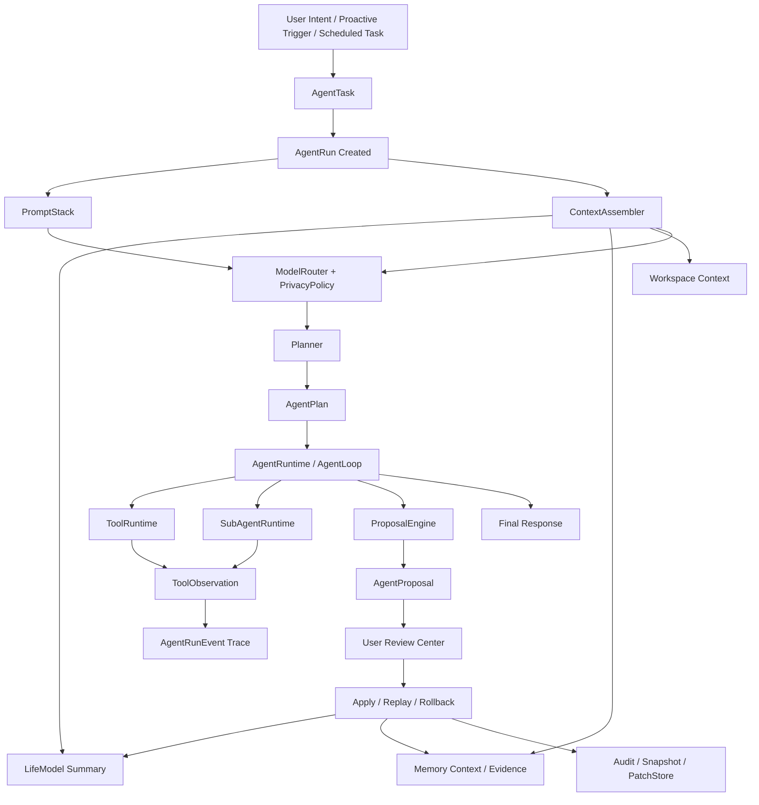
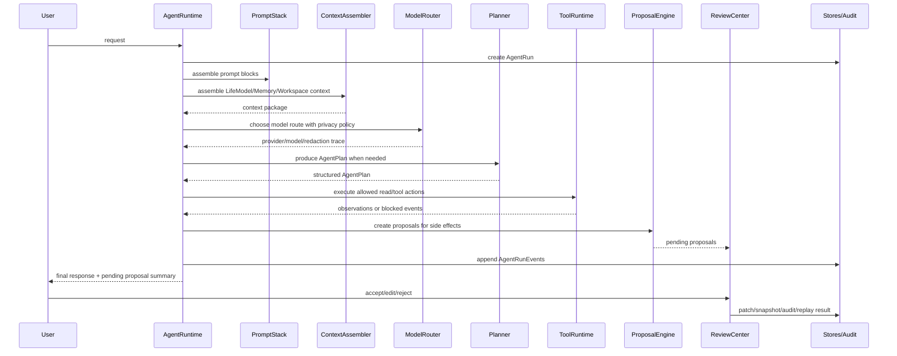
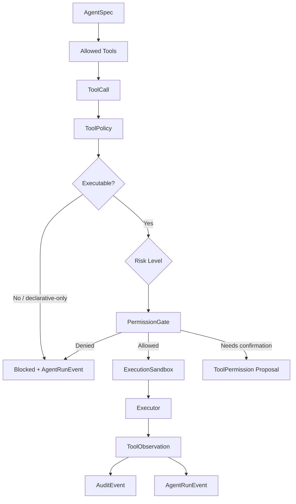
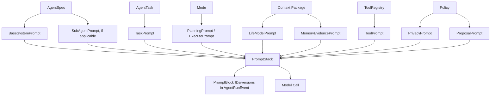
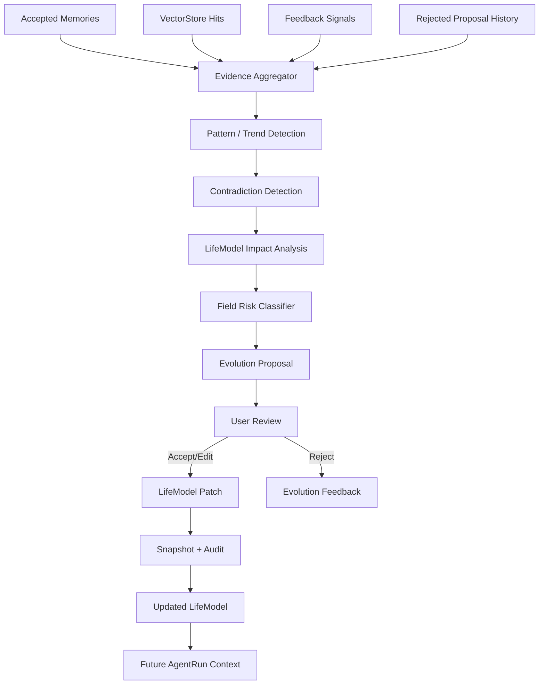
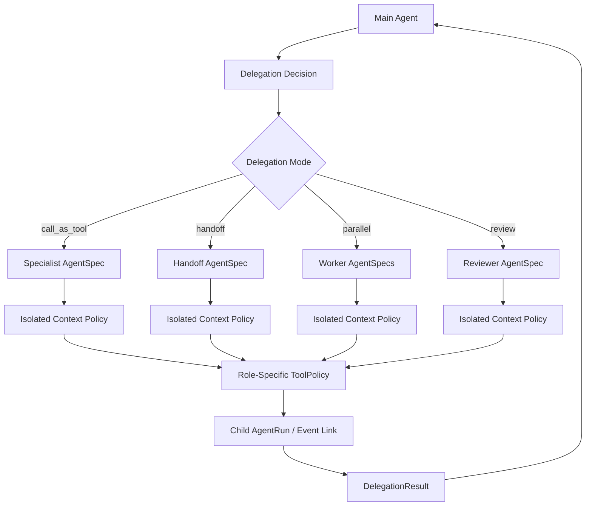

# OpenLife vNext Architecture Diagrams

Date: 2026-05-06

This document provides development-oriented diagrams for the Agent Framework upgrade. These diagrams are meant to guide implementation and review, not to serve as marketing diagrams.

## 1. Overall Framework Architecture

## 2. Single AgentRun Sequence

## 3. Tool Permission and Execution Model

## 4. PromptStack Assembly

## 5. Memory to LifeModel Evolution

## 6. Sub-Agent Orchestration

## 7. Development Dependency Order

```mermaid
flowchart LR
    A["Runtime Audit"] --> B["Architecture Baseline"]
    B --> C["Execution Path Convergence"]
    C --> D["AgentRunEvent"]
    D --> E["ToolRuntime Hardening"]
    E --> F["PromptStack"]
    F --> G["MemoryEvidence + Evolution"]
    G --> H["AgentSpec + PlanMode"]
    H --> I["SubAgentRuntime"]
    I --> J["Compaction"]
    J --> K["Bash / Sandbox"]
    K --> L["Frontend Agent Workspace"]
```

